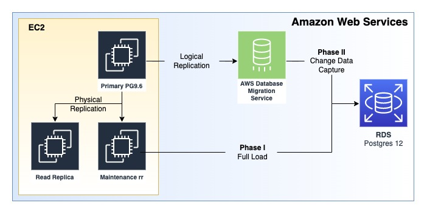
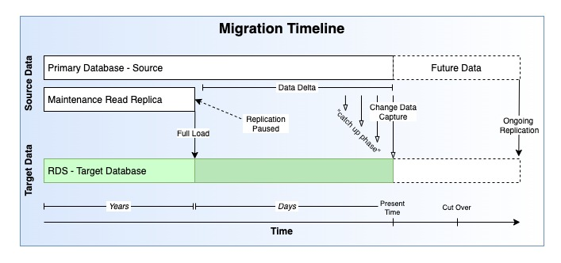
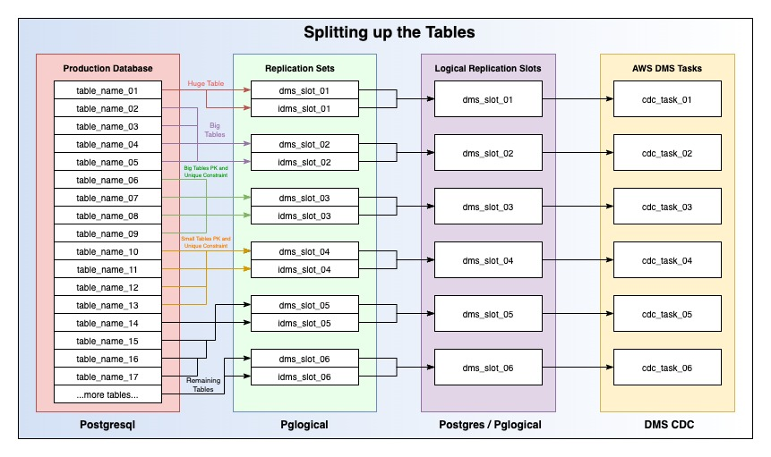

---
authors:
- Lucas Ward, Wanchen Zhao
tags:
- Cloud
- AWS
- AWS Map
- Migration
- DB Migration
date: 2023-08-03T12:21:50.000Z
title: "CallRail Paves the Way for Further Cloud Modernization Efforts by Migrating to Amazon RDS for PostgreSQL"
image:
---

# CallRail Paves the Way for Further Cloud Modernization Efforts by Migrating to Amazon RDS for PostgreSQL

CallRail offers comprehensive return on investment calculations for marketing campaigns through their advanced Call Tracking Products, constituting their primary business application. Additionally, the company possesses a diverse range of capabilities beyond this core service. 

CallRail manages several extensive and vital databases, among which is a large database previously self-managed by their engineers on Amazon Elastic Compute Cloud (EC2). The migration of this particular database stands as a pivotal undertaking in their ongoing efforts towards modernizing their cloud infrastructure. The significance of this migration lies not only in its potential cost savings from maintenance and upkeep, but also in alleviating the strain caused by CallRail's substantial workload on the database.

## A Challenging Migration

Despite encountering challenges, CallRail successfully executed the migration of the database with valuable assistance from Ippon Technologies' consultants and AWS' database support specialists. The intricacy of the migration arose from three main factors. Firstly, the database in question held the utmost importance for the business, allowing for minimal to no downtime during the migration process. Secondly, the migration entailed a version upgrade of PostgreSQL v9.6 to PostgreSQL Engine v12, necessitating careful handling of the transition. Lastly, the sheer volume of data and the immense daily throughput presented obstacles that had to be carefully managed throughout the migration.

## A Truly Collaborative Effort

CallRail devoted considerable time to meticulously planning the migration process. However, they recognized the necessity of augmenting their efforts with a team of skilled and dedicated experts in cloud and database domains. Collaborating with the proficient Ippon consultants proved beneficial for planning and initial execution phases of the migration, leveraging their expertise in parallel with CallRail's domain knowledge.

Despite investing months in previous unsuccessful attempts, CallRail decided to seek additional specialized assistance. It was at this juncture that an AWS Database Specialist was brought on board to navigate the final, yet crucial phase of the migration. The synergy achieved by combining the three groups proved to be the catalyst that the project required.

Through six months of persistent efforts and despite encountering multiple challenges and setbacks, the migration was ultimately accomplished, leading to a successful outcome.

## What was Gained

In conjunction with the growing collaboration among Ippon consultants, CallRail team members, and AWS Support members, numerous benefits were realized. The successful migration of CallRail's final database to RDS marked a significant milestone in their cloud modernization endeavors. Consequently, the company can now proceed with optimizing the same critical database for enhanced operational efficiency. This newfound operational efficiency not only instills a sense of assurance, but also liberates valuable engineering resources, enabling them to focus on other projects.

# In-Depth Process and Technical Details


In order to get all of the data out of the source database and into RDS without ever stopping the source database, albeit briefly, we have to run this two part process. There are two main phases to the migration plan.  After all prerequisites have been met - Phase I can be kicked off. 

Phase I - Full Load: use `pg_dump` and `\copy` to get the bulk of the data transferred. The full load portion utilize the maintenance read replica (see below) in a paused state and the RDS instance. DMS does provide a full load option, but on certain databases it can fail to complete. Part 1 of the series will cover all the steps to get through the Prerequisites section and Phase I.

Phase II - Change Data Capture with DMS: use multiple DMS tasks to transfer the remaining "data delta" into RDS.  The Data Delta is simply any data that has come into the database after pausing the Maintenance Read Replica. Phase II is performed against the Source Database, i.e. - the primary. Part 2 of the series will cover all the steps necessary to complete Phase II, and hopefully, the database migration.

This diagram shows the AWS Infrastructure that is used for this migration.



This diagram shows the timeline of the different phases of the migration.



### Environment Notes

Environment: For illustration purposes, consider this setup. A Client has a Primary Database, a Read Replica, and then a second "maintenance" Read Replica. Both read replicas are replicating from the primary database using built-in Postgres 9.6 "log shipping". See Postgres Replication - Log Shipping. Most of this plan can be adapted to work with different environment setups, I will try to describe in as much detail as possible where trade offs exist.

Constraints - The primary database can not be stopped for any significant period of time, even for a maintenance window. The Secondary (read replica) similarly cannot be stopped for any period of time. A separate read replica was created to allow this work to be done and still maintain a strong Disaster Recovery Posture. 

Database size: approximately 4.5 TB. 10s of billions of rows with single tables being upwards of 1 TB.

### Justification

This strategy poses near *zero* risk to current production operations. If the migration is successful, the required maintenance window will just be a database "cut over". We utilize native Postgresql utilities and AWS DMS on top of `pglogical` for additional functionality and visibility. 

We use `pglogical` to enable a cross version migration.  This allows us to minimize the number of maintenance windows and high risk tasks within the production setup. 

### Naming Conventions

Primary = Source = Prouduction Database
Secondary = Production Read Replica
Secondary = Maintenance Read Replica
RDS = New Primary = Target 

In the steps below, I will use a combination of the above naming conventions.  When discussing replication via DMS CDC leveraging pglogical, I will simply say `source` or `target`. In a migration attempt, the source for the CDC portion is the Production Database, the primary. The `target` will always refer to RDS.

For the Full Load portion, the Maintenance Read replica will be utilized and I will refer to it simply as "the secondary" or the "maintenance read replica".  The Production Read Replica is never touched during this process.

# Prerequisite Steps

Install the `pglogical` extension on the Source (production primary database), and on the Target (RDS). The secondary does not require the `pglogical` extension.

### Create a Maintenance Read Replica

In order to minimize risk and in an effort to not interfere with production, a fresh, separate read replica should be created and utilized for the migration. Replication will be paused on this separate read replica before performing full load, the current production read replica will continue to replicate and can still be used in the case of an emergency. Information surrounding the point in time backup will be garnered from this read replica and used to load any changed data after full load is completed.

### Add pglogical repo to Source

For the source database, the follow steps may differ slightly depending on the underlying OS that you are running.  The follow *sample steps* are for a system running Ubuntu 16.04, please note, your mileage may vary. 

1. Find the pgdg.list `cd /etc/apt/sources.list.d
2. Edit the list to include the apt-archive repository `vim pgdg.list
3. Change the entry to match this one:
```bash
deb [trusted=yes] http://apt-archive.postgresql.org/pub/repos/apt/ xenial-pgdg main
```
4. Run `sudo apt update`
5. Verify package with `apt list | grep pglogical
6. Run `sudo apt-get install postgresql-9.6-pglogical to install pglogical
7. Follow the next series of steps (install pglogical) to get postgresql 9.6 to load the plugin

### Install pglogical on Source
`pglogical` must be installed on the source database running on EC2 as well as the target running on RDS. The [github repo](https://github.com/2ndQuadrant/pglogical) for `pglogical` will have the latest, most up to date instructions on how to install. Installation into the source database involves changing `postgresql.conf` settings.  On Ubuntu, these settings are located in `/etc/postgresql/9.6/main/`. Note: Installation requires a database restart.

Sample Procedure: 
1. SSH into the source database. Be careful, this is the main production database!
2. Run: `sudo -s` and then `cd /etc/postgresql/9.6/main`
3. Edit the file with `sudo vim postgresql.conf`
4. Make sure these settings are set to the following values (or higher). 
```bash
shared_preload_libraries= 'pglogical'  
wal_level = logical  
max_replication_slots = 10  
max_wal_senders = 10  
wal_sender_timeout = 0  
max_worker_processes = 10  
track_commit_timestamp = on
```
5. Restart the database with `systemctl restart postgresql.service`
6. Log in to the Source Database: `sudo -u postgres psql` 
7. Connect to the desired database using ``\c {database_name}``
8. Create the pglogical extension: `create extension pglogical;`
9. Verify the installation: `select * FROM pg_catalog.pg_extension;`

Sample Return Data:
```sql
     **extname       | extowner | extnamespace | extrelocatable | extversion | extconfig | extcondition  
--------------------+----------+--------------+----------------+------------+-----------+--------------  
plpgsql            |       10 |           11 | f              | 1.0        |           |  
hstore             |       10 |         2200 | t              | 1.2        |           |  
pg_stat_statements |       10 |         2200 | t              | 1.3        |           |  
pgcrypto           |       10 |         2200 | t              | 1.2        |           |  
tablefunc          |       10 |         2200 | t              | 1.0        |           |  
pglogical          |       10 |    585589989 | f              | 2.3.4      |           |  
(6 rows)**
```

### Install Target Version of PSQL on the Maintenance Read Replica

We need to make sure that we have a version of `psql` on our machine that matches the version of PostgreSQL on the Target Database. Find out which version of PostgreSQL you are migrating to, and then install that version of the `psql` tool on that machine. 

Use what ever package manager your system supports.  Here is an example using Ubuntu 16.04:
```bash
apt list | grep postgresql-client
sudo apt-get install -y postgresql-client-12
```
Replace the version number of `postgresql-client-XX` with what ever version you are migrating to. If you do not see the version listed, you may need to update your apt repo. Installing `psql` using this method will ensure that you don't accidentally install a different version of Postgresql on a system that is potentially already running an earlier version of Postgresql.

### Setup RDS

Follow the typical process for creating an RDS instance.
To install pglogical on RDS follow this [guide](https://aws.amazon.com/blogs/database/part-2-upgrade-your-amazon-rds-for-postgresql-database-using-the-pglogical-extension/). (Steps 1 - 3 only).
There a lots of settings and things to consider (sizing and such), but these processes are well documented on the internet. 

### Fresh Schema Dump

The schema dump should be performed as close to the start of the full load procedure as possible. This will ensure that the schemas on the source and the target match. Use `pg_dumpall` to ensure that all database objects are copied (i.e. - read user). 

Here is an example for getting the schema dump to a file (to be run against source database):
```sql
--On a system with access to the source database, like the maintenance read replica
pg_dumpall -l {database_name} -p 5432 -U {database_user} -s > dump_schmea_and_global.sql
```

Here is an example for restoring the schema dump to RDS.  This can be run from any EC2 instance with `psql` & access to RDS. First, put a copy of the file from the last step on that box. You will be prompted for the password to RDS.

```sql
--On the Command Line
psql -d {database_name} -h {rds_host_string} -p 5432 -U {database_user} -f dump_schmea_and_global.sql
```

Next, add the extension for `pglogical` (all other extensions will be created in previous step) if not already present.

```sql
--On the RDS Instance
CREATE EXTENSION pglogical;
```

### Get to Know the Data

Now that we have our hands on the database schema, there are a couple of things we need to identify. One of the ways that we will be splitting up our tables for the migration process is based on the information contained within the database schema. 

Compile a list of tables that have both a Primary Key and a separate Unique Constraint. Tables that fall into this category have a few *special* steps. Search the schema for `unique: true` or use some other mechanism to identify the tables. Once you have the list of tables, you will need to go through the painstaking process of writing a script to remove all of the unique constraints. That is - a saved document that has `sql` commands that you can copy and paste into `psql` later on in the steps. 

Run this command on one of the tables to *describe* it:
```sql
\d table_name
```
There will be a section called `Indexes`. Mark down the name of the any indexes that say `UNIQUE`. Set this list aside to be used later on during the migration.

# Migration Steps - Phase I - Full Load

Each Replication Slot will map to one DMS task. It is important to put tables together that make sense. For instance, huge and very busy tables should have a fully dedicated slot. Tables that have primary keys and unique constraints should be put together. Tables that are closely related should be kept in the same slot.  Do your research and run lots of tests. After each iteration of the migration process, apply new settings and resolve issues that arise.  This is by far the hardest part of the migration to nail down properly.

### Step 1 - Replication Slots

Create the replication slots on the source database - there will likely need to be several. Each replication slot will perform logical decoding of the `wal_log` for their specified tables contained within their respective replication sets. Make sure to test the impact of multiple replication slots on the primary database.  For this guide, we are going to use 6 replication slots. Note the name of the slot, as it will be used later to create the replication sets used by `pglogical`. 
```sql
--On the Source Database
SELECT * FROM pg_create_logical_replication_slot('dms_slot_01', 'pglogical');
SELECT * FROM pg_create_logical_replication_slot('dms_slot_02', 'pglogical');
SELECT * FROM pg_create_logical_replication_slot('dms_slot_03', 'pglogical');
SELECT * FROM pg_create_logical_replication_slot('dms_slot_04', 'pglogical');
SELECT * FROM pg_create_logical_replication_slot('dms_slot_05', 'pglogical');
SELECT * FROM pg_create_logical_replication_slot('dms_slot_06', 'pglogical');
```

After the database creates the replication slots, note the `restart_lsn` and the `confirmed_flush_lsn` for all slots on the Source (primary). This information can be used for troubleshooting purposes if a migration attempt fails (which it will, test, make tweaks, run again).
```sql
--On the Source Database
select * from pg_replication_slots;
```

Sample output:
```sql
slot_name | plugin | slot_type | datoid | database | active | active_pid | xmin | catalog_xmin | restart_lsn | confirmed_flush_lsn -------------+-----------+-----------+--------+---------------------+--------+------------+------+--------------+----------------+--------------------- 
dms_slot_01 | pglogical | logical | 16400 | db_name | f | | | 2087144987 | 35FE3/46194620 | 35FE3/463C2B08 
dms_slot_02 | pglogical | logical | 16400 | db_name | f | | | 2087144987 | 35FE3/472ACCC8 | 35FE3/4737C6C8 
dms_slot_03 | pglogical | logical | 16400 | db_name | f | | | 2087144987 | 35FE3/47B7C6F0 | 35FE3/47B86480 
dms_slot_04 | pglogical | logical | 16400 | db_name | f | | | 2087144987 | 35FE3/486790B8 | 35FE3/488671E8 
dms_slot_05 | pglogical | logical | 16400 | db_name | f | | | 2087144987 | 35FE3/4903FA28 | 35FE3/491B8EE0 
dms_slot_06 | pglogical | logical | 16400 | db_name | f | | | 2087144987 | 35FE3/4985FF50 | 35FE3/49AA2C90 (6 rows)
```

Notice the `active` column which reports a value of `f`. A value of `false` in this column is to be expected, as we have not began consuming any information from these replication slots. As long as this column returns a false value, log files will slowly start to fill storage.

**IMPORTANT**: If at this point in the migration plan you see a slot that you did not explicitly create and it reports a value of `true` or just `t` in the active column, it means there could be some form of logical replication already in use on the database.  Be sure to verify the use of logical replication with other team members and ensure that you do not interrupt any production work loads - i.e. - an existing read replica that is using logical replication versus physical replication or streaming. ***Be careful*** if you are performing these steps on production database.

### Step 2 - Create a Pglogical Node

Create a `pg_logical` node on the Source Database (the primary). If the node already exists - and **you are confident that no other form of replication depends on it**, drop the node and recreate it. 

Drop Node
```sql
--On the Source Database
select pglogical.drop_node('{node_name}')
```
Create Node - populating the required fields
```sql
--On the Srouce Database
select pglogical.create_node(node_name := 'provider1', dsn := 'host={ip_address} port={port} dbname={db_name} password={password} user={db_user}');
```

### Step 3 - Create Replication Sets

Create the replication sets. Note - the name of the replication sets must match the name of the replication slot. For instance - if the replication slot is `dms_slot_01` then the replication slot names are `dms_slot_01` and `idms_slot_01` respectively.  Each replication slot will have two replication sets named after it.
```sql
--On the Source Database
SELECT pglogical.create_replication_set('dms_slot_01', false, true, true, false);  
SELECT pglogical.create_replication_set('idms_slot_01', true, false, false, true);

SELECT pglogical.create_replication_set('dms_slot_02', false, true, true, false);  
SELECT pglogical.create_replication_set('idms_slot_02', true, false, false, true);

SELECT pglogical.create_replication_set('dms_slot_03', false, true, true, false);  
SELECT pglogical.create_replication_set('idms_slot_03', true, false, false, true);

SELECT pglogical.create_replication_set('dms_slot_04', false, true, true, false);  
SELECT pglogical.create_replication_set('idms_slot_04', true, false, false, true);

SELECT pglogical.create_replication_set('dms_slot_05', false, true, true, false);  
SELECT pglogical.create_replication_set('idms_slot_05', true, false, false, true);

SELECT pglogical.create_replication_set('dms_slot_06', false, true, true, false);  
SELECT pglogical.create_replication_set('idms_slot_06', true, false, false, true);
```

Note: the name of the replication set having to match the replication slot name is an artifact of using AWS DMS for CDC in phase II.  If you are performing a *purely* `pglogical` approach, then this guide is not for you, although a lot of the setup and lessons learned still apply. 

### Step 4 - Populate Replication Sets

Add all of the tables that need to be migrated to the replication sets. NOTE - you should have a general idea about the schema and the data contained within the tables - make sure you have separated your replication sets according. For instance:
- `dms_slot_01` - a Huge table, all by itself 
- `dms_slot_02` - a Collection of larger tables, but not too many!!
- `dms_slot_03` - a Collection of larger tables with Primary Keys and Unique Constraints
	- These tables may require different settings.
- `dms_slot_04` - Similar to slot 2 but small tables and probably a lot more!
- etc... These different replication sets (and therefor the replication slots they reference) will eventually be mapped to Change Data Capture (CDC) tasks in AWS DMS. Refer back to this step after reading the section on CDC in Part 2 if need be.

NOTE: Set aside the list of tables that have a Primary Key and a separate Unique Constraint from the prerequisite steps. They will be used later before the Full Load process starts.

To add the tables, run these commands on the source database.
```sql
--On the Source Database
select pglogical.replication_set_add_table(set_name := 'dms_slot_01', relation := 'some_table_001', synchronize_data := false);
select pglogical.replication_set_add_table(set_name := 'idms_slot_01', relation := 'some_table_001', synchronize_data := false);

select pglogical.replication_set_add_table(set_name := 'dms_slot_02', relation := 'some_table_002', synchronize_data := false);
select pglogical.replication_set_add_table(set_name := 'idms_slot_02', relation := 'some_table_002', synchronize_data := false);

select pglogical.replication_set_add_table(set_name := 'dms_slot_02', relation := 'some_table_003', synchronize_data := false);
select pglogical.replication_set_add_table(set_name := 'idms_slot_02', relation := 'some_table_003', synchronize_data := false);

--etc...
```

Notice how each table get's added to two replication sets? Earlier, when we created the replication sets, we had one set for `insert` and `truncate`, and then another set for `update` and `delete`. Every table in your database should be added to two sets.  Tables without primary keys will throw an error saying that they cannot be added to a replication set that replicates `updates` and `deletes`. This is to be expected. 

If this step is confusing or if you feel like you are missing part of the puzzle, please read through the [pglogical](https://github.com/2ndQuadrant/pglogical) documentation as well as the [AWS DMS pglogical documentation](https://docs.aws.amazon.com/dms/latest/userguide/CHAP_Source.PostgreSQL.html). There are two sections in the AWS documentation that I want to highlight. 
- Under the section "Enabling change data capture (CDC) using logical replication" there is a sub-section called "configuring the pglogical plugin".
	- Also familiarize yourself with the "notes" regarding `REPLICA IDENTITY FULL` and read up on `restart_lsn` and `wal_logs`. Check back frequently for a write up on "all you need to know about postgresql wal_logs".
- Under the section "Using native CDC start points to set up a CDC load of a PostgreSQL Source" there is a sub-section called "To use a new replication slot not previously created as part of another DMS task".
	- This section is crucial. Because we are performing the full load portion of the migration outside of DMS, we will not have "previously created" a replication slot through DMS. 

This diagram shows an overview of the logical separation between tables, replication sets, replication slots, and future DMS Tasks.



### Step 5 - Pause the Maintenance Read Replica

Now that all of your database tables have been added to their respective replication sets, it's time to pause the Maintenance Read Replica and verify the existences of a usable `restart_lsn` (restart log sequence number). You can think of the log sequence number as a mile marker on the highway. You need this number to be able to tell DMS where to pick up replication.

Pause the Maintenance Read Replica - [more info on postgresql administrative functions here](https://www.postgresql.org/docs/9.6/functions-admin.html).
```sql
--On the Maintenance Read Replica
select pg_xlog_replay_pause();
select pg_is_xlog_replay_paused(); --Should return true if replication is paused.
```
Note: if you are using a newer version of Postgresql (v10 or higher) for the Source database, the command may look more like this:
```sql
select pg_wal_replay_pause();
select pg_is_wal_replay_paused();
```

In earlier versions of Postgres, the *write ahead log* was called the *xlog*, which loosely means "transaction log". Version 10 of postgresql saw the name changed to the `wal_log`. The `wal_log` stands for write ahead log and is a core concept in database replication, not just for postgresql either. I highly recommend reading up on the `wal_log` as it is pivotal to understanding how and why this migration method works and the underlying mechanism behind it. More information regarding the write ahead log and postgresql interanl operations can be found [in the docs](https://www.postgresql.org/docs/9.6/wal.html).

Note: Now that the read replica is paused, it will begin storing `xlogs` or `wal_logs` on disk. Be sure to monitor your database system to ensure that storage does not run out! If you start to run out of storage space, you can change where the logs are stored by editing the `postgresql.conf` file and performing a config reload. If you are facing a disaster scenario and just need to free up space as fast as possible, then proceed to drop the logical replication slots on the source database. This will cause you to have to start back from step 1 if you are following this guide. 

### Step 6 - Capture the Log Sequence Number

With the Maintenance Read Replica paused, we are ready to *capture* our log sequence number. 

The command to do so is as follows:
```sql
--On the Maintenance Read Replica
select pg_last_xlog_replay_location();
```
On postgresql version 10 and higher the command is:
```sql
select pg_last_wal_replay_lsn();
```

More information regarding this command can be found in the [docs](https://www.postgresql.org/docs/9.6/functions-admin.html#FUNCTIONS-RECOVERY-INFO-TABLE). 

Sample return value:
```sql
postgresql_db=# select pg_last_xlog_replay_location(); pg_last_xlog_replay_location 
------------------------------ 
 35FE3/B63D4718 (1 row)
```

In the above sample output, `35FE3/B63D4718` is called a log sequence number. This is the value that we will be passing to DMS to specify a CDC Start position. Make sure to mark this down for the next step. It will also be used to verify that the "pause" position that we have on the Maintenance Read Replica exists inside the Logical Replication Slots that we created on our Source Database.

### Step 7 - Verify Pause Point on the Primary

Take the log sequence number you wrote down from the previous step and keep it handy. We are going to log into to Source Database (the Primary Production Database) and run a few *non-intrusive* commands. 

Using `psql` on the source database, run this command:
```sql
SELECT location,xid, jsonb_pretty(data::jsonb) FROM pg_logical_slot_peek_changes('dms_slot_01',null, null, 'min_proto_version', '1', 'max_proto_version', '1', 'startup_params_format', '1', 'proto_format', 'json', 'pglogical.replication_set_names', 'dms_slot_01,idms_slot_01') where location='{LSN_FROM_MAINTENANCE_READ_REPLICA}';
```
For Postgresql version 10 or higher, the command is:
```sql
SELECT lsn,xid, jsonb_pretty(data::jsonb) FROM pg_logical_slot_peek_changes('dms_slot_01',null, null, 'min_proto_version', '1', 'max_proto_version', '1', 'startup_params_format', '1', 'proto_format', 'json', 'pglogical.replication_set_names', 'dms_slot_01,idms_slot_01') where location='{LSN_FROM_MAINTENANCE_READ_REPLICA}';
```
Be sure to repalce `dms_slot_01`, `idms_slot_01` with what ever you named your replication slots and replication sets. Replace `{LSN_FROM_MAINTENANCE_READ_REPLICA}` with the log sequence number. Run this command for each Logical Replication Slot and its respective replication sets.  We are simply looking for the command to *not* return an error. Here is a sample *successful* return value:
```sql
location | xid | jsonb_pretty ----------------+------------+----------------------------------- 354AD/3811D1C8 | 1504600818 | { + | | "action": "C", + | | "end_lsn": "354AD/3811D1C8", + | | "final_lsn": "354AD/3811D198"+ | | } (1 row)
```
If it returns `0 rows` or says anything at all about a change, then the Log Sequence Number is valid and we are safe to proceed! If you would like to understand better the Postgresql Internals surrounding the Write Ahead Log, check out [chapter 9 of this E-Book](https://www.interdb.jp/pg/pgsql09.html).

### Step 8 - Prep Target for Full Load

In the pre-migration steps, we compiled a list of indexes that were unique and lived on tables that also had primary keys.  Before we kick off the Full Load process, we need to login to the RDS instance and remove these Unique Indexes. This will ensure that the full load process can insert all of the data required without erroring out.  This step will catch a very sneaky bug that can arise and cause data integrity issues.

Here is a sample script that will be copied and pasted into the `psql` command prompt:
```sql
--On Target RDS Instance
DROP INDEX index_table_name_01_on_table_06_field_id;
DROP INDEX index_table_name_02_on_table_03_field_id;
DROP INDEX index_table_name_05_on_some_other_field_id;
```
If the database you are attempting to migrate is *rather large* then this list is probably gonna be pretty huge!

### Step 9 - Perform Phase I - Full Load

In the "Pre Migration Steps" you will have installed the version of the `psql` tool that matches the Target Database version of PostgreSQL. This will ensure that when we "dump" the data from our paused maintenance read replica, that we are getting an output that is compatible with our target database.

This step is where Phase I truly kicks off. The "Full Load" portion of this migration is less complicated and less error prone than Phase II - CDC, but still has a few gotchas. In order to make the full load operation run as fast as possible, we want to do it in parallel. This means once again figuring out the proper "split" for the tables.  I recommend taking your 5 largest tables and doing them each in a separate screen session. Then put all of the remaining "smaller" tables into a 6th screen sessions and kick them all off at the same time.

The reason we use screen sessions, is some of these full load operations can take *days* to finish. If you use a screen session, then it won't matter if you get logged out of the terminal. The operations will continue to run and you will be able to "reattach" to the sessions and check on the operation. I also recommend turning on "performance insights" in your RDS monitoring settings so that you can see which SQL commands are running and how far along the Full Load process is.

Here are the commands, including the screen session creations:
```bash
screen -S table_name_01
```
This will land you in a fresh new screen session, now run the commands to perform the full load operation:
```bash
echo START TIME is: `date +"%Y-%m-%d %T"` &&  
/usr/lib/postgresql/12/bin/pg_dump {database_name} -p 5432 -U {database_user} -t {big_table_name_01} | psql -d {database_name} -h {RDS_host_endpoint} -p 5432 -U {database_user} &&  
echo END TIME is: `date +"%Y-%m-%d %T"`  
```
Okay, a few things to note:
- This command will start by printing the "START TIME" and will end by printing the "END TIME". This information is invaluable for subsequent migration attempts when it comes to planning time frames, be sure to record the start and stop time once the dump and load is complete. 
- Note the use of the PATH to the `psql` binary that we installed in the pre-migration steps.  Be sure to verify the location and the version of your `psql` binary.
- This command may prompt you for a database password - enter your database password to continue.
- All of the large tables will use the `-t table_name` syntax.  This just tells `pg_dump` that we want to only dump this one single table
To exit the screen session and create the next one, simply press `[ctrl]-a` and then press `d`. To list all existing screen sessions, type `screen -ls`.  Kick off screen sessions and `pg_dump` for the remaining large tables.

Now we need to `pg_dump` the remaining *small tables*. This command differs slightly, so make sure to double check what you are typing into the command prompt!
```bash
screen -S small_tables
```
then:
```bash
echo START TIME is: `date +"%Y-%m-%d %T"` &&  
/usr/lib/postgresql/12/bin/pg_dump {database_name} -p 5432 -U {database_user} -T {big_table_name_01} -T {big_table_name_02} -T {big_table_name_03} -T {big_table_name_04} -T {big_table_name_05} | psql -d {database_name} -h {RDS_Host_string} -p 5432 -U {database_user} &&  
echo END TIME is: `date +"%Y-%m-%d %T"`
```
Notice how we use a Capital `T` and list out the big tables that we have already starting dumping? The big `T` tells `pg_dump` to exclude these tables. If we get the command just right, it means that it will dump all of the tables in the database with the exception of the ones listed. You can read more about `pg_dump` and the different flags [here](https://www.postgresql.org/docs/12/app-pgdump.html).

The `pg_dump` process will add back the indexes that removed in the previous step, though it's a good idea to make sure you have a good way to verify that all of the indexes were correctly added back to the Target Database.

### Step 10 - Quick QA

Before moving onto Phase II of the migration, take some time after full load has completed to spot check a few tables. This is simply to ensure that the full load process indeed moved all the data from the paused Maintenance Read Replica into the target RDS instance. 

Sample spot check:
```sql
--Run on both Paused Maintenance Read Replica and Target RDS Instance
SELECT
date_trunc('month', created_at) as created_by_month,
count (*)
FROM
{table_name}
WHERE
created_at BETWEEN '01-01-2020 0:00:00.000000' AND '07-01-2023 23:59:99.999999'
GROUP BY
date_trunc('month', created_at)
ORDER BY
created_by_month;
```

Adjust the above query to something that makes sense for your data and then compare month over month row count between the two databases.  Do this for every large table that you transferred and also a random sampling of the smaller tables too!

If everything looks good, move on to the next step.

### Step 11 - Resume Maintenance Read Replica

Once Full Load has completed, and you can verify that all of the screen sessions have completed their respective `pg_dump` commands, it is time to *resume* the Maintenance Read Replica.  This will achieve two things. First and foremost, it will allow the read replica to catch back up to the primary database, therefore making it ready for any subsequent migration attempts. Secondly, it will stop any wal_log or x_log build up on the primary. There are still *other* logical replication slots in play that will be causing said log files to build up, but at least this will take care of one of the causes of the build up.

To resume replication on the Maintenance Read Replica, simply log into the database using `psql` and run this command:
```sql
--On the Maintenance Read Replica
select pg_xlog_replay_resume();
select pg_is_xlog_replay_paused(); -- should return false if replication is resumed
```
For Postgresql version 10 or higher:
```sql
select pg_wal_replay_resume();
select pg_is_wal_replay_paused();
```

You can now log out of the Maintenance Read Replica, it's job is done and it has served its purpose.  Do not decommission this server until the migration has been successfully completed. If you have to do the migration again, you will once again need this replica.

# Phase II

## Prerequisites

### Items from Phase I

If you are coming here from part 1, you should have everything that you need to proceed.
- A log sequence number from the paused read replica.
- The names of all the Logical Replication Slots that you setup in part 1.
- A list of tables that have a Primary Key and a separate Unique Constraint.
- An in-depth understanding of the data contained within the Source Database.
Before we dive into the steps to setup and configure DMS, let's talk about some things we need to figure out before we proceed. Remember when we compiled the list of tables that have a Primary Key and a separate Unique Constraint? We need another similar list, but this time, a list of tables that have Large Objects, also known as LOBS. If you are unfamiliar with LOBs, then read up on them in the [documentation](https://www.postgresql.org/docs/15/largeobjects.html).

### Large Objects

When performing Change Data Capture (CDC) with AWS DMS, tables with large objects have a couple of specific settings that need to be adjusted. In order to get the settings just right, we need to have a list of tables that contain LOBs. More importantly, for each table that has LOBs, we need a value, in kilobytes, of the largest possible LOB for that table. Here is an example, let's say we have a database table that is part of an integration, and one of the columns stores a large amount of JSON. We will need to figure out the maximum size of that JSON object across all the rows of the table. This will be a bit of a guessing game. You could take a few rows at random and check the size of the column and make an educated guess. 

In addition to know what tables have lobs and what size to set for the max LOB, we also need to identify if there are any tables where "LOB Truncation" is acceptable. This will largely depend on the usage of the LOBs in this table, but if you are okay with *some *truncations*, i.e. - some missing JSON characters off the end of a large object that contains JSON, then there are different settings to be used that can speed up the process.

When you have finished your analysis, you should have something akin to this table as the result:
| Table       | Max LOB Size (Kb) | Truncations OKAY? |
| ----------- | ----------------- |-------------------|
| table_name_1| 325               | Yes               |
| table_name_2| 1200              | No                |
| table_name_3| 36000             | Yes               |

Armed with our list of tables that have Primary Keys and Separate Unique Constraints as well as our list of tables with LOBs and the *estimated max LOB size*, we are ready to setup and configure DMS. Please note, that with regards to the former list (primary keys and unique constraints), you should already have logically separated these tables into different replication sets (and therefore different replication slots) in the previous part of this series. If you need a refresher, refer to the top part of the section titled "Migration Steps - Phase I - Full Load". 

# Migration Steps - Phase II - Change Data Capture

Amazon Web Services Database Migration System is an awesome tool to have at your disposal and will greatly ease this part of the migration process. There is loads of documentation surrounding the tool, and I encourage you to familiarize your self with it before you attempt this part of the migration.

### Step 1 - Create a Replication Instance

Log in to your AWS management console and navigate to the DMS page. Follow [this guide](https://repost.aws/knowledge-center/create-aws-dms-replication-instance) to setup your DMS Replication instance. This is the server that will handle the CDC tasks - that is, receive the data from the source database and apply it to the target database. Be sure to take into consideration the volume and size of the data and spec your machine out based on that information. It may take some testing to get this value just right.

### Step 2 - Setup your DMS Endpoints

We will need a separate DMS source endpoint for each replication slot that we created in Part 1. Go through the process of creating the endpoint as you normally would - Specify source database connection information, give it a name that makes sense, like `dms_slot_1_endpoint`. Before you press create or even test the endpoint, we have one last setting to apply. 

At the very bottom of the endpoint creation screen is a checkbox that says `Use endpoint connection attributes`. Click this checkbox and a text field will appear. Add the following text to the text field *Extra endpoint connection attributes*:
```bash
PluginName=PGLOGICAL;slotName=dms_slot_01
```

Test the connection and then press save. Repeat this process for all of the replication slots that we created in Phase I of the migration.

Now that we have source endpoints for all of the replication slots that exist on the source database, we need to create a target endpoint. Follow the same process as above but instead specify the connection string for your RDS instance and skip the bit about using "extra endpoint connection attributes".

### Step 3 - Create the DMS Tasks

In order to setup our DMS Tasks, we will navigate to the DMS console and click on "Create a DMS Task". The absolute most critical step here, is to select "Replicate data changes only". We do not want to direct DMS to perform full load, as we have already done this step outside of DMS. Specify the Source Endpoint for your first "Replication Slot Endpoint" and choose the target database (RDS endpoint). This setup part, and the following part, will be the same across all of the DMS tasks you create.

One of the next settings is: `CDC Start mode for source transactions` and there is an option for `Custom CDC start point for source transactions`. Choose `Specify a log sequence number`. In the `System change number` text field, input the log sequence number that we ascertained from `Step 6 - Capture the Log Sequence Number` in Part 1 of this series. This critical step will tell DMS where it should "pick up" the change data capture on the Source Database.

The only other settings that will be the same across all DMS tasks are as follows:
- do create recovery table on target DB
- do nothing - target table prep (we already handled target table prep before full load)
- turn on cloudwatch and select all logs
- create recovery table in `public` schema (or what ever schema name you use)
- enable all awsdms control tables

Here is where things change based on which DMS Task, and therefore which replication slot, and therefore which tables we are considering...

If the tables that this task references has the tables that `Have a primary key and a separate unique constraint`, make sure `batch-optimized apply` is disabled. For all other tasks (replication slots), it's okay to turn this on.

If the tables that this task references have any tables that are included in your `Large Object` or `LOB` list that we compiled above, then we have specific settings to take care of. Set the large object settings to `Limited LOB Mode` and put in a value that makes sense for the "maximum lob size" based off of your list. If the DMS Task has a table where some truncations are not okay, then we have some more special settings to add below. 

Navigate passed the "full load" settings, as they won't be used, and go to the "Mapping Rules". This is where we will tell DMS all of the tables that exist in the replication slot that we are setting up. I recommend using the JSON editor, especially if you have tables in the slot that cannot have LOB truncations. Using the list from phase I that we used to setup our replication sets, make a list of tables in JSON format for the DMS task that matches exactly.

Here is some sample JSON that will match the sample replication set from part I:
```JSON
{
    "rules": [
        {
            "rule-type": "selection",
            "rule-id": "348698101",
            "rule-name": "348698101",
            "object-locator": {
                "schema-name": "public",
                "table-name": "some_table_001"
            },
            "rule-action": "include",
            "filters": []
        },
        {
            "rule-type": "selection",
            "rule-id": "348698102",
            "rule-name": "348698102",
            "object-locator": {
                "schema-name": "public",
                "table-name": "some_table_002"
            },
            "rule-action": "include",
            "filters": []
        },
        {
            "rule-type": "selection",
            "rule-id": "348698103",
            "rule-name": "348698103",
            "object-locator": {
                "schema-name": "public",
                "table-name": "some_table_003"
            },
            "rule-action": "include",
            "filters": []
        },
        {
            "rule-type": "table-settings",
            "rule-id": "031787795",
            "rule-name": "some_table_001-lob",
            "object-locator": {
                "schema-name": "public",
                "table-name": "some_table_001"
            },
            "lob-settings": {
                "mode": "unlimited",
                "bulk-max-size": "64"
            }
        }
    ]
}
```

Notice the `rule-type` - `table-settings` portion of the above example. The first 3 JSON "chunks" reference a table selection rule - specifying to the DMS task what tables are in what slot. The 4th section, that says `table-settings` is how you specify a LOB setting where truncations are not allowed. This setting will override the previously set limited lob mode for just the table specified.

Finally, check the option that says you will `start manually` after creation. This way we can create all of our tasks, double check all of the settings and table mappings, and then start them all back to back. 

If any of the above doesn't make sense, it probably means you should take a turn through the DMS documentation. There is a wealth of information contained there-with-in and the amount of possible configuration options is HUGE. If you are still stuck, we have AWS MAP professionals on stand by ready to help. Please don't hesitate to reach out to our sales team at sales@ipponusa.com. 

### Step 4 - Kick Off Phase II - CDC

Now that all of our DMS Tasks have been created, full load has finished, and settings have been double and triple checked, we are ready to start the DMS Tasks. It is my recommendation to start each task, one at a time, with a "few minutes" interval between each task.  As you are starting the tasks and monitoring cloud watch logs, there are a couple things to watch out for. 

In the cloud watch logs, you should see that it says "full load complete", this just means that `full load` has been skipped and DMS is acknowledging it. Eventually, the logs should start saying `replication has started`. Don't be alarmed if you see warnings or info messages about running out of swap space or pausing replication, this is perfectly normal during the "catch up" phase. 

### Step 5 - Monitoring the Catch Up Phase of CDC

The catch up phase is where DMS CDC attempts to migrate all of the data that has built up in the Logical Replication Slots while we were performing Full Load and Setup. In other words, you should expect to see some pauses, and if you check the metrics on each task, you should expect to see some latency. Keep an eye on the metrics for the replication instance to see if Memory and Storage amounts are well within range.

You can also monitor the progress of the catch up phase by logging into the Target RDS Instance with `psql`. Once logged in, run this SQL query to check on the progress:
```sql
--Run On Target RDS Instance
target_database=> select task_name, task_status, source_timestamp_applied from awsdms_status order by task_name desc;
                task_name                |    task_status    | source_timestamp_applied
-----------------------------------------+-------------------+--------------------------
 XCXNJODDOAXXJXNDZVOXTHREG7YHWZIZQ6DIKYA | CHANGE PROCESSING | 2023-05-25 08:45:11
 OAORYYEYKB4KE7P6BDGUSCOTIOUWIHVQ365ILDY | CHANGE PROCESSING | 2023-05-26 13:05:08
 IGGOX4DMKOL565NJKQCLK5Z3RBN4GNMH6WVJLTQ | CHANGE PROCESSING | 2023-05-27 11:11:32
 6NY4C53LQWXLOJ5LOQW6RXWDQAKDHZCDC42ZPDI | CHANGE PROCESSING | 2023-05-26 13:12:45
 4XHASLIMNZP2BDBZRUQGXAJAGAL3XLBZQLJP27A | CHANGE PROCESSING | 2023-05-28 23:05:12
 2DSG7USR6Q27VQJ2ZWRAJS5GLLHH3WXXTNFRMPI | CHANGE PROCESSING | 2023-05-26 13:07:07
(6 rows)
```
There are three things to note here:
- The `task_name` column will match up to the AWS ARN for the DMS Task.
  - This is the best way to reconcile the status of each AWS Task to the Replication Slot that it maps to, and therefore the tables.
- The `task_status` column will usually just say `CHANGE PROCESSING`. If the DMS task needs to pause for what ever reason, you may see this reporting `Paused`. 
  - This column is not a very reliable way to tell the actual status. When a DMS CDC task fails, this column will report `CHANGE PROCESSING` and the `source_applied_timestamp` will report the last time it was able to communicate. For this reason, it is best to check status of the Task in the DMS console, and to check the "catch up" postition using the above method.
- The `source_timestamp_applied` column will tell you at what point in time the replication has caught up to.
  - Notice that some of the above tasks are further behind then others. As long as the timestamp is catching up faster than *time is passing* then we are good to go!

The speed at which the *data delta* can be consumed and that CDC can catch up to present time will depend on a number of different factors. First and foremost is the tables, and therefore subsequent data, that is contained in the replication slot. A replication slot with really big tables that get updated a lot will take longer to catch up then a slot that just contains a few smaller tables. Pay close attention to the "speed of catch up" as well as the "metrics and monitoring" garnered from the DMS Console for the task at hand. This is the best way to gauge how well you did when separating out tasks from a data throughput stand point. If you end up having a task that can't catch up, you may need to split it into two replication slots, or more, to spread some of that data out. 

Once a single task has caught up to present time, it is safe to begin running QA on those tables.  Keep in mind that replication from the Source Database to the Target RDS instance through DMS will have a little bit of latency - possibly up to `minutes`. Reference the "Quick QA" section from part 1 for an example query to run. More information regarding QA analysis on the migration will be provided in subsequent sections.

# Handling Errors and Running Subsequent Attempts

Throughout this process, you are certain to see some errors. Let's cover a few common ones so that they don't catch you off guard.

### Truncations

First, let's talk about truncations. When dealing with Large Objects (LOBs), if DMS finds a LOB that is bigger than the size specified by the limited lob mode setting, and the table does not have a special `table-setting` for lobs in the table mapping, then you may see an error like this:
```bash
2023-05-24T13:52:50 [SOURCE_CAPTURE  ]W:  Value of column 'column_name_001' in table 'schema.table_name_001' was truncated to 131072 bytes, actual length: 143687 bytes  (postgres_pglogical.c:2550)
```
As you can see, our limited lob size was set to 132kb and we encountered a value for a column that was more than that. Because of this, the data aws truncated. If it is okay for a few truncations to occur on this table, then we can safely ignore it. The issue is when we are seeing lots of truncations. In that case, take note of the "actual length" and readjust the max lob size for your next attempt. 

Most truncations that you see in cloudwatch will have a matching row in the `awsdms_apply_exceptions` table on the target. This is a great place to go for additional information regarding truncations. For example, if a JSON column is truncated, it could result in an apply exception "malformed JSON" - meaning the row that the truncated column came from had some JSON that got cut off. 

### Batch Apply Errors

You may see some rows in Cloudwatch logs that read like this:
```bash
[TARGET_APPLY ]I: Bulk apply operation failed. Trying to execute bulk statements in 'one-by-one' mode (bulk_apply.c:2000
```
This by itself is not necessarily an error, rather just an info statement, but I have seen in my experience, that when you see this log statement quite frequently, data integrity issues can be present. It is most common on CDC replication tasks that have many small tables and also have `batch apply` mode enabled. If you see this in your cloudwatch logs, don't panic. Instead, mark down what slot and therefore what tables and make sure to perform QA on these tables. Compare the values for certain time frames contained with in the "catch up" phase of CDC. If you do see data inconsistencies, consider disabling this setting on subsequent attempts.
### Check the awsdms_apply_exceptions table
DMS will create a table on the target that will contain any rows that were failed to be inserted. If you have wide spread misconfiguration, this table can quickly fill up. In a successful migration attempt, this table should be very small, containing only a few truncations, any duplicate key value errors that you would normally see in the production database operation logs, and failed "UPDATE" statements that say 0 rows affected.
Most of the error messages will contain the failed SQL, including the table name an id - meaning they can be back filled after a successful migration. Keep an eye on this table and adjust your task settings as you see fit.
### Inexplicable Failures
If you are running Phase II and you notice that one of the tasks have changed to the failure state - it can be a bit hard to diagnose the issue sometimes. I highly recommend, if the root cause is not obvious, to open up a support case with AWS Support. The support engineers will be able to see additional logs and information that is not readily available to the customer.
### Managing Restarts
In the above paragraphs I have said a few times "update the settings for subsequent migration attempts".  There are certain types of settings changes that will require you to start fresh, all the way back from Phase I. Other types of settings changes can be updated on the fly. Sometime it is pertinent to scrap the entire migration attempt and start back from step 1. I will try to describe how to manage these restarts and when a "full restart" is required versus a "partial restart". 
Partial Restart - If all of you DMS tasks are caught up except 1, and QA has passed the other slots and said the data looks good, then you may just want to re run the whole migration for just the tables contained within the one failed slot. Here are the steps to perform a partial re-migration:
1) Stop the failed DMS Task.
2) Truncate the tables on the target RDS instance that are contained with the slot.
3) Make any changes to the DMS task or to the full load steps that you need to fix the issue you have run into.
4) Return to step 1 from part 1, this time drop just the failed replication slot. Re-create the replication sets, pause the read replica, run the pg_dump commands etc... but just for the tables that are affected. 
5) Using `pglogical` and DMS, it is 100% feasible to just migrate a *slice* of the database.
Full Restart - If you identify through QA that wide spread data inconsistencies exist, of that there is a "data gap" between the time full load finished and the time CDC picked up, you will need to re-run the entire migration for the whole database. Don't be discouraged! Take this as an opportunity to learn from your mistakes, gain understanding, and polish your migration strategy. 
### Long Term Cross Version Replication is not a Design Target
Once the database has been fully migrated and CDC is on-going, it is time to plan your cut-over process. You do not want to depend on replication through CDC for a long period of time. This is especially true if you are replication across versions Postgres. Cross system, cross version replication is not a design target of `pglogical` or DMS. Use the tools to perform the migration, run QA as quick as possible, and then perform your cut-over. 

## AWS Services Used

Amazon RDS for PostgreSQL
Amazon DMS for Change Data Capture