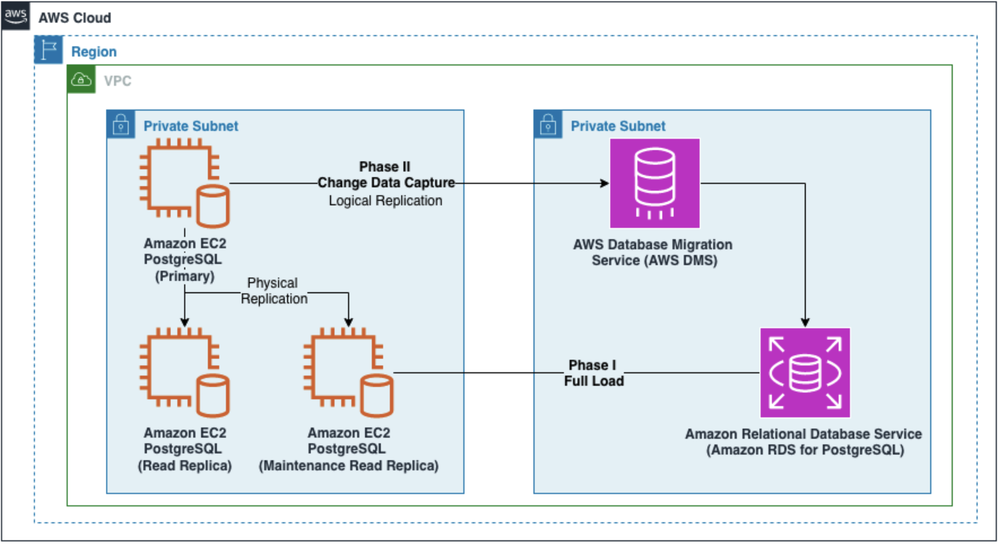
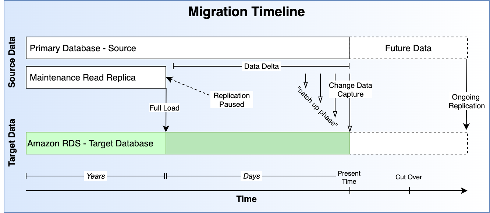
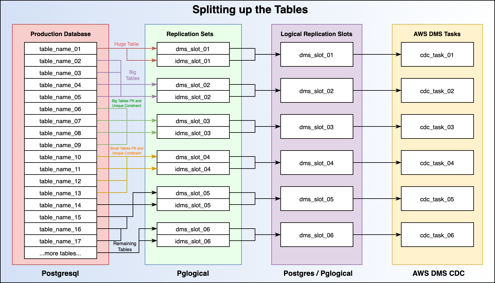

---
authors:
- Lucas Ward, Wanchen Zhao
tags:
- Cloud
- AWS
- AWS Map
- Migration
- DB Migration
date: 2023-08-03T12:21:50.000Z
title: "CallRail Paves the Way for Further Cloud Modernization Efforts by Migrating to Amazon RDS for PostgreSQL"
image:
---

Lucas Ward, DevOps / Cloud Engineer, Ippon Technologies
Wanchen Zhao, Sr. Partner Solutions Architect, DB Specialist, AWS
David Mbonu, Sr. Solutions Architect, AWS

Customers who move to managed databases innovate faster, spending more time building new applications and less time managing infrastructure. Managed databases integrate seamlessly with other services (such as AI/ML, Data Warehouse), reduce database administrative burden, allow migrations without the need to re-architect existing applications, and achieve greater performance, availability, scalability, and security.

[Amazon RDS for PostgreSQL](https://aws.amazon.com/rds/postgresql/) is a fully managed relational database engine that is easy to set up, operate, and provides a scalable relational database in the cloud. It provides cost-efficient and resizable capacity while managing time-consuming database administration tasks, allowing you to focus on your applications and business.

[Ippon Technologies](https://us.ippon.tech/) is an international consulting firm. As an [AWS partner](https://partners.amazonaws.com/partners/0010L00001iWx29QAC/Ippon%20Technologies), Ippon supports the digital transformation of companies and helps their customers accelerate their journey of database migration and modernization.

In this blog, we will share how Ippon assisted a customer’s successful migration from self-managed PostgreSQL to Amazon RDS for PostgreSQL. The migration alleviated the strain caused by substantial workload on the database and unblocked cost savings by eliminated manual database maintenance and management.

# Customer Use Case

[CallRail](https://www.callrail.com/) offers comprehensive return on investment calculations for marketing campaigns through their advanced Call Tracking Products, constituting their primary business application. Additionally, the company possesses a diverse range of capabilities beyond this core service.

CallRail manages several extensive and vital databases, among which is a large database, terabytes in size, previously self-managed by their engineers on [Amazon Elastic Compute Cloud](https://aws.amazon.com/ec2/) (Amazon EC2). As is typical for enterprise workloads, it has a Primary Database, a Read Replica, and then a second "maintenance" Read Replica.

This database is the backbone of several applications, including their primary call tracking database. Every time a phone call was tracked, several data points would move through this database. CallRail needed the ability to perform maintenance in a more predictable and controlled manner while allowing further modernizations efforts, because of these requirements, a migration was pertinent.

# Migration Challenges

The intricacy of the migration arose from three main factors:
* The database in question held the utmost importance for the business, allowing for minimal to no downtime during the migration process. The primary database could not be stopped for any significant period, even for a maintenance window. Furthermore, the secondary (read replica) also could not be stopped. The separate "maintenance" read replica also maintains a strong Disaster Recovery Posture.
* The migration entailed a version upgrade of PostgreSQL v9.6 to PostgreSQL Engine v12. Migrating to v12 added complexity because PostgreSQL native logical replication does not accommodate a skip version migration.
* The sheer volume of data and the immense daily throughput presented obstacles that had to be carefully managed throughout the migration. The database size is approximately 4.5 TB with 10s of billions of rows with a single table being upwards of 1 TB.

# Migration Design and Process

To minimize performance impact and downtime to the primary database, the database was migrated in 2 phases as illustrated below.



**Phase I - Full Load:** Use `pg_dump` and `\copy` to get the bulk of the data transferred from the "maintenance" read replica in a paused state to ensure the consistency of the snapshot. PostgreSQL native APIs for dump and restore is utilized for streamlining the operations and index creation after the initial bulk load. Multiple dumps are run in parallel to maximize the migration throughput, thus reducing the number of changes to capture in the second phase.

**Phase II - Change Data Capture (CDC) with AWS Database Migration Service (AWS DMS):** AWS DMS is a managed migration and replication service that helps move your database and analytics workloads to AWS quickly, securely, and with minimal downtime and zero data loss. Multiple AWS DMS tasks were used to transfer the remaining "data delta" into Amazon RDS PostgreSQL. The "data delta" is simply any data that has come into the database after pausing the "maintenance" read replica. Phase II is performed against the primary database.

The following figure illustrates the migration timeline for the 2 phases discussed above. Once the replication latency becomes zero and the data is validated, engineers perform a cut over to point the application to the target Amazon RDS PostgreSQL.



# Migration Tips and Best Practices

## 1. Leverage a read replica for Full Load

Logical dump is an IO-intensive workload for a database. To minimize performance impact to the production database, it is recommended to use a read replica for the Full Load phase. To ensure a consistent snapshot can be taken from the source database, pause the "maintenance" read replica to capture the Log Sequence Number (LSN) for the replication to start from. Note that once the read replica is paused, it will begin accumulating `xlogs` or `wal_logs` on disk. Be sure to monitor your database system to ensure free space.

## 2. Splitting up the tables to maximize migration throughput

To make the Full Load operation run as fast as possible, split the large database into varied pieces to load in parallel. One way to split the database is according to the size of the tables. For example, take your 5 largest tables and put them each in a separate screen session - running your `pg_dump` commands. Then put all the remaining relatively smaller tables into the 6th screen session and kick them all off at the same time. The table splits are also utilized for creating replication sets and replication slots, as well as AWS tasks accordingly. Each AWS DMS task handles a subset of the replication workloads, which is better in terms of performance, scalability and issue isolation.



It is also recommended to turn on [Amazon RDS Performance Insights](https://aws.amazon.com/rds/performance-insights/) in your Amazon RDS PostgreSQL to monitor potential performance bottleneck, top SQL commands, and how far along the Full Load process is.

## 3. Choose a proper logical replication plugin

AWS DMS supports `test_decoding` and `pglogical` plugins for logical decoding. `pglogical` can perform selective decoding based on the replication scope of an AWS DMS task. In comparison to `test_decoding`, the `pglogical` plugin consumes less network bandwidth, CPU, and I/O during the replication for a use case that just requires replication for selective tables. As shown in Figure 3 above, multiple DMS tasks run in parallel for subset of the tables in each task. Instead of decoding the Write Ahead Log (WAL) entirely for each AWS DMS task, `pglogical` only decodes and transfers the changes per each task scope.

## 4. Verify the LSN to start replication from

The LSN captured before Full Load needs to be verified from the primary database for AWS DMS CDC-only task to run smoothly, otherwise the task fails after 1 hour complaining the LSN cannot be found. Here is an example how to verify if the LSN is valid to start replication from when using `pglogical` plugin.

For PostgreSQL earlier than version 10, run this command on the source database:
```SQL
SELECT location,xid,jsonb_pretty(data::jsonb) FROM pg_logical_slot_peek_changes('dms_slot_01',null, null, 'min_proto_version', '1', 'max_proto_version', '1', 'startup_params_format', '1', 'proto_format', 'json', 'pglogical.replication_set_names', 'dms_slot_01,idms_slot_01') where location >= '{LSN_FROM_MAINTENANCE_READ_REPLICA}' limit 5;
```

For PostgreSQL version 10 or higher, replace location in the above command with lsn.

Be sure to replace `dms_slot_01`, `idms_slot_01` with the name of your replication slots and replication sets. Replace `{LSN_FROM_MAINTENANCE_READ_REPLICA}` with the LSN. If the command returns the details associated with the LSN supplied, then it is a valid position to specify in the AWS DMS CDC-only task. If the output does not contain the LSN supplied, then use the next LSN that
is higher than the one supplied.

## 5. Properly handle large objects (LOB)

When performing Change Data Capture (CDC) with AWS DMS, tables with LOBs are handled according to [the LOB handling mode setting](https://docs.aws.amazon.com/dms/latest/userguide/CHAP_Tasks.LOBSupport.html). It is recommended that you use limited LOB mode whenever possible for performance and effective resource utilization of the AWS DMS replication instance.

To set limited LOB mode properly, first, output a list of tables that contain LOBs. More importantly, for each table that has LOBs, a value is required, in kilobytes, of the largest possible LOB for that table. In addition, validate if there are any tables where LOB truncation is acceptable. If not, use [table-level LOB setting](https://docs.aws.amazon.com/dms/latest/userguide/CHAP_Tasks.CustomizingTasks.TableMapping.SelectionTransformation.Tablesettings.html#CHAP_Tasks.CustomizingTasks.TableMapping.SelectionTransformation.Tablesettings.LOB) with inline LOB mode. Note that only the tables with primary key or unique key can be replicated with LOBs.

If a LOB that is bigger than the size specified by the limited lob mode setting, and the table does not have a special table-setting for LOBs in the table mapping, then the following warning will be generated.

```bash
[SOURCE_CAPTURE ]W: Value of column 'column_name_001' in table 'schema.table_name_001' was truncated to 131072 bytes, actual length: 143687 bytes (postgres_pglogical.c:2550)
```

## 6. Improve CDC latency with batch apply

Besides running AWS DMS tasks in parallel, AWS DMS provides a [task-level setting](https://docs.aws.amazon.com/dms/latest/userguide/CHAP_Tasks.CustomizingTasks.TaskSettings.ChangeProcessingTuning.html) `BatchApplyEnabled` to minimize the changes to apply to the target using batches. `BatchApplyEnabled` is useful if there is high workload on the source DB, and a task with high target CDC latency.

It is important to note that for AWS DMS batch apply to work properly, the table must have a primary key or a unique key (if no primary key exists), and no other unique constraints on other columns. If a table has both primary key and unique constraints on other columns, missing data in the target database would occur during replication. Ensure to disable `BatchApplyEnabled` for these types of tables.

## 7. Monitoring during replication

As a managed services, Amazon RDS PostgreSQL and AWS DMS provide rich monitoring tooling and services, including [Amazon CloudWatch](https://aws.amazon.com/cloudwatch/) metrics and logs, [Amazon RDS Enhanced Monitoring](https://docs.aws.amazon.com/AmazonRDS/latest/UserGuide/USER_Monitoring.OS.html), [Amazon RDS Performance Insights](https://docs.aws.amazon.com/AmazonRDS/latest/UserGuide/USER_PerfInsights.html), [AWS DMS control tables](https://docs.aws.amazon.com/dms/latest/userguide/CHAP_Tasks.CustomizingTasks.TaskSettings.ControlTable.html).

For monitoring replication progress and issue resolution:
* Monitor replication log for AWS DMS tasks from Amazon CloudWatch. Search for log signatures annotated with E: and W:. Use [Amazon CloudWatch Logs Insights](https://docs.aws.amazon.com/AmazonCloudWatch/latest/logs/AnalyzingLogData.html) to interactively search and analyze your replication log.
* Monitor Amazon CloudWatch metrics `CDCLatencySource` and `CDCLatencyTarget` for replication latency of AWS DMS tasks. Monitor `CPUUtilization`, `FreeableMemory`, `SwapUsage`, and `FreeStorageSpace` of the AWS DMS replication instance for resource utilization.
* Monitor [AWS DMS control tables](https://docs.aws.amazon.com/dms/latest/userguide/CHAP_Tasks.CustomizingTasks.TaskSettings.ControlTable.html), especially `awsdms_status` and `awsdms_apply_exceptions` for replication status and issues. For example, if the LOB truncation occurs to a JSON column, besides a warning in the replication log as the log example above, an entry with the timestamp, the SQL statement failed, and the error message is recorded by AWS DMS control table `awsdms_apply_exceptions`. Choose to back fill the correct JSON from the source table to the target accordingly.

## 8. Plan for migration disaster recovery

Best practices dictate the need to plan for worst-case scenarios. As such, the following migration disaster recovery options are advised:
* Resume from a failed task. This is useful when the issue is intermediate, and the WAL stopped or failed at is still available in the source database.
* Partial restart. This is useful when only a small set of the tables fails to replicate but is not able to resume. Using `pglogical` and AWS DMS, it is feasible to migrate a slice of the database.
* Full restart. This is the last resort of the recovery attempt. Preserve the failure state and conduct a root cause analysis before restarting from fresh.

Besides the above, doing a dry run prior to the actual production migration will be helpful to find any unforeseen issues and fix them in advance.

# Conclusion

By partnering with Ippon and AWS, CallRail was able to realize numerous benefits. The successful migration of CallRail's final database to RDS marked a significant milestone in their cloud modernization endeavors. Consequently, the company can now proceed with optimizing the same critical database for enhanced operational efficiency. This newfound operational efficiency not only instills a sense of assurance, but also liberates valuable engineering resources, enabling them to focus on other projects.