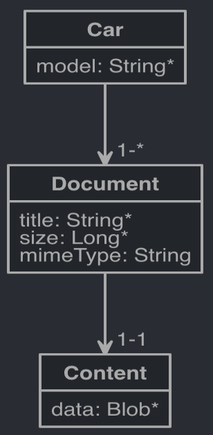
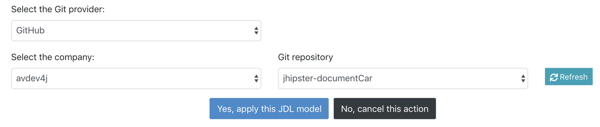
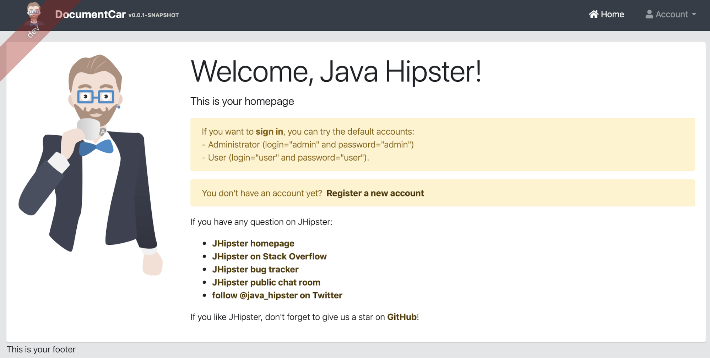
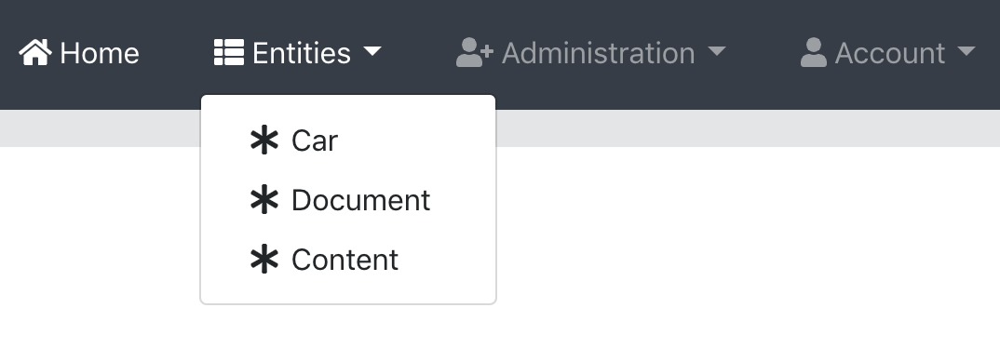
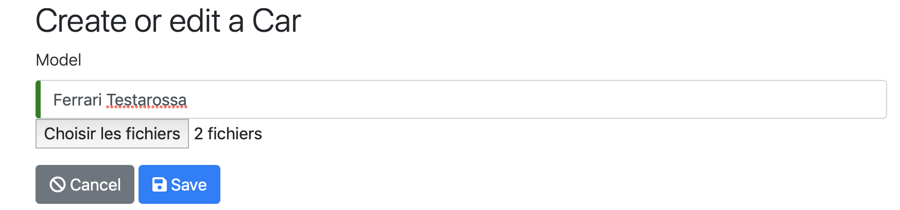
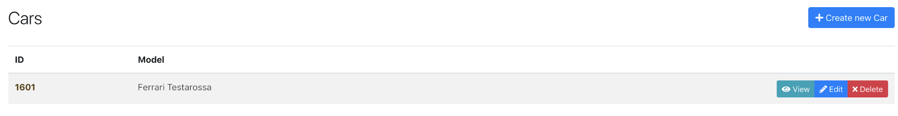
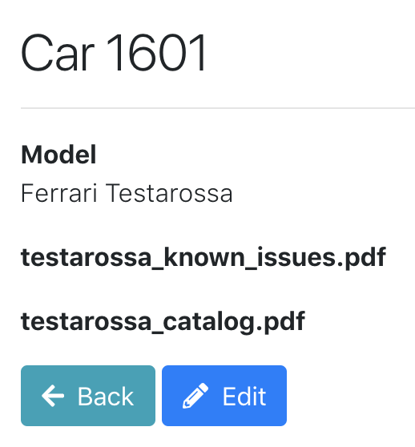

---
authors:
- Anthony Viard
tags:
- JHipster
- File storage
- Binaries
date: 2019-01-10T10:00:00.000Z
title: "Create a simple file storage through database with JHipster"
image: 
---

Hello my fellow hipsters, let me introduce to you a use case from my experience: storing attachments in a database.

This use case matches real situations met in some companies. I wrote this article because some years ago, I faced storage problematics in a tiny web app ; one of the stories was to deal with upload/download files such as .CSV or .XLS. 

The application, in this case a monolith, was deployed on a VM without external access with only 10 users and about 20 files generated per years as you could guess no needs to use the heavy artillery. Now that I'm aware of existence of JHipster bootstrapper, I would have realised it in few days, and I will describe the steps to achieve it easily.

Storing files as a Blob in databases doesn't seem to be the approach you would follow with a large amount of calls and writes and you will probably go for a cloud solution such as Amazon S3 or [Minio](https://www.minio.io/). But in our case we will focus on a simple architecture with no extra components for file storage in reusing the existing database.

The second question could have been wondering between file system or database storage, both have pros and cons: using file system ensures better performance and makes the migration easier but you have more security issue and the file lifecycle to handle. Using a database is more secure and avoids orphan files nevertheless backups are a little bit cumbersome and files should be converted to Blob.

Now I will show you how to quickly build a simple application that can efficiently store binaries. As previously mentioned, we use JHipster to bootstrap the application. The [JHipster Domain Language](https://www.jhipster.tech/jdl/) (JDL) helps you to design (kind of UML editor) our entities. 

Furthermore it provides a way to run our application like if you were in production mode thanks to docker-compose pre-built for you.

To achieve this use case we will generate a JHipster application, bring some modifications to the generated code to tune Hibernate behaviour with attachments and update Angular components to manage file upload through multipart form.


# Use case: Car technical documentation

Our client, a car builder, wants us to do a simple application to manage all the car documents his company produces. For the purpose of the article we simplify the use case and imagine that a car is only defined by its name, a document with some metadata and content. A car can have one or many documents, a document can only have one content.

We want to retrieve cars with their document list but content only on demand when downloading them.


# Prepare the application


## Generate the application with [JHipster Online](https://start.jhipster.tech)

JHipster Online is a JHipster generator as a service. You can bootstrap your application without installing the JHipster generator locally. You can also link it with your GitHub/GitLab account and let JHipster Online initialize a new Git repository for you.


Go to[ https://start.jhipster.tech/#/generate-application](https://start.jhipster.tech/#/generate-application) and fill out your application and repository name.

	

Generate your application by clicking on « Generate on GitHub » button. After a short moment the application will be created and uploaded to  your new repository. Congratulations!


## Generate the entities with the JDL studio

The JHipster Domain Language will permit us to generate our repositories, entities, REST resources and all the related tests. We just have to define our model and how entities work before importing them into our application.

For this article we will use a simple JDL. Copy/paste it into JDL studio and select « create new JDL model » in the list then click on the save button:


```
entity Car {
  model String required
}
	
entity Document {	 
  title String required 
  size Long required			 
  mimeType String 
} 
 
entity Content {			 
  data Blob required 
} 
 
relationship OneToOne {			 
  Document{content} to Content{document(id) required} 
} 

relationship OneToMany {	 
  Car{document} to Document{car(id) required} 
}
```




## Apply the JDL model to the application

In the manage JDL view ([https://start.jhipster.tech/#/design-entities](https://start.jhipster.tech/#/design-entities)) you have to select your model then click on the apply button.


In the next page you will have to select your repository on which you want to  apply the JDL model.





Applying the JDL model will create a Pull Request on your repository. Merge it and clone the project on your computer.


# Customize the application

To fulfill our client use case, we have to customize the application. Both backend and frontend have to be modified to handle documents through the car creation process and content has to be retrieved only on demand to optimize memory usage and improve performance.


## Backend 


### Modify Car and Document entities

Entities come from JHipster with some Hibernate configuration. We just have to update it according to our performance goal.

By default `@OneToMany` associations are LAZY in Hibernate. That mean that our documents are retrieved only with an explicit call like `car.getDocuments()`. By setting the relationship as EAGER we ask hibernate to retrieve the documents everytime we retrieve a car. As explained at the beginning of this article we always want to display cars and documents together. We are also adding `cascade = cascadeType.ALL` to propagate changes from Car to Document entities. Creating, updating or deleting a car will impact all related Documents.

**Car.java**


```
@OneToMany(mappedBy = "car", cascade = CascadeType.ALL, fetch = FetchType.EAGER)
@Cache(usage = CacheConcurrencyStrategy.NONSTRICT_READ_WRITE)
private Set<Document> documents = new HashSet<>();
```


By default `@OneToOne` relations are EAGER. We don't want to retrieve content everytime we retrieve a document. Why ? Simply because the Content entity handles a Blob that we should load only when needed, for performance issues of course. So we have to set the relation as LAZY. We also add a Jackson annotation, `@JsonIgnore` to prevent a possible lazy loading during deserialization. Like above, adopt a `cascadeType.ALL` strategy.

**Document.java**


```
@OneToOne(fetch = FetchType.LAZY, cascade = CascadeType.ALL)
@JoinColumn(unique = true)
@JsonIgnore
private Content content;
```


In the same entity we also add two new methods addContent() and retrieveContent().  They are wrapper methods to ensure that the Content entity is only handled by the Document one. The Document becomes the only way to access the byte array field and we also can remove Content accessors since they became useless.


```
public void addContent(byte[] data) {
    Content content = new Content();
    content.setData(data);
    content.setDataContentType("not-used"); // the field is generated by JHipster but redundant in our case, we can delete it later
    this.content = content;
}
public byte[] retrieveContent(){
    return content.getData();
}	
```


### Add a multipart endpoint to save a Car with documents 

Add a new class mapper in service/mapper to map MultiPartFiles to Document entities. We can see that we call `addContent()` to map multipart file binaries to our Content entity.

**DocumentMapper.java**


```
package io.github.jhipster.application.service.mapper;

import java.io.IOException;
import java.util.List;
import java.util.Set;
import java.util.stream.Collectors;

import org.slf4j.Logger;
import org.slf4j.LoggerFactory;
import org.springframework.stereotype.Service;
import org.springframework.web.multipart.MultipartFile;

import io.github.jhipster.application.domain.Document;

@Service
public class DocumentMapper {
   private final Logger log = LoggerFactory.getLogger(DocumentMapper.class);
   public Set<Document> multiPartFilesToDocuments(List<MultipartFile> files){
       return files.stream()
           .map((this::multiPartFileToDocument))
           .collect(Collectors.toSet());
   }

   public Document multiPartFileToDocument(MultipartFile file) {
       Document document = new Document();
       document.setTitle(file.getOriginalFilename());
       document.setSize(file.getSize());
       document.setMimeType(file.getContentType());
       try {
           document.addContent(file.getBytes());
       } catch (IOException e) {
           log.error(e.getMessage());
       }

       return document;
   }
}
```


In the web.rest folder JHipster has generated a CarResource.java. Open it and add a new method createCar() - POST /v2/cars. It will be useful for sending our future form with one call.

**CarResource.java**


```
private final DocumentMapper documentMapper;

public CarResource(CarRepository carRepository, DocumentMapper documentMapper) {
   this.carRepository = carRepository;
   this.documentMapper = documentMapper;
}
[...]

@PostMapping("/v2/cars")
@Timed
public ResponseEntity<Car> createCar(@Valid @RequestPart Car car, @RequestPart List<MultipartFile> files) throws URISyntaxException, IOException {
   log.debug("REST request to save Car : {}", car);
   if (car.getId() != null) {
       throw new BadRequestAlertException("A new car cannot already have an ID", ENTITY_NAME, "idexists");
   }

   Set<Document> documents = documentMapper.multiPartFilesToDocuments(files);
   documents.forEach(car::addDocument);

   Car result = carRepository.save(car);
   return ResponseEntity.created(new URI("/api/cars/" + result.getId()))
       .headers(HeaderUtil.createEntityCreationAlert(ENTITY_NAME, result.getId().toString()))
       .body(result);
}
```


Fix the CarResourceIntTest.java by adding the DocumentMapper in the constructor.

**CarResourceIntTest.java**


```
   @Autowired
   private DocumentMapper documentMapper;
   [...]
   @Before
   public void setup() {
       MockitoAnnotations.initMocks(this);
       final CarResource carResource = new CarResource(carRepository, documentMapper);
   [...]

   }
```


### Add code to download the content document

We can add a new car and its documents and retrieve the cars list with their documents but how do we download the content? 

As we did above, the Content entity has a lazy fetching strategy, so we have to force the fetch by adding a new method in the Document repository. To do this we are using `@EntityGraph `from Spring Data JPA, to learn more about this: [Boost the performance of your spring data jpa application](https://blog.ippon.tech/boost-the-performance-of-your-spring-data-jpa-application/).

**DocumentRepository.java**


```
@EntityGraph(attributePaths = "content")
Optional<Document> findOneById(Long id);
```


In the package web.rest.errors add a new exception to handle when a document is not found.


**DocumentNotFoundException.java**


```
package io.github.jhipster.application.web.rest.errors;

import org.zalando.problem.AbstractThrowableProblem;
import org.zalando.problem.Status;

public class DocumentNotFoundException extends AbstractThrowableProblem {

   private static final long serialVersionUID = 1L;
   public DocumentNotFoundException() {
       super(null, "Document not found", Status.NOT_FOUND);
   }
}
```


We said that the Content entity is hidden for other elements than Document, so add a new endpoint in the Document resource to download the content.

**DocumentResource.java**


```
@GetMapping("/documents/{id}/$content")
@Timed
public ResponseEntity<byte[]> getDocumentContent(@PathVariable Long id) {
   Document document = documentRepository.findOneById(id)
       .orElseThrow(DocumentNotFoundException::new);

   return ResponseEntity.ok()
       .contentType(MediaType.parseMediaType(document.getMimeType()))
       .header(HttpHeaders.CONTENT_DISPOSITION, "attachment; filename=\"" + document.getTitle() + "\"")
       .body(document.retrieveContent());
}
```


## Frontend

When we imported the JDL model, JHipster also created the Angular code to have all the CRUD actions for each entity. All entities can be found in the webapp/app/entities folder.

Because we want the car to handle documents we will add uploading and downloading features in the related views.


### Install dependencies

We have to add the file-saver library. File-saver will easily allow us to save our documents to the file system. Open a terminal in your project folder and type :


```
npm install file-saver --save
npm install @types/file-saver --save-dev
```


	


### Add file upload when creating a new car

In the service add a new method to call the multipart car endpoint.


**car.service.ts**


```
public resourceUrlV2 = SERVER_API_URL + 'api/v2/cars';

[...]

createV2(car: ICar, files: FileList): Observable<EntityResponseType> {
   const carMultipartFormParam = 'car';
   const filesMultipartFormParam = 'files';
   const formData: FormData = new FormData();
   const carAsJsonBlob: Blob = new Blob([JSON.stringify(car)], {type: 'application/json'});

   formData.append(carMultipartFormParam, carAsJsonBlob);
   for (let i = 0; i < files.length; i++) {
       formData.append(filesMultipartFormParam, files.item(i));
   }

   return this.http.post<ICar>(this.resourceUrlV2, formData, { observe: 'response' });
}
```


In the update view, add a new multiple upload field in the car create/update form.

**car-update.component.html**


```
<div class="form-group">
   <label class="form-control-label" for="field_model">Model</label>
   [...]
   <input type="file" (change)="handleFileInput($event.target.files)" id="documents" multiple/>
</div>
```


In the controller, modify the save method to call the `createV2()` method when saving a new car.

**car-update.component.ts**


```
files: FileList;

constructor(private carService: CarService, private activatedRoute: ActivatedRoute) {}
[...]

handleFileInput(files: FileList) {
   this.files = files;
}

save() {
   this.isSaving = true;
   if (this.car.id !== undefined) {
       this.subscribeToSaveResponse(this.carService.update(this.car));
   } else {
       this.subscribeToSaveResponse(this.carService.createV2(this.car, this.files));
   }
}
```


Then update the test class by adding FileList and spy the wright method.

	

**car-update.component.spec.ts**


```
it(
   'Should call create service on save for new entity',
   fakeAsync(() => {
       // GIVEN
       const entity = new Car();
       const files = {} as FileList;
       spyOn(service, 'createV2').and.returnValue(of(new HttpResponse({ body: entity })));
       comp.car = entity;
       comp.files = files;
       // WHEN
       comp.save();
       tick(); // simulate async

       // THEN
       expect(service.createV2).toHaveBeenCalledWith(entity, files);
       expect(comp.isSaving).toEqual(false);
   })
);
```


### Add file download when reading a car

In the Document service add a new method to download the content.

**document.service.ts**


```
export class DocumentService {
   [...]
   download(id: number): Observable<Blob> {
       return this.http.get(`${this.resourceUrl}/${id}/$content`, { responseType: 'blob' });
   }
}
```


In the car-detail view add a link for each documents and add a click event to download it.

**car-detail.component.html**


```
<div *ngIf="car">
   [...]
   <dl class="row-md jh-entity-details" *ngFor="let document of car.documents">
       <dt>
           <span>
               <a (click)="downloadDocument(document)">{{document.title}}</a>
           </span>
       </dt>
   </dl>
   [...]
</div>
```


Finally add a `downloadDocument()` method in the car-detail controller and use the FileSave library.

**car-detail.component.ts**


```
import * as FileSaver from 'file-saver';

export class CarDetailComponent implements OnInit {
   car: ICar;

   constructor(private activatedRoute: ActivatedRoute,
               private documentService: DocumentService) {
   }
   [...]
   downloadDocument(document: IDocument) {
       this.documentService.download(document.id).subscribe(file => {
           FileSaver.saveAs(file, document.title);
       });
   }
}
```


# Start the application

JHipster provides all you need to start our application. According to the README.md file, generated in your project folder, you have to open a terminal and type:


```
./mvnw
```


After a moment our application is running:


```
----------------------------------------------------------
        Application 'documentCar' is running! Access URLs:
        Local:          http://localhost:8080/
        External:       http://192.168.43.52:8080/
        Profile(s):     [dev, swagger]
----------------------------------------------------------
```





Congratulations Hipster, your application is running!


## Create a new car with documents

After logging in to the application you can access the menu "entities".





Click in the car menu to access all the cars where you can create, edit/ view and of course delete a car. Because we want the car to be the only entry point to manage our documents we'll ignore Document and Content entities.


Then click on the "Create new Car button", fill in the form and save.




You will be redirected to the list where you can see the newly created car.





By clicking on the "View" button we are able to validate all the acceptance criteria by looking at the SQL logs.


```
select car0_.id as id1_0_, car0_.model as model2_0_ from car car0_
select documents0_.car_id as car_id5_2_0_, documents0_.id as id1_2_0_, documents0_.id as id1_2_1_, documents0_.car_id as car_id5_2_1_, documents0_.content_id as content_6_2_1_, documents0_.mime_type as mime_typ2_2_1_, documents0_.jhi_size as jhi_size3_2_1_, documents0_.title as title4_2_1_ from document documents0_ where documents0_.car_id=?
```


As you can see the Content table is not requested and we have not loaded the binaries as expected. If we do it twice, we can see that there are no more SQL logs because JHipster has already set a [cache](https://www.jhipster.tech/using-cache/) for us and all cars and documents are loaded from it. 


## Download the content

When we clicked on the "View" button we saw the car model and the documents. By clicking on the document name we should be able to download them.




What about SQL logs now?


```
select document0_.id as id1_2_0_, content1_.id as id1_1_1_, document0_.car_id as car_id5_2_0_, document0_.content_id as content_6_2_0_, document0_.mime_type as mime_typ2_2_0_, document0_.jhi_size as jhi_size3_2_0_, document0_.title as title4_2_0_, content1_.data as data2_1_1_, content1_.data_content_type as data_con3_1_1_ from document document0_ left outer join content content1_ on document0_.content_id=content1_.id where document0_.id=?
```


Document and Content tables are requested as expected. The cache is not used here and the SQL request is sent at every call.


# Run with Docker in production mode

JHipster will make this step easier than expected as the generated application already comes with Docker and Docker Compose configurations. Beware! To complete this step you need Docker running on your computer. 

Shutdown your local application instance, open a terminal in the main application folder, and build a Docker image for the application.


```
./mvnw package -Pprod verify jib:dockerBuild
```


Then start the application with docker-compose.


```
docker-compose -f src/main/docker/app.yml up
```


And that's all, you can now play with your application by adding cars and documents, and of course downloading them.


# Going Further

What to do next? 

Learn more about performance tests with Gatling, e2e tests with protractor or simply unit tests for both frontend and backend. All these kinds of tests are handled by JHipster and you can read more about it here: [https://www.jhipster.tech/running-tests](https://www.jhipster.tech/running-tests/). 

Clean up the unnecessary code (an important part of Content and Document) and tests related to that. We also should use [DTO](https://www.jhipster.tech/using-dtos/)s instead of directly using entities in the Web Resource layer.

And by the way, you can set up your continuous integration with a JHipster sub-generator as explained here: [https://www.jhipster.tech/setting-up-ci](https://www.jhipster.tech/setting-up-ci).


# Conclusion

During this article we have generated an application, a model, pushed them into a GitHub repository, generated all classes, configurations, unit tests etc… We also coded a little to fine tune the generated application to fulfill our customer's needs. Finally we were able to run it in production mode with Docker and all the configuration brought by Jhipster.

JHipster brings us all the things we need to start our project quickly and run it in both development and production mode. Also the philosophy around JHipster is to bring to the developer the good practices and a performant bootstrapped application, and this can be verified with this use case.

Now your application is production ready, take a break and drink a coffee like a real hipster.

All feedback is appreciated, feel free to [contribute](https://github.com/jhipster/generator-jhipster/blob/master/CONTRIBUTING.md) to the JHipster project! Thank you for reading this article and, I hope to see you next time for a new adventure with JHipster!')


# Resources

JHipster: [http://jhipster.tech](http://jhipster.tech)

JHipster-online: [https://start.jhipster.tech](https://start.jhipster.tech)

FileSaver: [https://www.npmjs.com/package/file-saver](https://www.npmjs.com/package/file-saver)

My Document Car project on GitHub: [https://github.com/avdev4j/document-car-mysql](https://github.com/avdev4j/document-car-mysql)
