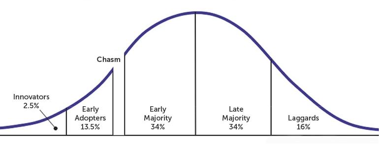

## Summary 
In this article we will explore the possible impacts and benefits of personal data ownership ( aka personal data stores) and decentralized digital identity ( aka verified credentials ) within banking and finance.  Are there benefits to customers if banks integrate with these personal data stores?  Are there benefits to banks themselves if they undertake these integrations?  How likely are these data stores to reach a tipping point of adoption? 

# Distrubuted Personal Data Stores and Verified Credentials: Potential Opportunities in Finance?

Various corners of the internet envision a future in which users own and control the content they create online.  These visions go by a variety of names such as Personal Data Stores, Trusted Digital Web, Self-Sovereign Identity, Verified Credentials, and more.  Here we will indelicately lump all of these concepts under the general umbrella of 'distributed personal data stores' to indicate both that 1) the data is user owned and that 2) the data is architecturally distributed across many locations.  There are a variety of projects that implement some version of this user controlled data paradigm.  These solutions are variously built using peer-to-peer technologies, assorted cryptography, and blockchain to provide access control and immutability.  The standards for achieving these solutions are beginning to take shape.  As the ecosystem develops they may offer opportunities to address financial customer's privacy concerns and create more personalized banking experiences.

## Context
According to [a 2020 Harvard Business review article](https://hbr.org/2020/01/why-companies-make-it-so-hard-for-users-to-control-their-data) 'A [2019] IBM study found that 81% of consumers say they have become more concerned about how their data is used online'. According to that same [2019 IBM study](https://www.axios.com/consumers-kinda-sorta-care-about-their-data-3292eae9-2176-4a12-b8b5-8f2de4311907.html), 89% say technology companies need to be more transparent about their products.  However, 71% are willing to accept a loss of privacy for the benfits of technology.  And only 30% of the survey group were aware of data breaches that have occurred.  The HBR article calls this a '“privacy paradox” where users’ concerns aren’t reflected in their behaviors'. 

While people are concerned about their privacy, there are also more reasons that ever to be concerned.  According to the [2020 World Economic Forum 'Reimagining Digital Identity'](https://canada-ca.github.io/PCTF-CCP/docs/RelatedPolicies/WEF_Digital_Identity.pdf)
> The digital revolution has also brought with it new forms of fraud, identity theft and misuse or abuse of personal data. Cybersecurity incidents have become a pervasive and seemingly permanent threat to personal data privacy, threatening the foundations of trust on which society functions. 

In a world where people are concerned about how their data is used, cybersecurity breaches are pervasive, but people will trade privacy for the benefits of technology; how can banks offer more personalized experiences to their customers?  Against the backdrop of this customer sentiment, Tim Berners-Lee has been working on the high profile Solid Platform which promises both transparency in how data is used as well as creating interoperability that permits new experience. And [in 2019 the W3C recommended a specification for 'Verified Credentials'](https://www.w3.org/standards/history/vc-data-model) which aims to create a system of verification to permit authorization for these decentralized records.

## Solid
The Solid Platform was started by Tim Berners-Lee, a founder of the modern web, in 2015 with a grant from Mastercard to MIT.  Berners-Lee's and team began updating the W3C specifications in 2018 to include the use of a distributed personal data store ([source: wikipedia.org](https://en.wikipedia.org/wiki/Solid_(web_decentralization_project))).  The Solid Project calls these distributed data stores 'pods'.  "Pods are like secure personal web servers for data. When data is stored in someone's Pod, they control which people and applications can access it." ([source: SolidProject.org](https://solidproject.org/) Access to data in a pod is controlled through a decentralized extension of OpenId Connect which itself is an API friendly identity layer on top of the OAuth 2.0 protocol.  With these pieces the Solid specification allows the owner of data to make specific allowances for other organizations to access that data. A reasonable metaphor would be when your browser asks if you want to share your location information with a website. In the case of personal data stores [a physician could ask if you want to share your medical history](https://www.rsa.com/en-us/blog/2021-07/verifiable-credentials-the-key-to-trust-on-the-next-web) or a bank would ask if you wanted to share your tax returns.

The solid server project has around 70 github contributors.  Other projects which are listed as in the early adopter or early majority phase on ThoughtWorks or The Cloud Native Computing Foundataion have between 100 and 300 contributors in a sample of about 20 projects.  As far as the adoption curve is concerned, this places the work in the innovators phase of the adoption curve.  

## Verified Credentials

The W3C Verified Credentials works with the Solid Platform to provide a decentralized layer of trust.  They focus on the storage and retrieval of 'claims' about identity that enable 'authorization'.  In the decentralized web, all this would still be stored on decentralized user controlled pods. For instance, a claim could be added by the government which includes a credential to drive.  This would authorize you to drive a car.  This decentralized Verified Credentials approach has attracted the attention of large groups such as OWSAP, RSA, and the UK NHS as a solution to the growing problem of data breaches.

The W3C site for Verified Credentials lists [13 different implementations of the specification](https://w3c.github.io/vc-test-suite/implementations/), these are not all fully compliant and they use a variety of methods for verification.  [Microsoft also has an implementation of the specification](https://docs.microsoft.com/en-us/azure/active-directory/verifiable-credentials/decentralized-identifier-overview) that they claim is fully compliant.

## Use Cases
To date, distributed stores have seen a few use cases implemented within finance and a few important pushes by influencers. The primary use cases implemented thus far of interest to banking fall into two categories.  1) customer convenience and 2) personalized customer experience.  Both these categories of use case are enabled by the concept of interoperability.  [explain concept]. Presumably this same interoperability is what would enable what [Berners-Lee described as ](https://thenewstack.io/sir-tim-berners-lees-solid-protocol-puts-data-back-in-the-control-of-the-end-user/)
'a more complex financial profile that could help bank the unbanked.' And the same interoperability that will enable "(improving their [the customer] experiences access the digital context)[https://canada-ca.github.io/PCTF-CCP/docs/RelatedPolicies/WEF_Digital_Identity.pdf" as described in a World Economic Forum paper from Janurary 2020. 
 
The solid project has been used by groups such as the NatWest Bank and the BBC to provide more personalized experiences for customers [(source: Inrupt.com](https://inrupt.com/solid-enterprise-natwest-bbc). The NatWest integration in particular
> .. demonstrated how a customer could use Solid-powered applications from  different organizations to change their name or register a business. Since all the apps write data to the user’s NatWest Pod, changes only need to be made once. And they could even receive new offers based on their newly recorded “life moment”.

[An example of using decentralized customer information to improve customer convenience](https://hbr.org/2020/01/why-companies-make-it-so-hard-for-users-to-control-their-data) comes from India.
> 'Many Indian banks are taking this forward by preparing to give consumers access to their financial data so that they can directly share it to apply for credit, investment products, or insurance, bypassing the credit ratings agencies as gatekeepers or the lack of credit histories as barriers. This initiative will use third-party mediators and is backed by the country’s central bank.'

For verified credentials, which in some sense is a subset of decentralized personal data storage, [the Verifiable Credentials W3C specifications](https://www.w3.org/TR/vc-use-cases/#finance) point to several interesting use cases.  For instance, they describe the reuse of 'Know Your Customer' checks in which the 'Know Your Customer' check from one bank can be used by a second bank to verify the customer.  They also describe that the customer could move these verifications to a new verification provider.  Early implementations for Verified Credits seem to focus on health care applications with [RSA partnering with the UK NHS for the sharing of health information](https://www.rsa.com/en-us/blog/2021-07/verifiable-credentials-the-key-to-trust-on-the-next-web).  

https://www.w3.org/TR/vc-data-model/#data-schemas
https://solid.github.io/specification/

## Ecosystem and Conflict

- [mozilla](https://blog.mozilla.org/netpolicy/2020/08/06/by-embracing-blockchain-a-california-bill-takes-the-wrong-step-forward/)
  - mozilla 2020/8/6 is against some California legislation to pilot a VC system for medical status.  EFF and ACLU of California are also against the bill.

## Disruptor or Opportunity/Conclusion

The personal data store and verified credentials ecosystem is just beginning to take it's first steps.  With the direction of the W3C specifications to promote interoperability there are a few open projects and companies which are gaining the capability to address the issues of data use transparecy, data security, and customer experience.  At the moment VC and personal data stores are not ready for wide scale adoption, but worth familiarizing, investigating use cases, and monitoring implementations.  But these technologies seem like a solution which will continue to develop over the next 2-4 years and provide opportunities for banks to reduce duplication, improve their customer's experience, and also improve data privacy.