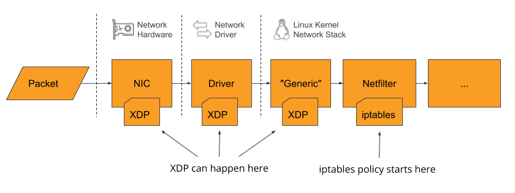

---
authors:
- John Blat
tags:
- Linux
- eBPF
- Kernel Modules
date: 2023-06-16T12:48:33.000Z
title: "eBPF and Kernel Modules - What's the Difference?"
image:
---

Extended Berkeley Packet Filter (eBPF) programs and kernel modules are both processes that can be dynamically loaded into the Linux kernel to extend or modify kernel functionality. Understanding the differences between the two will help in picking the best method to solve a given problem. This is helpful if you need to create your own solution that needs to be implemented in kernel-space, or if you are just interested in delving into kernel programming.

One major difference that will be explored is the safety guarantees of each method. If you don't know what you're doing when writing a kernel module, you can completely crash your system. However, you _need to know what you're doing_ to get an eBPF program to do any real damage[^1].

# Examples of Existing Applications

eBPF programs and kernel modules are all around us. Here are some real-world examples that have components that are either eBPF or kernel modules:

## eBPF programs
- [Katran](https://github.com/facebookincubator/katran): a load balancing  forwarding plane used by facebook that has very fast speeds for processing packets.
- [Cilium](https://cilium.io/get-started/): a networking and security project that provides a CNI (Container Network Interface) for Kubernetes. It does load balancing, network policy enforcement, and network visibility on a logical service/application level (as opposed to an IP Address level).
- [Suricata](https://suricata.io/): a high performance Network Intrusion Detection System, Intrusion Prevention System, and Security monitoring engine.
- [Falco](https://falco.org/) (eBPF driver): a tool for runtime security and visibility.

## Kernel Modules
- Iptables and nftables: can configure the built-in linux firewall
- [OpenZFS](https://openzfs.org/wiki/Main_Page): an advanced filesystem for linux
- [Wireguard](https://www.wireguard.com/): a VPN
- NVIDIA/AMD graphics drivers
- [VirtualBox](https://www.virtualbox.org/): an x86 hardware virtualizer which has host modules that are loaded into the kernel.
- Falco (kernel module driver)
- Various device drivers for mice, printers, and other hardware

# Scope and Use-Cases

eBPF’s scope is primarily intended for Security, Observability, and Networking. Some examples of what an eBPF program can do include, but are not limited to: overwrite parts of the Linux networking stack, make decisions about a network packet before it even reaches the kernel, and keep track of kernel system calls made by other programs.

Kernel Modules are much broader in scope than eBPF. They can do almost anything an eBPF program can do and more. Two domains that Linux kernel modules can be used for that eBPF cannot is in device drivers and filesystems. One reason is that these use-cases require direct hardware access.

There is one situation I have found where a kernel module can not do what an eBPF program can do. Some modern network interface cards (NIC), such as SmartNIC based ones, support running an eBPF program type called [XDP](https://www.tigera.io/learn/guides/ebpf/ebpf-xdp/) that can process packets as soon as the NIC receives the packet and before the packet reaches the kernel network stack. If the NIC does not support running XDP directly, XDP programs can still run on the CPU and still bypass the linux network stack for high-performance processing. To write non-eBPF code that would run on a SmartNIC, a vendor SDK and toolchain would be required, for example the [Netronome Agilio Dev Kit](https://www.netronome.com/products/datapath-programming-tools/). This is not done in a kernel module, this would be compiling code that runs directly on the NIC. In the other situation where programs bypass the linux kernel stack, but not run on the NIC itself, something like [Data Plane Development Kit (DPDK)](https://en.wikipedia.org/wiki/Data_Plane_Development_Kit) would be useful. This is not a kernel module as it runs in user-space.

[Diagram source](https://www.tigera.io/blog/introducing-xdp-optimized-denial-of-service-mitigation/)

With all this being said, the scope of eBPF might expand in the future. In Liz Rice's book _Learning eBPF_, she says that work is currently being done to add hardware device support to eBPF.

# Runtime

The following is a simplified explanation.

When kernel modules are loaded into the kernel, the kernel allocates memory for that program to execute, gives it all the privileges kernel code would get, and keeps a list tracking all kernel module names and locations so that the kernel can initialize and cleanup modules on user requests. Kernel module code runs directly on the CPU, like the kernel does.

eBPF programs on the other hand will run as bytecode inside the eBPF VM, which is a sandboxed subsystem of the linux kernel. The bytecode is Just-in-Time (JIT) compiled into machine code during execution. This is similar to how Java bytecode runs on the JVM. The eBPF Linux subsystem will also keep track of running programs.

# Supported Programming Languages
eBPF programs can be written in any language that has a compiler that can output eBPF bytecode. Currently, at the time of writing, those languages are C, Rust, [BPFTrace](https://github.com/iovisor/bpftrace) and [P4](https://github.com/p4lang/p4c/tree/main).

Kernel modules can be written in C or Rust.

As mentioned, eBPF programs are usually launched with user-space applications. These applications can be written in C, Rust, Go, Python, or any language that has libraries that can load eBPF binaries into the eBPF linux subsystem.

# Development Rigidity
Kernel Modules are very general purpose and can be used to write any type of program. There is no hand-holding or guardrails either.

eBPF on the other hand is very rigid and structured. There are even different specified eBPF program types. Some examples include:
- `BPF_PROG_TYPE_KPROBE`: determine whether a kprobe should fire or not
- `BPF_PROG_TYPE_SCHED_CLS`: a network traffic-control classifier
- `BPF_PROG_TYPE_LWT_*`: a network packet filter for lightweight tunnels
- `BPF_PROG_TYPE_XDP`: a network packet filter run from the device-driver receive path
- `BPF_PROG_CGROUP_DEVICE`: determine if a device operation should be permitted or not  

Each program type will then be restricted on the types of data or functions they are allowed to access since each program is geared towards a narrow domain. To get an eBPF program to compile, it must also pass a verifier check for program correctness and complexity.

# Program Bugs and Safety
## Kernel modules
- Some bugs may have the chance of crashing the entire system. For example, [the infamous NULL pointer dereference](https://www.suse.com/support/kb/doc/?id=000021042)
- [Lack of tighter security boundaries can risk corrupting the kernel or be more vulnerable to exploits](https://ebpf.io/what-is-ebpf/#ebpfs-impact-on-the-linux-kernel)

## eBPF
- The eBPF verifier makes eBPF programming more rigid, but in doing so attempts to detect issues such as:
	- Improper memory access
	- Infinite loops
	- Code-complexity issues such as too large of a program stack (512 byte limit)
- Note: Although one goal of eBPF is to be designed with security in mind and to avoid pitfalls of oversight that can occur in kernel module development, security issues have happened ([CVE-2017-16995](https://bugzilla.redhat.com/show_bug.cgi?id=CVE-2017-16995), [CVE-2020-8835](https://www.zerodayinitiative.com/blog/2020/4/8/cve-2020-8835-linux-kernel-privilege-escalation-via-improper-ebpf-program-verification)) and will likely happen in the future

# Portability Across Kernel Versions
## Kernel modules
- There is a chance that the kernel module will become obsolete or restricted to lower kernel versions if updates are not no longer made on the module. This is because a kernel update can have a change that the kernel module is incompatible with, for example, a dependence on the internal data structures of the kernel that have been updated. For a code example of how programmes get around this, take a look at this sample program, syscall.c in [this section of a kernel module programming guide](https://sysprog21.github.io/lkmpg/#system-calls) and notice the many `if #define`s for different kernel versions necessary for portability.  

## eBPF
- eBPF programs that are compiled with an eBPF developer library that support [Compile-Once Run-Everywhere (CO-RE)](https://facebookmicrosites.github.io/bpf/blog/2020/02/19/bpf-portability-and-co-re.html), will be able to continue to work on kernel updates even if kernel data structures or other aspects of the kernel change. This is because of abstraction layers and the design of eBPF libraries taken when building the eBPF program as well as abstraction layers present in the run-time.
- One thing to note is that there are eBPF development libraries that do not take advantage of CO-RE. One such library is BCC, which is a library that many eBPF programmers start in because of the greater simplicity.
- Production projects will be more incentivized to write eBPF programs using the more complex, but more portable CO-RE libraries. One CO-RE library is [libbpf](https://github.com/libbpf/libbpf) for C.

A takeaway from this is that development of eBPF programs and the linux kernel can be developed independently of each other, whereas a kernel module is very dependent on linux kernel development updates.

# Learning More
## eBPF
To learn about eBPF development, I would recommend starting with the BCC Python library. This is a user-space library that compiles and runs eBPF C programs. It can be installed by following [these official instructions](https://github.com/iovisor/bcc/blob/master/INSTALL.md).

To write a simple hello world program, [this article](https://rdelfin.com/blog/post_ebpf_002) should get you started. You can ignore the installation instructions as following the official BCC install instructions mentioned above will suffice. If you run into macro redefinition errors while going through this article, you can reference [this github issue](https://github.com/iovisor/bcc/issues/3366#issuecomment-1258054405).

If you want to go deeper into advanced topics, I recommend the book [Learning eBPF by Liz Rice](https://isovalent.com/learning-ebpf/)

## Kernel Modules
To learn about kernel module development, [this guide](https://sysprog21.github.io/lkmpg/) is very useful. It provides a simple hello world program at the beginning and then delves into more advanced topics.

# Conclusion
Although eBPF is more rigid and provides fewer use-cases than kernel modules, it is generally easier to work with as there are higher-level libraries for interacting with kernel functionality than kernel modules do. It may be a good option to go with eBPF if the kernel you're working with supports the needed eBPF features (eBPF features are constantly being updated and may not be supported by older kernel versions) and if your use-case involves Networking, Security, or Observability. If your use-case is outside of that, you will probably have to stick with kernel modules for now. Time will tell if eBPF starts including more features to overtake use-cases that were traditionally reserved for kernel modules.

In a cloud-native world, having eBPF applications running on your infrastructure can have large benefits such as having better support for application-first networking and firewall rules, and increased performance in rewriting underlying network rules as workloads and services come and go. eBPF allows developers to create more complex applications at a faster speed and more independence from the kernel itself.

If you would like help installing an eBPF application like those [mentioned above](#examples-of-existing-applications) or are interested in migrating to eBPF drivers for existing networking solutions like Calico, get in touch with us at contact@ippon.tech

[^1]: While it's still possible to introduce bugs or cause unintended effects with eBPF, the scope for serious damage is much less than with a kernel module. The main idea with this statement, is that you, the programmer, will most likely need to _try_ to exploit an eBPF program. In a kernel module, you can unintentionally shoot yourself in the foot without even trying.

