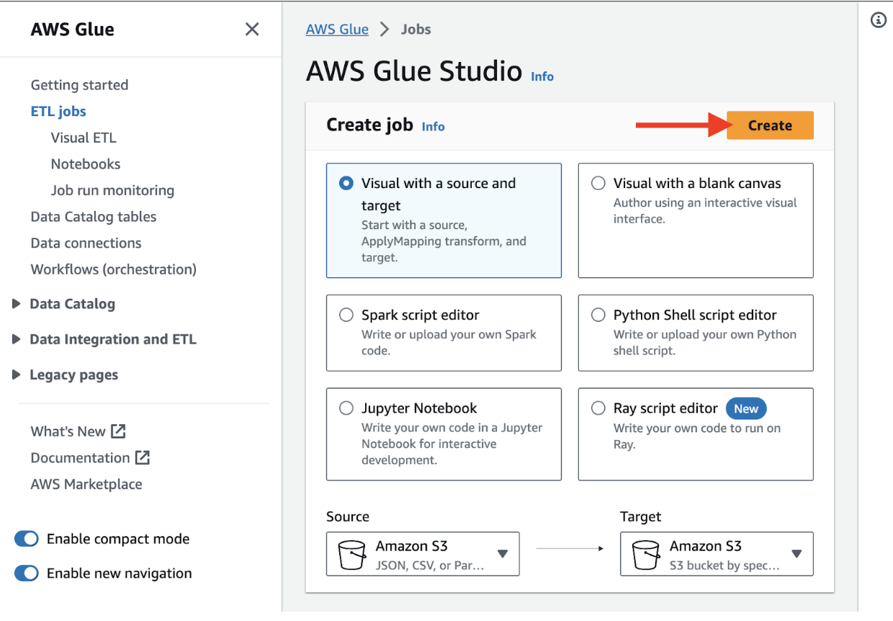
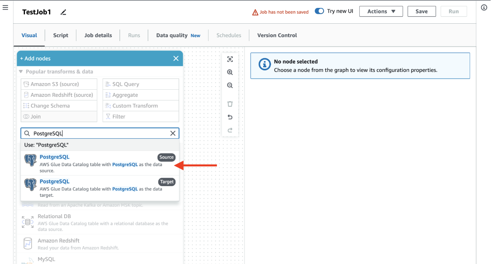
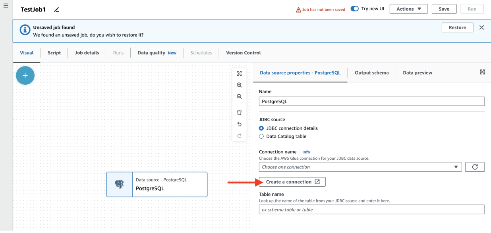
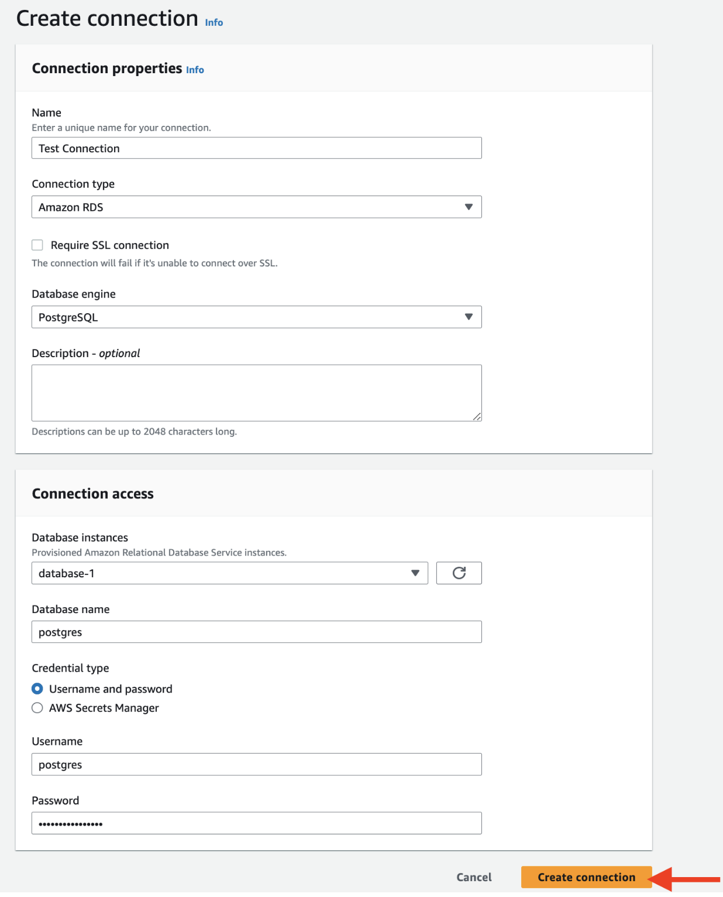
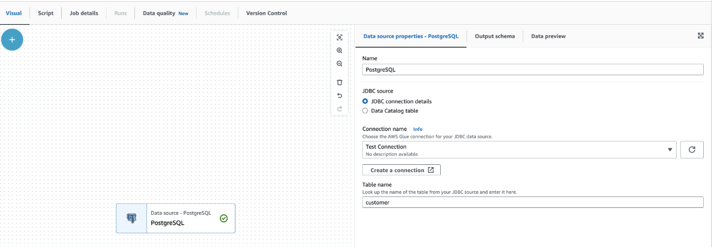

---
authors:
- Noah Shaw
  tags:
- AWS
- AWS Glue
- DevOps
  date: 2023-09-08
  title: "Effortless Data Ingestion with AWS Glue: From Databases to Data Warehouses"
  image:
---

It is common knowledge that data is the driving force behind pivotal business decisions every day. However, with data sets growing as a result of every business event, managing this data and discovering the most critical bits can be daunting. This is where AWS Glue can help by utilizing common capabilities for uncovering potentially undiscovered insights across multiple streams.

AWS provides an encompassing Glue landscape where users can leverage technology to not only uncover data but also gain valuable insight to guide decisions and strategy. With numerous ways to leverage these capabilities, users from both technical and non-technical backgrounds can drive this effort forward. This article will discuss how to get started ingesting some common data streams with a non-technical approach, thus setting you on the course to make better-informed decisions for your business.

# Common Input Streams
Data resides in a myriad of locations. Below are a few popular data sources that can be leveraged in AWS Glue with no coding expertise needed.

- **Databases**: Data is at the core of every business, and what better way to store that data than a database? AWS Glue is capable of connecting to multiple database engines, such as MySQL, PostgreSQL, DynamoDB, and many more.
- **Amazon Simple Storage Service (S3)**: A common place for data storage and archiving. S3 is another popular data storage option with which Glue can integrate seamlessly.
- **Snowflake**: A popular cloud-based data warehousing platform that provides powerful data storage, processing, and analysis capabilities. Coupled with AWS Glue, it can create a robust data integration solution.
- **Apache Kafka**: A distributed streaming platform commonly built to process real-time event-driven data, representing another possible data ingestion point for AWS Glue.
- **Kinesis**: A suite of AWS services that simplify the process of collecting and streaming data in real-time, all of which can be consumed by AWS Glue.
  
The examples above only capture a few of the possible data ingestion points that Glue can utilize. Be sure to check to see if Glue has an out-of-the-box connection for any of your data ingestion streams of interest in the [AWS connection catalog](https://docs.aws.amazon.com/glue/latest/dg/glue-connections.html).

# Why Leverage Multiple Input Streams?
Each piece of data represents a snippet of what makes your business special. By treating each input as a valuable source of information, AWS Glue can significantly enhance the flexibility, efficiency, and performance of your data processing capabilities. Utilizing multiple input streams will empower you to harness the full potential of your data, creating a versatile, efficient, and cost-effective data integration process that can adapt to the dynamic needs of your organization's complex data ecosystem.

# Getting Started with AWS Glue Visual ETL (Extract, Transform, and Load)
AWS glue provides a visual interface designed for creating [ETL jobs](https://aws.amazon.com/what-is/etl/#:~:text=Extract%2C%20transform%2C%20and%20load%20(,and%20machine%20learning%20(ML).). This interface enables users to build ETL workflows utilizing a graphical representation of the data transformation process. These visually composed workflows can be run on AWS Glue’s Apache Spark-based ETL engine, allowing you to inspect the data each step of the way.

To get started, navigate to AWS Glue Studios and create a job using the visual editor as shown.

At this point, you should be greeted by a graphical representation of your Glue job. You can remove any boilerplate connections and provide any necessary job details before moving forward. Once ready, select the “add nodes” icon and search for the associated source you want to explore.

## Example: Creating a PostgreSQL Connection
Utilize the Add nodes dropdown search to find PostgreSQL. Using the auto suggested connections select the Source option as shown.

Once you’ve added the node, you can add the details associated with your connection. For PostgreSQL (similar to many other database engines), you have the option of providing the [JDBC connection](https://docs.aws.amazon.com/glue/latest/dg/connection-properties.html#connection-properties-jdbc) details or selecting a database catalog table. For the sake of this article, we will select the JDBC connection details and create a connection ourselves, utilizing the AWS “create a connection” wizard.

On the next page, provide the details associated with your unique connection. The below screenshot shows an RDS connection, which may differ based on your current setup.

Once you’ve provided the necessary details of your data source and selected it in the visual editor, you’ll be one step closer to transforming your business's datasphere.

# Building on This Process
The process of selecting the associated node and providing the details for your specific connection can be repeated as many times as you’d like inside of a Glue job. As you are building out your connections graphically, you will find a similar experience with all of the available input options. As you set up these inputs, you’ll quickly realize that this is only the beginning of your data discovery journey. With the skill of Glue job creation under your belt, you’ll be on your way to streamlining the process of preparing and transforming your businesses' data.

# Conclusion
AWS Glue empowers businesses by demystifying the ETL data process, making it accessible to technical and non-technical team members alike. With its user-friendly interface and automated data extraction capabilities, Glue allows users to load and transform an exorbitant volume of data without the need for extensive coding expertise. This accessibility ensures that data-driven decision-making is achievable in every corridor of business. Glue’s inherent integration with other AWS services, coupled with its approachable build tool, has enabled hundreds of businesses to harness the full potential of their data. Get started on realizing the potential of your business's data today!

Need help with your complex data landscape? Want to learn more about the power of AWS Glue? Ippon can help! Reach us at [contact@ippon.tech](contact@ippon.tech).
