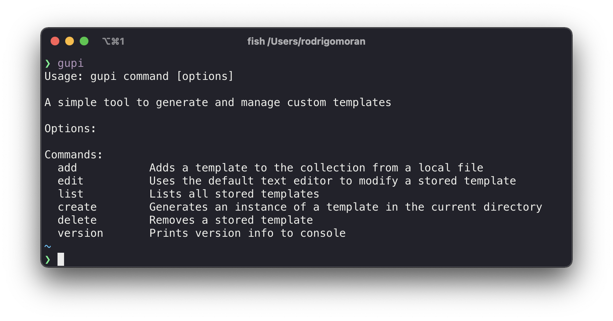

```
---
authors:
- Rodrigo Moran
tags:
- Golang
- CLI
date: 	2021-12-01T13:50:040Z
title: "A No Framework Approach to Building A CLI"
image:
---
```
# No Framework Approach to Building A CLI with Go

In this guide we will be building a CLI tool from scratch. No fancy frameworks or libraries instead we are building own highly minimal framework *loosely* based on [Cobra](https://cobra.dev/).

Here's a taste of what we're building: **:fish: gupi**



| :zap: Disclaimer: Popular CLI frameworks exist for every language, for most cases you're better off picking your favorite flavor and going with that. |
| ------------------------------------------------------------ |

Although if you've ever wondered how CLI Frameworks do what they do then read on. There are plenty of reasonable use cases for DIY tools, for a practical example look at Hashicorp (*Terraform, Nomad*). Most if not all their CLI products use [cli](https://github.com/mitchellh/cli) a Go CLI Framework developed by the founder.

Cobra which I briefly name dropped above is argubably the best and most popular CLI Framework for Go. It is trusted by the Kubernetes and Docker community (**Kubectl** & **Docker CLI**) among many more notable projects: *Helm, Etcd, Istio...*

Cobra has a deceptively simple API, for example here is a snippet directly from it's developer page:


This defines a single command *hello*, accepts a list of strings as arguments, and defines the logic to execute the command. The goal for this guide is to create a CLI with a similar look and feel.

Here is the agenda for building **:fish: Gupi**:

1. [Defining the requirements](#Defining-the-requirements)
2. [Initializing the CLI](#Initializing-the-CLI)
3. [Creating the Command struct](#Creating-the-Command-struct)
4. [Wiring up components](#Wiring-up-components)
5. [Adding subcommands](#Adding-subcommands): Add, Edit, List, Delete, Create, Version
6. [Putting it all together](#Putting-it-all-together)

Step 0: Make sure to have Go installed, see the official docs for the latest install instructions - [Go Install](https://go.dev/doc/install).

You view the full source while following along at [Gupi](https://github.com/phantompunk/gupi).


### Defining the requirements

Keep in mind what we are building does not matter as much as *how* we are building it. It could easily be adapted to do whatever you need.

**:fish: Gupi** will be able to add, edit, list, delete and create templates. The commands or features will be defined as follows:

- *Add*: Adds an existing template to the collection via a local file

```shell
$ gupi add -f /path/to/template.md TEMPLATE_NAME
Template 'TEMPLATE_NAME' was added
```

- *Edit*: Uses the default text editor to modify a stored template

```shell
$ gupi edit TEMPLATE_NAME
Template 'TEMPLATE_NAME' was edited
```

- *List*: Lists all stored templates

```shell
$ gupi list
NAME               CREATED       SIZE
todo-list	      	2 weeks ago   482
design-doc        3 days ago    300
```

- *Create*: Generates an instance of a template in the current directory

```shell
$ gupi create TEMPLATE_NAME
Created 'TEMPLATE_NAME' in '/path/to/TEMPLATE_NAME'
```

- *Delete*: Removes a stored template

```shell
$ gupi delete TEMPLATE_NAME
Template 'TEMPLATE_NAME' was deleted
```

- *Version*: Prints version info to the console

```shell
$ gupi version
gupi version: v0.1, build: 893b04957563cd7120f817dd654ba745075cfe6b
```

### Initializing the CLI

The first thing we need to do is create the project directory and initialize it as a Git repository. I'll call this project `gupi`:

```shell
$ mkdir gupi
$ cd gupi
$ git init
```

Go has its own way to manage dependencies by using a `go.mod` file, you can easily enable this on a new project by running:

```shell
$ go mod init github.com/USERNAME/gupi
```

The full path `github.com/USERNAME/gupi` is what others would use to download if you packaged and distributed this module. This is also helpful for importing local files from subfolders.

Next let's create our main entry point called: `main.go`

```shell
$ touch main.go
```

Add a basic print statement to make sure the environment is working:

```go
// main.go
package main

import "fmt"

func main() {
	fmt.Println("Working CLI!")
}
```

We can test this app by running:

```shell
$ go run main.go
Working CLI!
```

We just confirmed we have a working Go project but have no time to celebrate since this doesn't feel like a CLI tool.

One thing that stands out from CLIs like Docker and Kubectl is the informative and friendly user manuals that are displayed by calling the base command.

Essentially what I want is:

```shell
$ gupi
Our awesome CLI with instructions on how to quickly get started using it.
Options:
Commands:
	* Wicked Feature 1 - One wicked feature
	* Cool Feature 2 - Coolest feature by far
	* Practical Feature 3 - The daily driver of features
```

New users should be able to understand what the tool does and how to actually use it. We already clearly defined the main features of our tool so putting together this usage text will be easy.

So based on the features defined above I came up with this, feel free to modify as you see fit:

```go
var usage = `Usage: gupi command [options]

A simple tool to generate and manage custom templates

Options:

Commands:
  add		Adds a template to the collection from a local file
  edit		Uses the default text editor to modify a stored template
  list		Lists all stored templates
  create	Generates an instance of a template in the current directory
  delete	Removes a stored template
  version	Prints version info to console
`
```

Now that we have a base usage message we can update our main function print this to get a feel for the CLI.

```go
// main.go
func main() {
	fmt.Println(usage)
}
```

If we test this app again it will slowly start feeling like a real CLI.

```shell
$ go run main.go
```

We need to add one more thing before moving one. One important aspect of any CLI tool is exit/status codes. Any CLI needs to return **0** when successful and anything greater when an error occurred.

We'll create this `usageAndExit` method prints the usage message and an optional status message.

```go
// main.go
func usageAndExit(msg string) {
	if msg != "" {
		fmt.Fprint(os.Stderr, msg)
		fmt.Fprintf(os.Stderr, "\n")
	}

	flag.Usage()
	os.Exit(0)
}
```

If we update our main method as follows, then test:

```go
// main.go
func main() {
	usageAndExit("")
}
```

You should get this cryptic message after running:

```shell
$ go run main.go
Usage of /var/folders/47/jlb0vvyx0px72mykl96x41xm0000gp/T/go-build235122164/b001/exe/main:
```

Not to worry this just means we are trying to access `flag.Usage()` before setting a usage message. If we update the main method again:

```go
// main.go
func main() {
	flag.Usage = func() {
		fmt.Fprint(os.Stderr, fmt.Sprint(usage))
	}

	usageAndExit("")
}
```

Now it will behave as expected returning the usage message and the correct exit code.

You can confirm by running:

```shell
$ echo $?
0
```

Now that we have defined our commands, we can work on actually creating them.

### Creating the Command struct

First thing we want to define is the base Command Struct.  Each command needs to be able to have its own set of flags and a function defining what to do with those flags. We'll define this struct in a new file `commands.go`

```go
// command.go
type Command struct {
	flags   *flag.FlagSet
	Execute func(cmd *Command, args []string)
}
```

The `flag.Flagset` is just what it sounds like, a collection of flags. These will be defined for each subcommand. Execute is an anonymous function that accepts a Command and an array of arguments. Note: Go treats functions as first-class citizens so we can pass functions as parameters or when defining an instance of a struct. Next, we need a few functions on the Command struct. It needs to:

* Parse and assign flags to its flagset
* Tell if flags have been parsed
* Execute a given function

What those turn into is:

1.  Init()
2.  Called()
3.  Run()

So the full version will look like this:

```go
// command.go
package command

import (
	"flag"
)

type Command struct {
	flags   *flag.FlagSet
	Execute func(cmd *Command, args []string)
}

func (c *Command) Init(args []string) error {
	return c.flags.Parse(args)
}

func (c *Command) Called() bool {
	return c.flags.Parsed()
}

func (c *Command) Run() {
	c.Execute(c, c.flags.Args())
}
```

This way each new subcommand we add will just be of type Command. This will simplify things for the next step as we modify our main method to allow subcommands to be easily added.

## Wiring up components

The main method will be the entry point for all subcommands. We'll achieve this by leveraging to parts: subcommands are Command types and a switch statement.

We need to initialize an empty Command object this we'll be the container for incoming subcommands. New subcommands will be initialized based on the case statement. After the command is initialized we parse the flags and execute the function using the methods we defined earlier. What that begins to look like is this:

```go
// main.go
func main() {
	...
	var cmd *command.Command

	switch os.Args[1] {
	case "version":
		cmd = command.NewVersionCommand()
	default:
		usageAndExit(fmt.Sprintf("gupi: '%s' is not a gupi command.\n", os.Args[1]))
	}

	cmd.Init(os.Args[2:])
	cmd.Run()
}
```

Our subcommands haven't been defined yet but this is essentially what it'll look like, each new command will just get its own case statement.

So now we're at a good point to start building out our subcommands.

## Adding subcommands

We have six subcommands to add but it'll go quickly since each command will follow the same steps:

1. Define a friendly usage message
2. Create the specific new command method
3. Build out the core logic for the function
4. Add a new case statement

We already added the `version` case to the main method so let's start there.

### Add Version command

First, we need to define what the usage message should be, based on the requirements I put this together:

NOTE: I didn't mention this before but the Version command will accept a single flag `--short`, if added the short version of the build info will be printed.

```go
// version.go
var versionUsage = `Print the app version and build info for the current context.

Usage: gupi version [options]

Options:
  --short  If true, print just the version number. Default false.
`
```

Next we need to create the `NewVersionCommand()` which will return a pointer to a Command object.  This is where we will attach the usage message, define the flags, and specify the core logic:

```go
// version.go
func NewVersionCommand() *Command {
	cmd := &Command{
		flags: flag.NewFlagSet("version", flag.ExitOnError),
		Execute: versionFunc,
	}

	cmd.flags.BoolVar(&short, "short", false, "")
	cmd.flags.Usage = func() {
		fmt.Fprintln(os.Stderr, versionUsage)
	}

	return cmd
}
```

As defined in the usage message this command should print the version number, build info and accept a `-short` flag.

```go
// version.go
var (
	build   = "???"
	version = "???"
	short   = false
)

var versionFunc = func(cmd *Command, args []string) {
	if short {
		fmt.Printf("brief version: v%s", version)
	} else {
		fmt.Printf("brief version: v%s, build: %s", version, build)
	}
	os.Exit(0)
}
```

Nothing surprising about the `versionFunc`, it prints a message and exits with an all-clear exit code. What might've caught your eye is the ??? for the build and version variables. Those are meant as placeholder variables that will be overwritten during the build process. This allows us to specify version numbers in a config or dynamically include commit hashes on each build. We'll be using ldflags to do this, I'll go over this near the end. For now, if you want to read more check out [using ldflags to set version flags](https://www.digitalocean.com/community/tutorials/using-ldflags-to-set-version-information-for-go-applications).

One point I glanced over is the `func(cmd *Command, args []string)` type for the `Execute` field. That means `Execute` is an anonymous function that can be passed in at any time or extracted into a separate variable as we did for `versionFunc`. Extracting is not necessary but is helpful for building readable code.

The final step would be adding a case statement to our main method but since we already took care of that we're ready for this command.

Now we can accept subcommands and start testing with and without the `--short` flag:

```shell
$ go run main.go version --short
brief version: v???

$ go run main.go version
brief version: v???, build: ???
```

For now the `???` is fine we'll replace those during the build process later on. At this point we've touched on all the core components of creating a CLI

* Friendly messaging and instructions
* Adding new subcommands
* Adding subcommand specific flags
* Wiring up subcommands together

The next few steps will move faster since we're just repeating the same steps to add more functionality to our CLI.

### Add our Add Command

Next, we'll introduce the functionality to store templates for use. To keep this simple we'll just be keeping a copy of a given template in a specific folder.

As I mentioned we'll just repeat a few similar steps for each new function. I'll start focusing on the repetitive steps and more on the differences. We'll start by defining the usage messaging:

```go
// add.go
var addUsage = `Add a template from a file path or URL.

Usage: brief add [OPTIONS] TEMPLATE

Options:
	--file	path to an existing template file
`
```

Next by creating a new add command method which takes a single flag `--file` :

```go
// add.go
func NewAddCommand() *Command {
	cmd := &Command{
		flags: flag.NewFlagSet("add", flag.ExitOnError),
		Execute: addFunc,
	}
	cmd.flags.StringVar(&filePath, "file", "", "")
	cmd.flags.Usage = func() {
		fmt.Fprintln(os.Stderr, addUsage)
	}

	return cmd
}
```

Now we can focus on the functionality. The first thing we need to do is some error handling and validation. We need to confirm the file we're using as a template actually exists. We also need to confirm the directory for saved templates exists, if not we'll go ahead and create it.

The os package has several useful methods for handling files, paths, and folders. We'll use os.Stat() to determine if a file/folder exists.

The `os` package has several use methods for handling files, paths and folders. We'll use `os.Stat()` to determine if a file/folder exists. Then we'll use the `os.UserHomeDir()` to get the home directory, this will be the base path for our saved templates, the full path will be `USER_HOME/.gupi/templates/`.

```go
// add.go
var addFunc = func(cmd *Command, args []string) {
	if len(filePath) == 0 {
	... // file error handling

	if _, err := os.Stat(filePath); err != nil {
	... // file path error handling

	homeDir, err := os.UserHomeDir()
	... // home dir error handling

	fileDir := filepath.Join(homeDir, ".gupi", "template")
	... // file path error handling; create folder if not exists

	f, err := ioutil.ReadFile(filePath)
	... // file error handling

	file_name := filepath.Base(filePath)
	fileOutPath := filepath.Join(fileDir, file_name)
	out, err := os.Create(fileOutPath)
	... // file error handling

	defer out.Close()

	out.WriteString(string(f))
	fmt.Printf("gupi: Template '%s' was added\n", file_name)
}
```

And we'll use the method `errAndExit()` to handle any errors and return a helpful error message.

```go
// command.go
func errAndExit(msg string) {
	fmt.Fprint(os.Stderr, msg, "\n")
	os.Exit(1)
}
```

Then the final step is to add an `add` case to the switch statement

```go
// main.go
...
case "add":
	cmd = command.NewAddCommand()
...
```

Now you'll need to create a simple template file to test this subcommand, I'll create `test.md`:

```markdown
this is a test template
```

Now you save the template using this subcommand:

```shell
$ go run main.go add --file test.md
```

We should now be able to save templates but how can we confirm it's actually saved. This is where the next command `list` comes into play.

### Add List Command

This command will list all the available templates in the template folder. With this, we can validate the `test.md` template was added successfully. Similar to the add command we'll be relying on the `os` package to manage files and folder paths.

Jumping back to our steps, we'll first define the usage message:

```go
// list.go
var listUsage = `List all currently avaible templates.

Usage: brief list
Options:
`
```

Then create the new list command, this will be simpler than others since it does not use any specific flags.

```go
// list.go
func NewListCommand() *Command {
	cmd := &Command{
		flags:   flag.NewFlagSet("list", flag.ExitOnError),
		Execute: listFunc,
	}
	...
```

So this command needs to list all templates in the specific folder in the user home directory.

We'll use `os.UserHomeDir()` to grab the user-specific home directory then look for the template folder in the app subdirectory.

Finally, we use some basic string formatting for a friendly output.

```go
// list.go
var listFunc = func(cmd *Command, args []string) {
	homeDir, err := os.UserHomeDir()
	... // file error handling

	fileDir := filepath.Join(homeDir, ".gupi", "template")
	file, err := os.Open(fileDir)
	... // file error handling

	filelist, err := file.Readdir(0)
	... // file error handling

	fmt.Printf("NAME\t\tSIZE\t\tMODIFIED")
	for _, files := range filelist {
		fmt.Printf("\n%-15s %-15v %v\n", files.Name(), files.Size(), files.ModTime().Format("2006-01-02 15:04:05"))
	}
}
```

The last step is to add another case in the switch statement

```go
// main.go
case "list":
	cmd = command.NewListCommand()
```

Now we can test this command by running:

```shell
$ go run main.go list
NAME		SIZE		MODIFIED
test.md     24          2021-12-02 00:44:10
```

The next command will allow us to edit any existing templates in terminal.

### Add Edit Command

This next command is fun to use and surprisingly simple to put together. We'll add the ability to edit our saved templates directly from the terminal using your editor of choice. I'll be using Vim as my editor but this could easily be modified into a flag or config variable to be passed in.

The first thing to do is more familiar with error handling, we know where templates live and this command requires a template name so we just have to make sure it all exists as expected.

Then we will define what command will be executed to start the editor. In this case, we will run `vim FILE_NAME`. Before we actually execute the command we need to configure the IO to be sent to our terminal. Along with that some simple error handling in case anything goes wrong along the way.

```go
// edit.go
var editFunc = func(cmd *Command, args []string) {
	...
	if _, err := os.Stat(file_path); err == nil {
		command := exec.Command("vim", file_path)
		command.Stdout = os.Stdout
		command.Stdin = os.Stdin
		command.Stderr = os.Stderr
		err := command.Run()
		if err != nil {
			os.Exit(1)
		}
	}
	fmt.Printf("gupi: Template '%s' was edit\n", file_name)
}
```

Now we can edit the `test.md` template by running:

```shell
$ go run main.go edit test.md
gupi: Template 'test.md' was edited
```

Now lets try to create an instance of this template.

### Add Create Command

This is the most important step. Everything we have done so far has been leading up to this command. Several parts will look familiar especially around file manipulation. One new addition is the use of the `template` package, which enables us to parse templates and inject data into the template. If you've used any sort of templating framework such as Handlebars, Mustache, or Jinja you'll feel right at home.

As before, we first need to do some error handling to make sure all files exist as expected. If it all checks out then we'll use `template.ParseFiles(FILE)` to create a Template object from the actual file. Then, we'll create an empty file with the same name. Finally, we'll use `template.Execute()` to write the data to the newly created open file.

```go
// create.go
var createFunc = func(cmd *Command, args []string) {
	file_name := args[0]

	homeDir, err := os.UserHomeDir()
	... // file error handling

	path := filepath.Join(homeDir, ".gupi", "template", tmp)
	if _, err := os.Stat(path); err == nil {
		date := time.Now()
		data := getDates(date)

		t, err := template.ParseFiles(path)
		... // file error handling

		file_name := args[0]
		f, err := os.Create(file_name)
		... // file error handling

		err = t.Execute(f, data)
		... // file error handling

		currDir, _ := os.Getwd()
		fmt.Printf("Created '%s' in '%s'", file_name, filepath.Join(currDir, file_name))
	}
}
```

You can now create files using templates!

```shell
$ go run main.go create test.md
Created 'test.md' in '/Users/rodrigomoran/Workspace/gupi/test.md'
```

A final command we'll include is the ability to delete existing templates.

### Add Delete Command

Similar to a few other commands we need to validate that the template we plan to remove actually exists. If it checks out then we'll use `os.Remove()` to delete the file from the folder.

```go
// delete.go
var deleteFunc = func(cmd *Command, args []string) {
	if len(args) == 0 {
		... // file error handling

	file_name := args[0]

	homeDir, err := os.UserHomeDir()
	... // file error handling

	filePath := filepath.Join(homeDir, ".gupi", "template", file_name)
	if _, err := os.Stat(filePath); err == nil {
		os.Remove(filePath)
		fmt.Printf("gupi: Template '%s' was deleted\n", file_name)
	}
}
```

Now we can delete our test template by running:

```shell
$ go run main.go delete test.md
gupi: Template 'test.md' was deleted
```

## Putting it all together

Now that we have all the subcommands, we can put them all together into a standalone binary. For that, we'll use the Makefile. If you're not familiar with them, Makefiles were initially used to simplify compiling C programs but they can be used for any language.

The Makefile below includes commands to build, test, and clean.

```makefile
.PHONY: all test clean

user     = phantompunk
binary   = gupi
version  = 0.1.1
build	   = $(shell git rev-parse HEAD)
ldflags  = -ldflags "-X 'github.com/$(user)/$(binary)/command.version=$(version)'
ldflags += -X 'github.com/$(user)/$(binary)/command.build=$(build)'"

all:
	go build -o $(binary) $(ldflags)

test:
	go test ./... -cover -coverprofile c.out
	go tool cover -html=c.out -o coverage.html

clean:
	rm -rf $(binary) c.out coverage.html
```

Before building the binary make sure to update the user variable for your GitHub username.

To build the binary run: `$ make`

```shell
$ make
go build -o gupi -ldflags "-X 'github.com/phantompunk/gupi/command.version=0.0.1' -X 'github.com/phantompunk/gupi/command.build=98b2bf861904efb87b59422f5279735667f65093'"
```

To add the binary to your path run:

```shell
$ go install
```

Make sure you're `$GOPATH` is added to your. `$PATH`

You should then just be able to run:

```shell
$ gupi
```

## :tada: Congrats

You just built a CLI from scratch and hopefully learned a few things along the way.

Here is a brief walkthrough of what you can do with **:fish: Gupi**


Full source code: [here](https://github.com/phantompunk/gupi)
