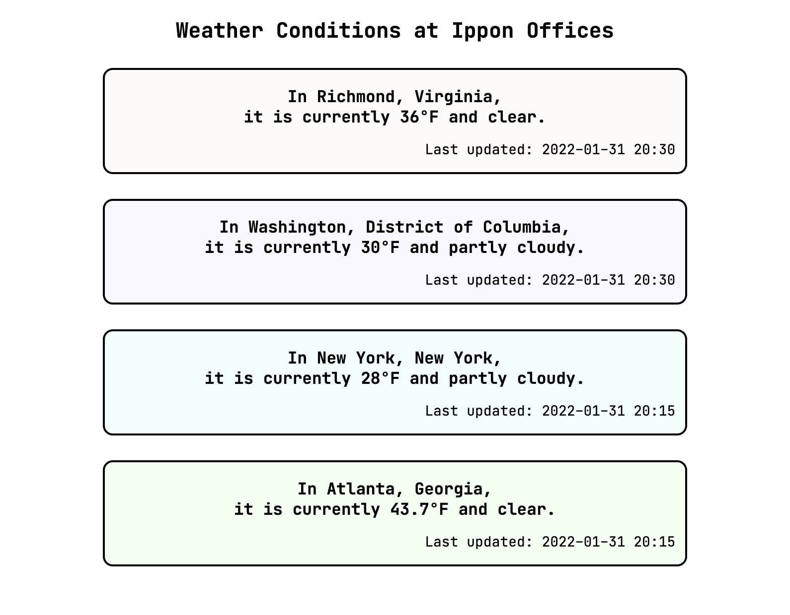
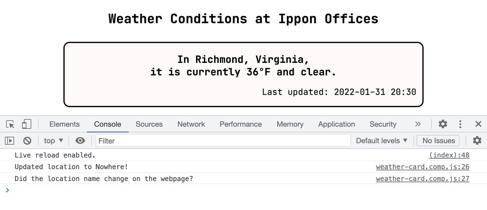
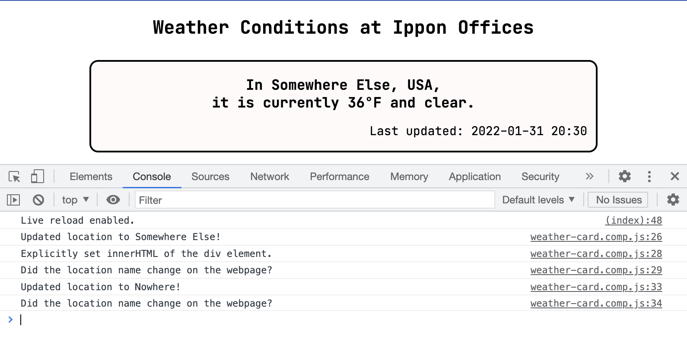
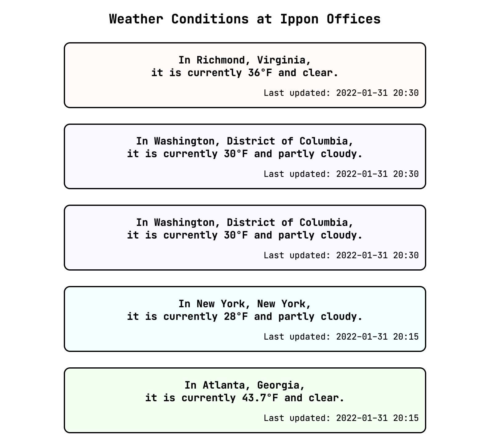
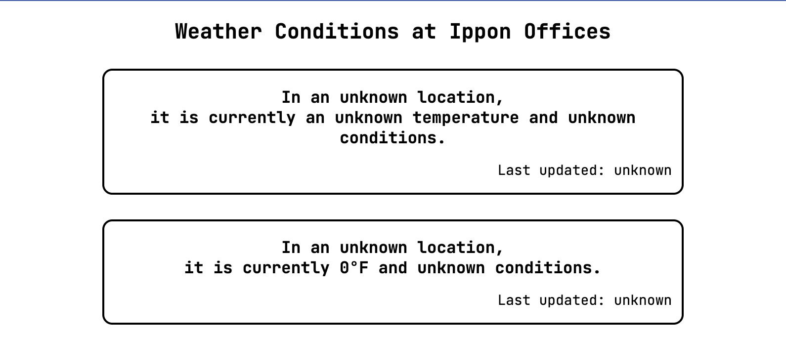
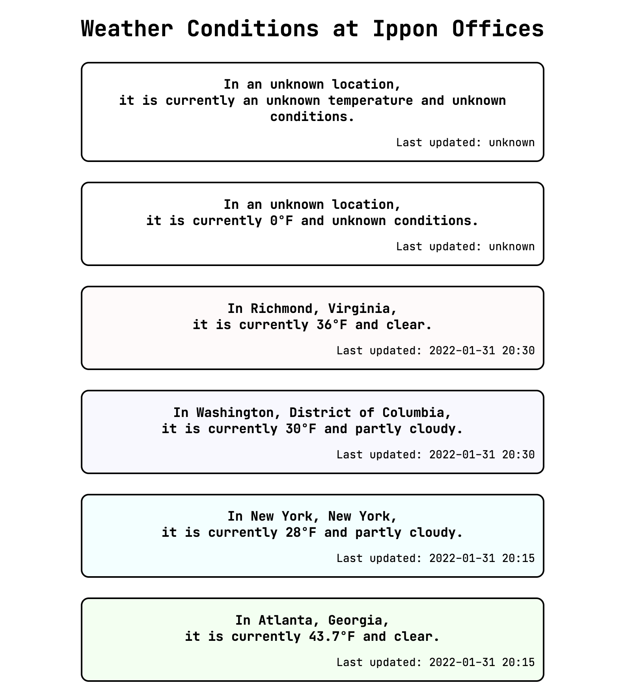
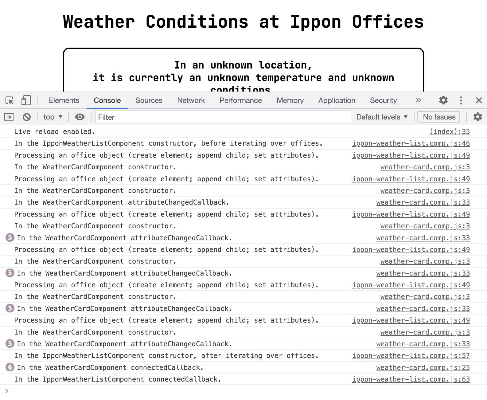
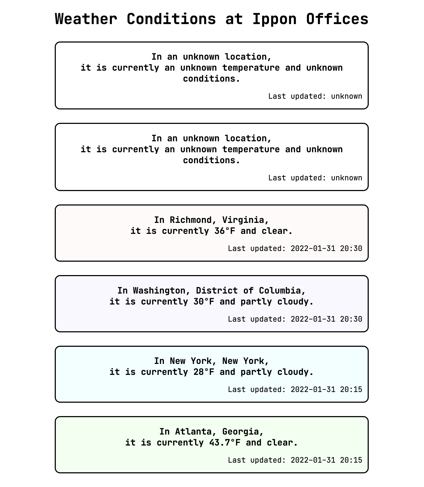
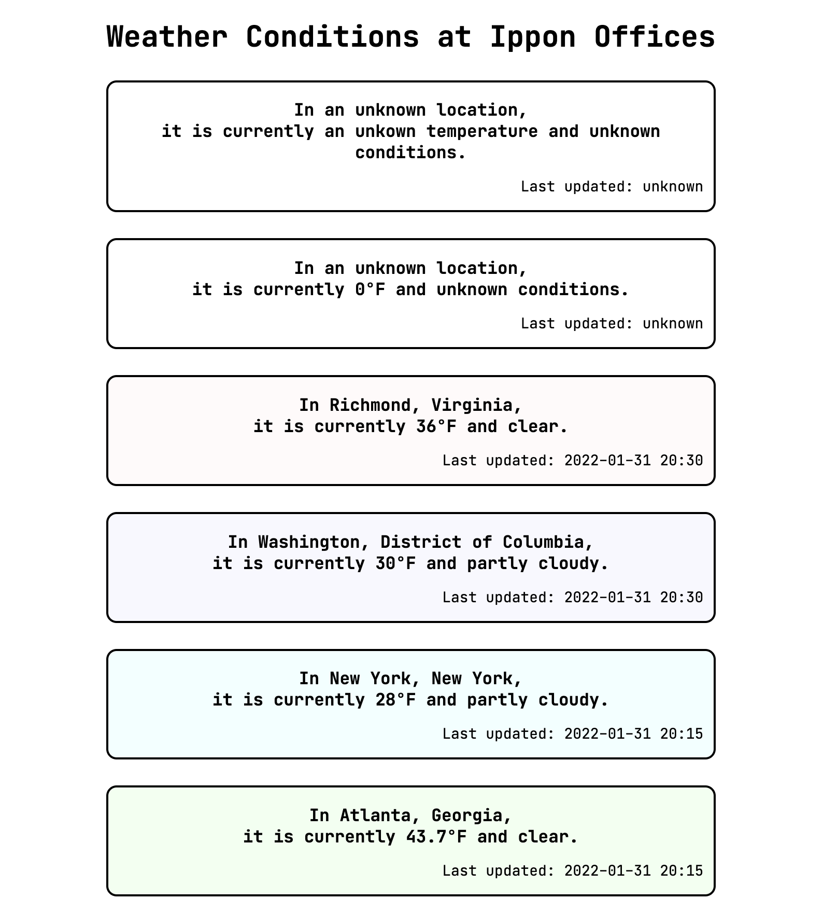

---
authors:
- Christina Annas
tags:
-back-end
-career-development
-front-end
-javascript
date: 2022-02-24T22:00:00.000Z
title: "Hey, This Looks Familiar: Front-End Development for Back-End Engineers"
---

Hey, welcome back! We learned a _ton_ in the last post. A lot of what this post will cover will be familiar to those with a strong foundation in the back-end, so this will be a bit more of an easy ride. As a reminder, there is an accompanying [GitHub repository](https://github.com/christinaannas/weather-at-the-office) to follow along with this series. 



When we left off, we had created a custom element and incorporated it into our overall page, but we could still only use the component to show outdated information about weather in Richmond. Let's fix that!

## Component State

The first concept we'll approach in this post is component state, which is more like the state in "state machine" than it is like the state in "the Commonwealth of Virginia." Well. You get my point. 

Sometimes, we want to store data in a component. In our case, we'd like to store the location, temperature, weather conditions, and time of last update in the component and then use that data to generate the inner HTML. Our eventual goal in doing this is to use our component to represent offices in cities other than Richmond. Let's start just by extracting our current values into an object. 

``` js
constructor() {
  var that = super();
  that.model = {
    location: "Richmond, Virginia",
    tempFahrenheit: 36,
    weatherCondition: "clear",
    lastUpdated: "2022-01-31 20:30"
  };
  // ...
}

getInnerHTML() {
  return `
<h3>In ${this.model.location},<br/>it is currently ${this.model.tempFahrenheit}&deg;F and ${this.model.weatherCondition}.</h3>
<p>Last updated: ${this.model.lastUpdated}</p>
  `;
}
```

We've used object literal notation to create a model to hold our data, and string interpolation to use that data in the rendering of our element. That's basically all the state of a component is: the data the component holds. 

## Data Binding

if we're storing data in a component with the intent of rendering it, then we normally want to update the view whenever that data changes. When it happens automatically, this update of the view triggered by an change of the linked data is called _data binding_. We have not explicitly added anything to our app to enable data binding between our state `model` and our innerHTML, and it is not something we get for free from `HTMLElement`. We can demonstrate that we don't have data binding by programmatically changing the state and observing the results. Recall that the `connectedCallback` can be used to add code that we want to run when our custom element is attached to the DOM. Let's use that function to add a timeout:

``` js
connectedCallback() {
  var that = this;
  setTimeout(() => {
    that.model.location = "Nowhere, USA";
    console.log("Updated location to Nowhere!");
    console.log("Did the location name change on the webpage?");
  }, 5000);
}
```

This is our first timeout, so let's check it out. We effectively schedule an arrow function to be invoked after `5000` milliseconds. The arrow function -- these are similar to the lambda functions from Java, but remember to watch out for scope! -- updates the location in our model object, and logs some messages to the console so that we can confirm the arrow function has run. 

After refreshing the page and waiting five seconds, we do see the messages in the console but do not see the location name changed on the webpage. Because we changed the data but the view was not updated automatically, we have shown that our app does not have data binding. 



In order to update the view, we will need to explicitly update the innerHTML whenever we change the data in the state, as we do in the following snippet. We continue to use `that` as an alias for `this`.

``` js
constructor() {
  var that = super();
  // save divElement as part of our object 
  // so we can manipulate it outside of this function
  that.divElement = document.createElement('div');
  // ...
}

connectedCallback() {
  var that = this;
  setTimeout(() => {
    that.model.location = "Somewhere Else, USA";
    console.log("Updated location to Somewhere Else!");
    that.divElement.innerHTML = that.getInnerHTML();
    console.log("Explicitly set innerHTML of the div element.");
    console.log("Did the location name change on the webpage?");
  }, 3000);
}
```

With this change made, we see that the location does update to "Somewhere Else, USA" in the output view. 



As it turns out, we don't need this component to update its own data right now. So while there are ways to implement data binding within a component, we won't consider them here. Instead, we'll move on to making our weather card components customizable, so they are able to represent the weather at Ippon's other offices.

## Attribute Binding

We know that we will want to pass the information to populate our model to the component from outside. Let's take a look at what that might look like. The information has to come from somewhere, and right now our only real option is from our `index.html` file. To refresh our memory, here's the `div` we currently have representing the weather card for Washington, DC.

``` html
<div class="weather-card purple">
  <h3>In Washington, District of Columbia,<br/>it is currently 30&deg;F and partly cloudy.</h3>
  <p>Last updated: 2022-01-31 20:30</p>
</div>
```

We know we'll need to use the tags for our custom element, `<weather-card-component></weather-card-component>`, somehow incorporating the additional information into or around the tag. The title of this section gives away that we'll eventually bind data to attributes of the element. (Recall that `class` on the `div` element in our HTML snippet is an example of an attribute.) Before we get to the details of attribute binding, I want to briefly present an alternative we won't use in this example and explain why I chose not to use it in this case.

### Templates and Slots

<!-- todo: get more feedback on whether this is a useless diversion (: -->

One way to approach inserting information into a custom element is by using `templates` and `slots`. Essentially, you define a template in HTML that is the common bits of the inner HTML you want to end up with, and provide slots within that template to insert more HTML. When we think of this from the DOM perspective, the template has some nodes defined and some nodes awaiting content - and that content can be a little "tree" in itself. This approach is useful when you want to create a custom element with a flexible or complex structure. 
 
 The structure of our weather card is simple and rigid; we will always want a `div` element containing only an `h3` element and a `p` element. While we could pass our information as pieces of HTML, we have no need to do so. Our information is better represented as strings, and we can easily pass strings into our element as attributes.

### Attribute Binding, For Real This Time

Now that we've completed our side quest to evaluate templates and slots as an alternative approach, let's remember what we're trying to do in our example app. Our goal right now is to pass simple information like location and temperature into our component. Our only option right now is to pass the information from our `index.html` file, and I've told you that we'll _bind_ data to _attributes_ of our custom element. This is such a common use case that it is built in to the Web Components API. We can list the attributes that we want to watch for changes as `observedAttributes` and provide an `attributeChangedCallback` lifecycle callback function to handle updating the text or appearance of our component based on updated attributes. 

``` js
static get observedAttributes() {
  return ['location', 'temp', 'condition', 'updated', 'color_class'];
}

attributeChangedCallback(name, oldValue, newValue) {
  var that = this;
  if (oldValue === newValue) {
    return;
  }

  switch (name) {
    case 'location' : {
      that.model.location = newValue;
      break;
    }
    case 'temp' : {
      that.model.tempFahrenheit = newValue;
      break;
    }
    case 'condition' : {
      that.model.weatherCondition = newValue;
      break;
    }
    case 'updated' : {
      that.model.lastUpdated = newValue;
      break;
    }
    case 'color_class' : { 
      that.model.colorClass = newValue;
      that.updateClass();
      return;
    }
  }

  that.updateInnerHTML();
}
```

We watch `location`, `temp`, `condition`, `updated`, and `color_class` attributes on our custom element. At this point, I'm using different names for our attributes and the fields in our model to stress the distinctinon between them. When an observed attribute gets updated in the DOM, our `attributeChangedCallback` determines what state data to update and what action to take based on the change -- updating the class that dictates the styling or updating the inner HTML of the div element in the component. In order to enable this change, we've added `colorClass` to our component's model object and refactored some code that lived in the constructor into `updateInnerHTML` and `updateClass`.

``` js
updateInnerHTML() {
  this.divElement.innerHTML = this.getInnerHTML();
}

updateClass() {
  this.divElement.setAttribute('class', this.model.colorClass);
}
```

Now, we're ready to pass in values for these attributes from our `index.html` document. We'll do the DC card both ways so we can compare. 

``` html
<weather-card-component></weather-card-component>
<weather-card-component
  location="Washington, District of Columbia"
  temp="30"
  condition="partly cloudy"
  updated="2022-01-31 20:30"
  color_class="purple"
></weather-card-component>
<div class="weather-card purple">
  <h3>In Washington, District of Columbia,<br/>it is currently 30&deg;F and partly cloudy.</h3>
  <p>Last updated: 2022-01-31 20:30</p>
</div>
```

We see that we have two identical "cards" for DC, which is what we expected.



Notice that we did't need to pass in any attributes for the Richmond office, because the model in our constructor provides those values as defaults. While that's fine for this current page, it's not what someone might expect from an "empty" component outisde of our context. Let's provide some default text to display when information is missing.

``` js
that.model = {
  location: "an unknown location",
  tempFahrenheit: "an unknown temperature",
  weatherCondition: "unknown conditions",
  lastUpdated: "unknown",
  colorClass: null
};
```

In our `index.html` document, we'll update our Richmond card to pass in the data using attribute binding and add a custom element with no attributes set. 


We've reached something that is _almost_ reasonable for an "empty" component. It would be better to not have the `°F` if we don't know the temperature. We'll get to that, but first, let's take a look at how we wrote `attributeChangedCallback` and how we might refactor it.

### Climbing Up On My "Refactoring for Readability" Soapbox

<!-- I added this section based on some feedback from Cody on clean/clear use of JavaScript. I can edit to be less opinionated and more concise, but I would prefer to keep the original code as it is and address the refactor. I think optimizing for understanding the distinction between attributes/fields is important when I first introduce attribute binding. I did incorporate Cody's suggestions into the props section below without first doing it my weird way (lol). -->

Our current versions of `observedAttributes` and `attributeChangedCallback` is replicated in the listing below. 

``` js
static get observedAttributes() {
  return ['location', 'temp', 'condition', 'updated', 'color_class'];
}

attributeChangedCallback(name, oldValue, newValue) {
  var that = this;
  if (oldValue === newValue) {
    return;
  }

  switch (name) {
    case 'location' : {
      that.model.location = newValue;
      break;
    }
    case 'temp' : {
      that.model.tempFahrenheit = newValue;
      break;
    }
    case 'condition' : {
      that.model.weatherCondition = newValue;
      break;
    }
    case 'updated' : {
      that.model.lastUpdated = newValue;
      break;
    }
    case 'color_class' : { 
      that.model.colorClass = newValue;
      that.updateClass();
      return;
    }
  }

  that.updateInnerHTML();
}
```

This is written to emphasize the difference between our model's fields and our element's attributes. Let's consider the changes below. 

``` js
constructor() {
  var that = super();
  // updating model field names to match attribute names
  that.model = {
    location: "an unknown location",
    temp: "an unknown temperature",
    condition: "unknown conditions",
    updated: "unknown",
    color_class: "transparent"
  };
  // also -- update functions to use the updated field names
  // ...
}

static get observedAttributes() {
  return ['location', 'temp', 'condition', 'updated', 'color_class'];
}

attributeChangedCallback(name, oldValue, newValue) {
  var that = this;
  if (oldValue === newValue) {
    return;
  }

  that.model[name] = newValue;

  if (name === 'color_class') {
    that.updateClass();
  } else {
    that.updateInnerHTML();
  }
}
```

JavaScript allows us to refer to fields within an object with either `object.fieldName` or `object[stringFieldName]` notation. If we change the model field names to match the attribute names, we can take advantage of the second notation to reduce the number of lines of code in our `attributeChangedCallback` significantly.  An experienced JavaScript engineer would likely prefer the second of our `attributeChangedCallback` options above. 

I tend to use the phrase "more ergonomic" (rather than, for example, "more readable") when what I mean is "more like what people who read and write a lot of code in this language are likely to be familiar with." One strong example of ergonomic use of a language is Python's list comprehensions. Readability of code using this syntax depends on the reader and their experience with Python. Nested list comprehensions may feel natural and expected for experienced Python developers, but may be an added level of complexity for beginners or even developers with non-Python backgrounds. (_The Programmer's Brain_ by Felienne Hermans influenced my thinking on this topic, and I recommend it to any readers who like to understand what's going on inside their brains. )

While "readability" is context-dependent, we have no reason not to refactor in this case, now that we understand a bit more. So -- we can thank our first version for helping us differentiate between the model's fields and the element's attributes and continue forward with the second, more ergonomic, version. And I can thank the reader for their patience with my belabored point and continue forward with fixing "unknown temperature°F". 

## Conditional Rendering

The next couple of concepts we'll cover are not necessarily new -- conditional ("if") and iterative ("for") processing are familiar for a back-end engineer. The syntax we'll use will also be familiar in our "vanilla" JavaScript approach.

We've reached a point where we want to display something differently or not display something at all given a certain situation. Basically, introducing an `if` structure into our rendered output -- rendering conditionally. Let's look at our current `getInnerHTML` function. 

``` js
getInnerHTML() {
  return `
<h3>In ${this.model.location},<br/>it is currently ${this.model.temp}&deg;F and ${this.model.condition}.</h3>
<p>Last updated: ${this.model.updated}</p>
  `;
}
```

We're already using string interpolation to insert the result of some JavaScript code into our inner HTML. We can expand on that just a bit by adding in a ternary operator to include the `°F` only if we have a valid temperature. Instead of comparing against the string value `"an unknown temperature"`, we'll also update the default value for our temperature state data to be `null`. 

``` js
constructor() {
  var that = super();
  that.model = {
    location: "an unknown location",
    temp: null,
    // ...
  };
  // ..
}

getInnerHTML() {
  return `
<h3>In ${this.model.location},<br/>it is currently ${this.model.temp ? this.model.temp + "&deg;F" : "an unknown temperature"} and ${this.model.condition}.</h3>
<p>Last updated: ${this.model.updated}</p>
  `;
}
```

We should be thoughtful here about one of the "gotchas" of JavaScript: type coercion. In our ternary operator, we're using `this.model.temp` as a statement that will evaluate to `true` or `false`, and then will use either the state data (with `°F`) or a default string, based on that true/false evaluation. Another way to state that we are evaluating `this.model.temp` as a true/false statement is that we are determining whether `this.model.temp` is "equal to" `true`. In JavaScript, this determination is made based on coercing the value of `this.model.temp` to a boolean. This coercion is much like casting from Java, but with a more aggressive name for a more aggressive and volatile application. There are certain values that are coerced to be equivalent to `false`, but all other values are coerced to be equivalent to `true`. For our purposes of evaluating a value as a true/false statement, "falsy" values include the boolean `false`, the empty string `""`, the number zero `0`, and the values `null` and `undefined`. 

Because the falsy value `0` is a perfectly reasonable value for our temperature, let's add a card that uses `0` as the value passed to the attribute and test whether type coercion will cause us any trouble. 

``` html
<weather-card-component></weather-card-component>
<weather-card-component
  temp=0
></weather-card-component>
```

As it turns out, passing the value `0` to an attribute will not cause us any trouble. The reason for this is that attribute binding passes the attribute values as strings -- by the time the `newValue` arrives in our `attributeChangedCallback`, it is the string `"0"` and not the number `0`. The card that we add with temperature 0 specified as an attribute correctly displays `0°F`.



If we were sharing this component with others, we might choose to code more defensively by doing a check on the incoming `newValue` and only updating our state data value if we can parse a number from the string we receive. Alternatively, we could enforce a type on our state data by using TypeScript. For now, though, we don't need to worry about that. 

As a bit of cleanup, we can now update the New York and Atlanta cards to use the custom element. We can then remove much of the styling from our `index.html`, because that we're confident in and exclusively using our `weather-card-component`. 

``` html
<style>
  body {
    text-align:center;
    font: 14px "JetBrains Mono", "Trebuchet MS", sans-serif;
  }
</style>
```

It's a good time to think about the next evolutionary step of our application. We've made our `weather-card-component` flexible in its ability to use attributes or make something meaningful in the absence of them. However, we still have the attributes hard-coded in HTML. Because we'll eventually want to show dynamic weather conditions for each of the three US offices, we'll need to pull that information out of our static `index.html` document and into JavaScript. Our next goal is to render a weather card component for each item in an array. 

## Rendering Collections

This task of displaying a component for each item in an array, which may have dynamic members and/or a dynamic number of members, is a common use case of components. In order to achieve this, we'll introduce a new custom element. As a reminder, for a new custom element, we'll need a `[component-name].comp.js` file, and we'll need to update our `app.js` file to import the component and define a custom element tag to use for it. Let's call our new component `IpponWeatherListComponent`. For now, we can set it up simply with inner HTML matching what we're removing from the `index.html` file. 

``` js
export class IpponWeatherListComponent extends HTMLElement {

  constructor() {
    var that = this;
    const shadowRoot = that.attachShadow({mode: 'open'});

    const divElement = document.createElement('div');
    divElement.innerHTML = that.getInnerHTML();

    shadowRoot.appendChild(divElement);
  }

  getInnerHTML() {
    return `
<h1>Weather Conditions at Ippon Offices</h1>
<weather-card-component></weather-card-component>
<weather-card-component
  temp=0
></weather-card-component>
<weather-card-component
  location="Richmond, Virginia"
  temp="36"
  condition="clear"
  updated="2022-01-31 20:30"
  color_class="pink"
></weather-card-component>
...
    `;
  }
}
```

We've kept the elements with incomplete information so we can keep an eye on whether they continue to function as expected. Recall that the first time we created a web component, we didn't know about the shadow DOM or lifecycle callbacks. Because of what we've learned so far, we're now well-equipped to move right along. 

``` js app.js
import { WeatherCardComponent } from "./components/weather-card.comp.js";
import { IpponWeatherListComponent } from "./components/ippon-weather-list.comp.js";

window.customElements.define('weather-card-component', WeatherCardComponent);
window.customElements.define('ippon-weather-list-component', IpponWeatherListComponent);
```

Now we can replace the entire contents of the `body` in our `index.html` with a single `ippon-weather-list-component`. Notice that in the inner HTML, we've changed the `h2` to a larger `h1` for our new component. 



We've confirmed that our example app still looks as expected after  creating a new component and using its custom element, but besides that we haven't added much value. The next step is to pull out the attribute values into the component's state data and programmatically generate the inner HTML. 

``` js
constructor() {
    var that = super();
    that.offices = [
      {},
      {
        temp: 0
      },
      {
        location: "Richmond, Virginia",
        temp: 36,
        condition: "clear",
        updated: "2022-01-31 20:30",
        color_class: "pink"
      },
      // ...
    ];
    // ...
  }

  getInnerHTML() {
    var that = this;
    const header = "<h1>Weather Conditions at Ippon Offices</h1>";

    function customElementFromOfficeObject(officeObject) {
      const attributes = Object.entries(officeObject)
          .map(([attributeName, attributeValue]) => `${attributeName}="${attributeValue}"`);
          return `<weather-card-component ${attributes.join(" ")}></weather-card-component>`;
    }

    const officeCards = that.offices
        .map((officeObject) => customElementFromOfficeObject(officeObject));
    return header + officeCards.join(" ");
  }
```

The result of our `getInnerHTML` function is still the same as it was before, and therefore our rendered output is still the same as before. 


Because we're setting `divElement.innerHTML` to the same value in both previous examples, our interaction with the DOM is identical, although we've generated our value differently. The next step to take in our refactor is to create the internally contained HTML elements by interacting with the shadow DOM of our component directly, rather than generating a snippet of HTML. 

``` js
const shadowRoot = that.attachShadow({mode: 'open'});
const containerElement = document.createElement('div');
const headerElement = document.createElement('h1');
headerElement.innerHTML = "Weather Conditions at Ippon Offices";
containerElement.appendChild(headerElement);

for (const officeObject of that.offices) {
  const componentElement = document.createElement('weather-card-component');
  containerElement.appendChild(componentElement);
  for (const [attributeName, attributeValue] of Object.entries(officeObject)) {
    componentElement.setAttribute(attributeName, attributeValue);
  }
}

shadowRoot.appendChild(containerElement);
```

In our constructor, we programmatically create a `weather-card-component` element for each office object, and set attributes for each of the name/value pairs in the objects. Note that this assumes that the names of the fields in the `officeObject` are the same as the attribute names that the card component expects. Our rendered output is again the same, but now we have achieved it by interacting directly with the DOM rather than giving some HTML to the little monster we imagined in the last post and asking the monster to add it to the DOM. Note that we still use attributes of our generated HTML elements to pass the data to render.


<!-- todo: link to little-monster discussion in previous post -->

As we have seen, attribute binding has enabled us to create a `weather-card-component` for each element in an array, making up our `ippon-weather-list-component`. Let's take a moment to examine the order in which things are happening. 

### Revisiting the Lifecycle of an Element

In a demonstrative commit in [the repo for these posts](https://github.com/christinaannas/weather-at-the-office), I've added some `console.log` statements throughout the component files. The statements indicate that constructors, `connectedCallback`s, and `attributeChangedCallback`s are invoked. 



Most of this order makes sense -- we enter the list constructor, iterate over offices including entering the card constructor and `attributeChangedCallback`, then we exit the list constructor. The last steps, however, are first the _card_ `connectedCallback` and then the list `connectedCallback`. Looking back at the constructor for the `IpponWeatherListComponent`, we see that for each office object we first create the card element, then append it as a child to the container element, then set its attributes. Append first, then attribute updates. So why do all the `attributeChangedCallback` calls happen before any `connectedCallback` calls?

It turns out that _appending_ an HTML element as a child of another HTML element is not quite the same as attaching or _connecting_ that child element's object representation to the DOM. Put this way, we see that what we call appending is an HTML operation, while connecting is a DOM operation. Indeed -- if we think of the DOM as a tree that the little monster assembles from an HTML blueprint, it wouldn't make sense to attach a leaf to the tree before we are done attaching the branch from which the leaf grows, even if the monster already knows the leaf will be there.

Thinking carefully about the order of these function calls has helped us continue to firm up our understanding of the DOM. Next, let's focus on the sheer number of function calls - can we refactor in such a way that we can pass a component five pieces of data without having to re-render it for each additional piece?

## Passing Information Through Properties

We have been passing data to our components using the `setAttribute` function that they inherit due to being `Element`s. Another way to pass data to them is by setting properties -- this bypasses interacting with the component as a representation of an HTML element and interacts with it simply as a JavaScript object. It would be nice to be able to send all of the relevant data with one value assignment from our `IpponWeatherListComponent`, passing the entire `officeObject`. 

``` js
for (const officeObject of that.offices) {
  const componentElement = document.createElement('weather-card-component');
  containerElement.appendChild(componentElement);
  componentElement.props = officeObject;
}
```

In order to receive this information on the side of the child component, we write a setter function to accept values from an input object and update our model data, updating the rendering as needed. Here, we're taking advantage of the fact that the names of the properties passed in the `props` object are the same as the names of the corresponding model fields on this component.

``` js
set props(props) {
  var that = this;

  var needToUpdateInnerHTML = false;
  var needToUpdateClass = false;

  for (const [propertyName, propertyValue] of Object.entries(props)) {
    if (!(that.model[propertyName] === propertyValue)) {
      that.model[propertyName] = propertyValue;
    }
    if (propertyName === 'color_class') {
      needToUpdateClass = true;
    } else {
      needToUpdateInnerHTML = true;
    }
  }

  if (needToUpdateInnerHTML) {
    that.updateInnerHTML();
  }
  if (needToUpdateClass) {
    that.updateClass();
  }
}
```

We handle each name-value pair in the `props` object, checking to see whether the new value is different than the current one in our model. Let's check our output. 



We see that our `0°F` temperature is missing, instead shown as `an unknown temperature`. Good thing we kept our "test cases" around to keep us honest! Recall our earlier discussion, when we first set up our conditional rendering, about type coercion in JavaScript. We were concerned about the `0` value we were passing as an attribute, but we illustrated that all attributes are passed as strings. There is no such transformation for properties, so we do need to be careful about our special case. The property is getting updated properly, but our rendering logic assumes that we can simply coerce our `this.model.temp` value to a boolean. Let's update our conditional rendering logic. 

``` js
getInnerHTML() {
  return `
<h3>In ${this.model.location},<br/>it is currently ${getTemperatureString(this.model.temp)} and ${this.model.condition}.</h3>
<p>Last updated: ${this.model.updated}</p>
  `;

  function getTemperatureString(temperatureValue) {
    // guard clause: catch valid 0 values explicitly
    if (temperatureValue === 0) {
      return "0&deg;F";
    }
    // if we haven't defined a temperature value, provide a decent string
    if (!temperatureValue) {
      return "an unkown temperature";
    }
    return `${temperatureValue}&deg;F`;
  }
}
```

We don't need to put `getTemperatureString` within `getInnerHTML` for any reason having to do with scope; I've simply placed it there because it isn't needed elsewhere. With our special handling in our `getTemperatureString` function, we now see what we expect for the special case value of `0` for temperature. 



Nice! It's gratifying to be able to predict what will happen with some JavaScript code, but it's even more exciting to be able to understand _why_ when our predictions are wrong. I think this high note is a decent stopping point. In our next installment, we'll _finally_ get some dynamic weather data incorporated into this! 