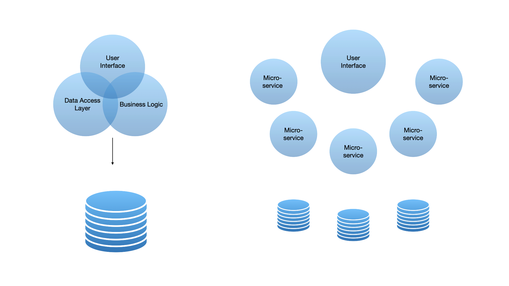
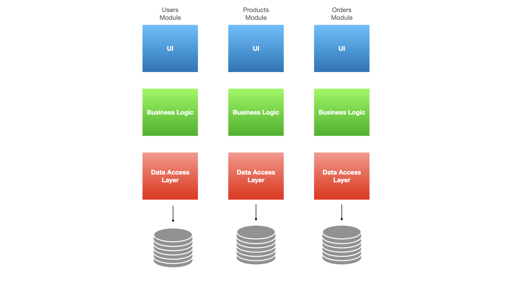

---
authors:
- Matthew Freshwaters
tags:
- entando
- microservice architecture
title: "Why Companies are Moving their Applications to Modular Architecture"
image:
---

 As applications become increasingly complex over time, engineering teams have sought to ease the process of creating scalable and malleable products. Many organizations have turned to microservices to help keep their products scalable. Today we will discuss why microservices & modular architecture have gained much attention and usage in the past few years.  

## Monolithic Architecture

To understand microservice architecture better, let's take a look into what traditional application architecture looks like - the monolith. "A monolithic architecture is a singular, large computing network with one code base that couples all of the business concerns together. To make a change to this sort of application requires updating the entire stack by accessing the code base and building and deploying an updated version of the service-side interface." [Atlassian](https://www.atlassian.com/microservices/microservices-architecture/microservices-vs-monolith#:~:text=A%20monolithic%20architecture%20is%20a%20singular%2C%20large%20computing%20network%20with,of%20the%20service%2Dside%20interface.)

Organizations and teams across the world have approached application development with an agile mindset, hardening the process of developing a monolith. Making a single change to the server side or client side of your application can turn into a large process with having to roll out the entire application again. This can make continuous development and continuous integration difficult, one reason why application architects and developers have leaned into a different type of architecture - microservice architecture. We'll first take a look at the Modular Monolith and how it differs from a traditional monolith before moving into microservices.

 ***Microservice vs Monolith Architecture***

## Modular Monolith

Modular Monolith consists of dividing logic into modules, as each module is independent and isolated. Every module is in charge of its own business logic, database or schema, etc. With this model of architecture, you can build and modify existing layers of each module while leaving the others unaffected.

Modules should communicate through APIs, allowing access to the logic of each module through public methods, not internal functions & the logic of each one.

This architecture model is less complex than microservices and more scalable and easier to maintain than traditional monolithic apps.  You can keep the entire project as a single unit without needing multiple servers for deployment.

One of the notable disadvantages for both monoliths and modular monoliths is how slow the development velocity is. Adding new features is slow because there is a large cognitive load on the developer. Modules of monoliths are tightly coupled, which can significantly lengthen the release cycle of a monolith.

While this architecture model has its advantages over a monolithic application, it proves to still be difficult to modernize. It takes a lot of time since the velocity for this model is slow and the release cycle is sluggish. This is something companies need to consider as many applications need to be modernized for several reasons (i.e. modern hardware, browser updates, network bandwidth, tech stack, etc.)

 ***Modular Monolith Architecture***

## Microservices

What is no longer considered a new architecture model has proven to be successful and adopted in approximately [63%](https://dzone.com/articles/new-research-shows-63-percent-of-enterprises-are-a) of enterprises. Most companies who have made the move have mentioned that their new architecture has improved customer & end-to-end experience and cut costs on infrastructure and other development tools. 

It is essential to recognize that breaking down a monolith and developing microservices can be expensive and time-consuming. Understanding the benefits of transitioning to microservices and why other organizations are doing the same is vital. Some reasons companies should leverage microservices may include the following: 

- Continuous deployment & continuous integration
- Testing becomes easier with smaller components to test
- Ability to switch tech stacks over time
- Teams can develop & test their components without dependency on other teams

Microservices follow the idea of segregation of duty, isolating data to the service that owns it. Each service should be created for a single responsibility, should be independent of others, & needs the ability to handle service-to-service communication in the event a single service fails.

While proven to be incredibly cost-efficient over time, microservices do not come without their challenges. Maintaining & testing data between services can be difficult, as applications that follow this architecture model can become increasingly complex. Fortunately, some services and applications help companies manage, develop, and deploy microservices for both back and front-end needs.

Modular architecture is no longer new and has proven to succeed for enterprises across the globe. Getting started with maintaining them, however, can be tricky for certain companies that don't know where to begin.  Today we will take a look at services that organizations can utilize for microservice deployment, creation, and management.

## Entando

Entando is an open-source Application Composition Platform that allows users to create, curate, and compose applications for business capabilities. Entando is built on top of Kubernetes which allows developers to not only build their applications but run and deploy them as well. There are various components users can create such as microservices, micro front ends, UI/UX widgets, page templates, and so on. Entando seeks to remove redundant, repetitive code and empower developers to reuse code that can be used across applications.

Building a bridge between business and development, Entando uses a 4 step process; create, curate, compose, and consume.  

### Create

Application building with Entando starts with designing and creating independent components. Developers can leverage the [Entando Component Generator](https://developer.entando.com/v7.1/docs/create/component-gen-overview.html) to package and automate project files.

### Curate

Teams can curate by bundling components and sharing them within a central catalog. Several teams can collaborate on individual components or packaged business capabilities (PBCs) while sharing them across organizations and applications. From here they can test components, manage versions and share metadata for future upgrades.

### Composition

Composing an app with Entando is built around the [Entando App Builder](https://developer.entando.com/v7.1/docs/compose/app-builder.html). Application owners can generate new components or make changes to existing ones. Entando provides their Component Manager and Local Hub tools to manage components, allowing for an agile workflow.

### Consuming Applications

Throughout the development lifecycle of an application, consuming an app is where users start to interact with the product. The Entando platform grants the ability to scale services individually or all together. Additionally, content can be added and adapted with ease. This creates a continuous development cycle, minimizing disruptions and allowing for a faster time to market.

Check out [Entando Architecture Concepts](https://developer.entando.com/v7.1/docs/getting-started/concepts-overview.html#entando-app-engine) to learn more about how applications can be structured and created through Entando.

## Conclusion

Determining how to design an enterprise application can be a very difficult problem to address. While architectural designs such as microservice architecture are proven to scale for most business needs, they aren't necessarily the best choice for every application. Understanding the future of your product is important to consider. A platform like Entando is a great way of developing apps leveraging microservices built on Kubernetes. To learn more about Entando, click [here.](https://entando.com/) If you have any further questions be sure to reach out to us at contact@ippon.tech.