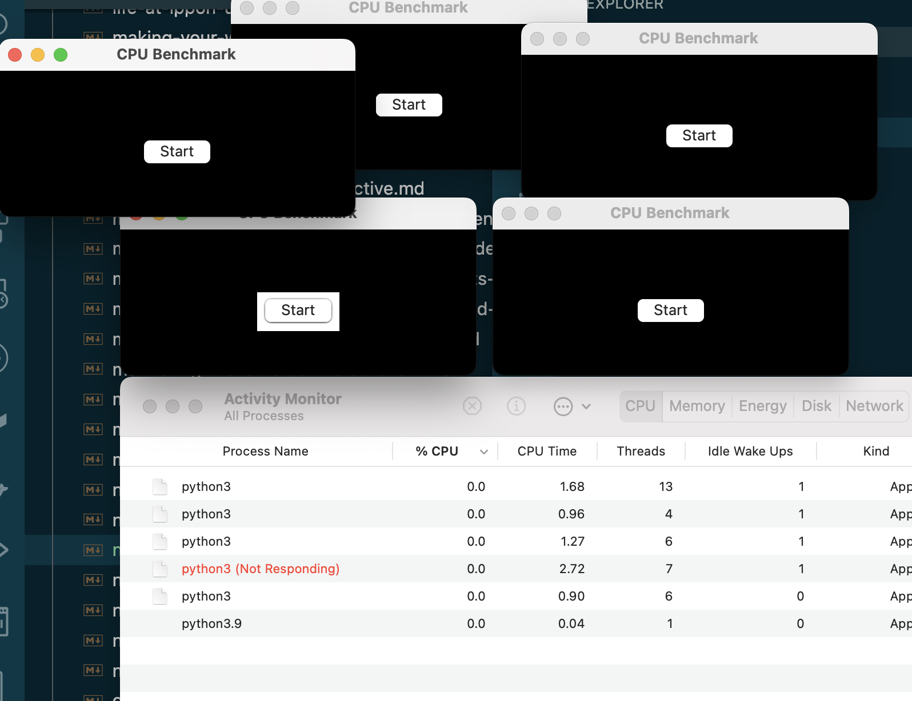

---
authors:
- Lucas Ward
tags:
- python
- chatgpt
- devops
title: "No... ChatGPT is Not Going to Take Away Your Programming Job"
image: 
---

# What People Think

Over the past few months, I have seen a huge influx in the number of posts, articles, and questions regarding ChatGPT. People are worried it is going to make their "hard fought" software engineering job obsolete. These types of fear mongering posts are so prevalent, that I thought there must be something of substance actually there.  I decided to take ChatGPT for a quick spin and see what the fuss was all about.  After all, if it was going to take my job, I would want to know, right?

# The Reality of the Situation

Follows is a "real world" example of a task that I asked ChatGPT to perform. I share this information with you now for several reasons. First and foremost, I wish to calm your nerves. No, ChatGPT will not replace your programming job. Secondly, I wish to explore how ChatGPT can actually make you better at your job. Lastly, I will talk about what the future holds for generative AI models and if their is really ever cause for concern regarding "the robots took my job!".

# The Example

The next "big block" of text is my exact interaction with ChatGPT. If you want to skip it and just go to the discussion, scroll down to the section named *Discussion*.

## Initial Prompt
Write a Python program that is used to benchmark a multiple core cpu.

### ChatGPT's Response
Here's an example Python program that can be used to benchmark a multiple core CPU using the multiprocessing module:

```python
import multiprocessing
import time

# Function to calculate the sum of a given range
def calc_sum(start, end):
    return sum(range(start, end))

if __name__ == '__main__':
    # Number of processes to spawn
    num_processes = multiprocessing.cpu_count()

    # Size of the range to calculate the sum for
    range_size = 100000000

    # Split the range into equal parts for each process
    chunk_size = int(range_size / num_processes)

    # Create a list of start and end values for each process
    chunks = [(i * chunk_size, (i + 1) * chunk_size) for i in range(num_processes)]

    # Start the timer
    start_time = time.time()

    # Spawn the processes and wait for them to finish
    with multiprocessing.Pool(processes=num_processes) as pool:
        results = pool.starmap(calc_sum, chunks)

    # Calculate the total sum
    total_sum = sum(results)

    # Stop the timer
    end_time = time.time()

    # Print the results
    print(f'Total sum: {total_sum}')
    print(f'Time taken: {end_time - start_time:.2f} seconds')
```

In this program, we first import the multiprocessing module and define a function called calc_sum that calculates the sum of a given range.

We then use the cpu_count function from the multiprocessing module to determine the number of cores available on the CPU, and use this to determine the number of processes to spawn.

We specify the size of the range to calculate the sum for and split it into equal parts for each process. We then create a list of start and end values for each process.

We start a timer, spawn the processes using a Pool object from the multiprocessing module and wait for them to finish using the starmap method. The starmap method takes an iterable of argument tuples and applies the function to each tuple.

We calculate the total sum by summing the results of each process, stop the timer and print the results.

Note that the performance of the program will depend on the CPU being used, as well as other factors such as the size of the range being calculated and the number of processes spawned.

## Follow Up Prompt
Dockerize the above program and create a manifest to deploy it into a kubernetes cluster

### ChatGPT's Response
Sure! Here's how you can Dockerize the Python program and create a manifest to deploy it into a Kubernetes cluster:

Create a Dockerfile for the Python program:
```Dockerfile
FROM python:3.9-slim-buster

WORKDIR /app

COPY requirements.txt .
RUN pip install --no-cache-dir -r requirements.txt

COPY main.py .

CMD ["python", "main.py"]
```

Create a requirements.txt file that lists the dependencies required by the Python program:
```text
multiprocessing
```
Build the Docker image:
```bash
docker build -t my-image:latest .
```

Push the Docker image to a container registry (e.g., Docker Hub, Google Container Registry, etc.):
```bash
docker push my-image:latest
```

Create a Kubernetes manifest (e.g., my-app.yaml) to deploy the Docker image as a Kubernetes Deployment:
```yaml
apiVersion: apps/v1
kind: Deployment
metadata:
  name: my-app
spec:
  replicas: 3
  selector:
    matchLabels:
      app: my-app
  template:
    metadata:
      labels:
        app: my-app
    spec:
      containers:
      - name: my-container
        image: my-image:latest
```
In this manifest, we specify a Kubernetes Deployment that runs three replicas of the Docker image we created earlier. The selector field specifies that the Deployment should manage Pods with the app=my-app label, and the template field specifies the configuration for the Pods.

Under the containers field, we specify the Docker image to use (my-image:latest) and give the container a name (my-container).

Apply the Kubernetes manifest to your cluster:
```bash
kubectl apply -f my-app.yaml
```
This will deploy the Python program as a Kubernetes Deployment with three replicas. You can use kubectl get pods to check that the Pods are running, and kubectl logs to view the logs of the Pods.

# Discussion

When I first saw this output, I was pretty impressed. I could see how someone who is just starting out or is still in school could think that this technology was going to replace them. When ever I went to run the code, that's when things started to fall apart... Let's talk about the fun times now. 

## Bad Code

You may notice that the Dockerfile that ChatGPT generated uses `python:3.9`.  This is great, because it is what I run on my machine. The problem is, the generated `requirements.txt` file lists the `multiprocessing` package as a dependency. The `multiprocessing` package is part of the standard library in python 3.9 though. When I went to try and build my image (which also required some changes to file names and where they are placed), python threw up and started talking about the `multiprocessing` package using the old python 2.7 `print 'stuff'` without the `()`. That's because it was trying to install a package that was already included in the standard library... 

All of that to say, ChatGPT had given me a decent starting point, but without my existing knowledge of python and containers, it would have been a pain to get it to work. Some may argue that this could have been avoided if the prompt had been more specific... Either way, the user of ChatGPT still needs to *know their stuff*, whether that is to write a proper prompt, or figure out what is wrong on the back side.

Given just the prompt, ChatGPT has no conception of what my system looks like, what version of python I have, what version of docker I am running, or even the fact that is specified a python 3.9 container but with a python 2.7 package. Even though I was impressed, I didn't feel very threatened.

## Dangerous Code

After I had gotten this program to run in Docker (I didn't bother with the kubernetes bit), I decided to add another additional prompt. For brevity's sake, I will just share the fun part with out the giant text wall. I asked ChatGPT to give me the code to run my Multi-core CPU benchmark program with a GUI. It started spitting of a bunch of python tkinter code. As a thought experiment, I wanted to run the code as-is with no changes. Here is the code in full: DO NOT RUN THIS CODE!!

```python
import multiprocessing
import time
import tkinter as tk

# Function to calculate the sum of a given range
def calc_sum(start, end):
    return sum(range(start, end))

# Function to start the benchmark
def start_benchmark():
    # Number of processes to spawn
    num_processes = int(processes_entry.get())

    # Size of the range to calculate the sum for
    range_size = int(range_entry.get())

    # Split the range into equal parts for each process
    chunk_size = int(range_size / num_processes)

    # Create a list of start and end values for each process
    chunks = [(i * chunk_size, (i + 1) * chunk_size) for i in range(num_processes)]

    # Start the timer
    start_time = time.time()

    # Spawn the processes and wait for them to finish
    with multiprocessing.Pool(processes=num_processes) as pool:
        results = pool.starmap(calc_sum, chunks)

    # Calculate the total sum
    total_sum = sum(results)

    # Stop the timer
    end_time = time.time()

    # Display the results in the GUI
    total_sum_label.config(text=f'Total sum: {total_sum}')
    time_taken_label.config(text=f'Time taken: {end_time - start_time:.2f} seconds')

# Create the GUI
root = tk.Tk()
root.title('CPU Benchmark')

# Create the input fields
processes_label = tk.Label(root, text='Number of processes:')
processes_label.grid(row=0, column=0)

processes_entry = tk.Entry(root)
processes_entry.grid(row=0, column=1)
processes_entry.insert(0, '4')

range_label = tk.Label(root, text='Range size:')
range_label.grid(row=1, column=0)

range_entry = tk.Entry(root)
range_entry.grid(row=1, column=1)
range_entry.insert(0, '100000000')

# Create the start button
start_button = tk.Button(root, text='Start', command=start_benchmark)
start_button.grid(row=2, column=0, columnspan=2)

# Create the output labels
total_sum_label = tk.Label(root, text='Total sum: ')
total_sum_label.grid(row=3, column=0, columnspan=2)

time_taken_label = tk.Label(root, text='Time taken: ')
time_taken_label.grid(row=4, column=0, columnspan=2)

root.mainloop()
```

If you copy and past this code (I do not recommend) and run it, it will start a small gui. Mine only has a start button, the text fields are there, but you can't see them. Further more, pressing "start", causes the program to spawn multiple versions of it's self and gives my MAC the rainbow spinning wheel of death. I was able to capture a screen shot of it with activity monitor open before I killed.



While this example is not actual dangerous, it is clear to me that ChatGPT has the capability to generate "system crashing" code. As always, and this goes for places like stack overflow as well, do not blindly run code you found on the internet.

## The Good Stuff

Okay, now for a positive note. Throughout this whole process, which I thoroughly enjoyed, I actually learned something new about python that I didn't know before. That's rigth, ChatGPT taught me something. It came in the form of a python function that I had never seen before. If you look back at the first code that ChatGPT generated for me, there is this little function:

```python
# Spawn the processes and wait for them to finish
with multiprocessing.Pool(processes=num_processes) as pool:
    results = pool.starmap(calc_sum, chunks)
```

This is the first time I had seen the function `starmap`. I took a quick detour to the [official python docs](https://docs.python.org/3/library/multiprocessing.html#multiprocessing.pool.Pool.starmap) and read all about it. Obviously I could have come across this function or this piece of code in the wild or learned it by reading the docs more thoroughly, but my point is that, given this generated output from ChatGPT, I learned something. Period. The End.  

# Conclusion

I don't believe that generative large language models such as ChatGPT are poised to take our hard won programming jobs. There is still just to much surrounding knowledge, adjacent knowledge, that can't fit into a prompt, or that doesn't make sense for ChatGPT to have access to.  For instance, an organizations entire source code does not need to be handed over to ChatGPT, but in some cases, that is what it would take to have the given context. So rest assured, we are safe! For now... Who knows what the future holds, in the meantime, I am going to make the most out of the situation and use ChatGPT as a learning tool, to discover new functions and paradigms I may have missed, or would not otherwise know about.

If you are trying to use ChatGPT to build a piece of software for your organization and are having troubles, feel free to reach out to Ippon Technologies, USA.  We would love to hear from you and could maybe even lend a hand. If you need anything at all, drop us a line at contact@ippon.tech.