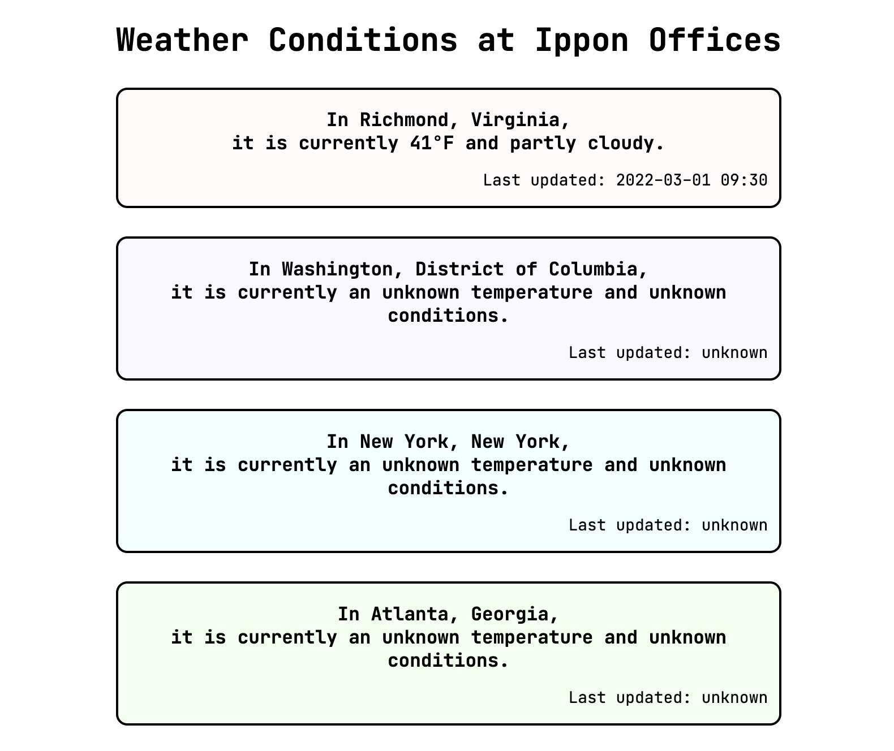
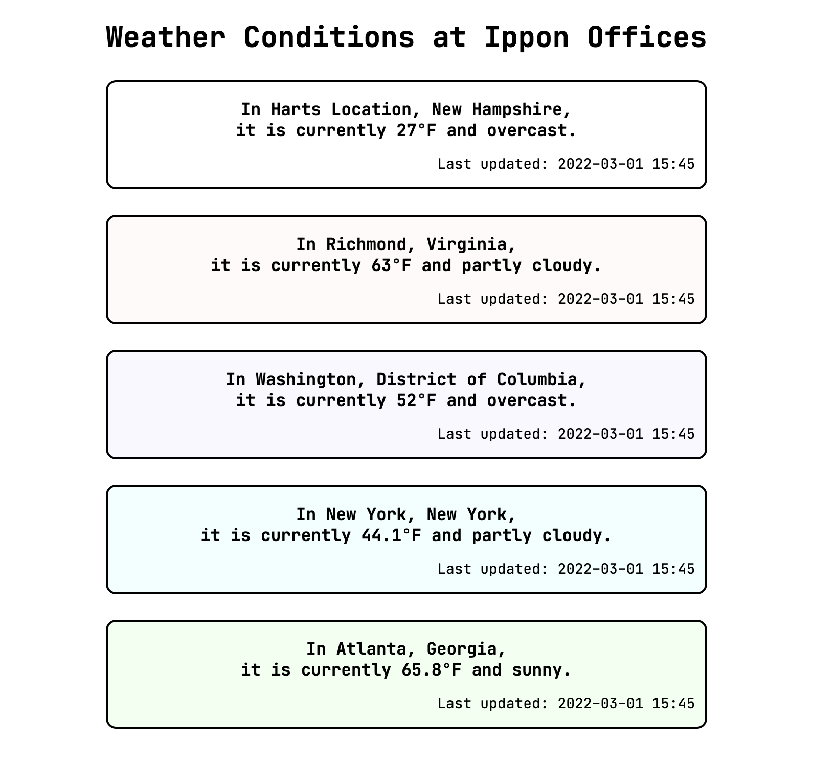
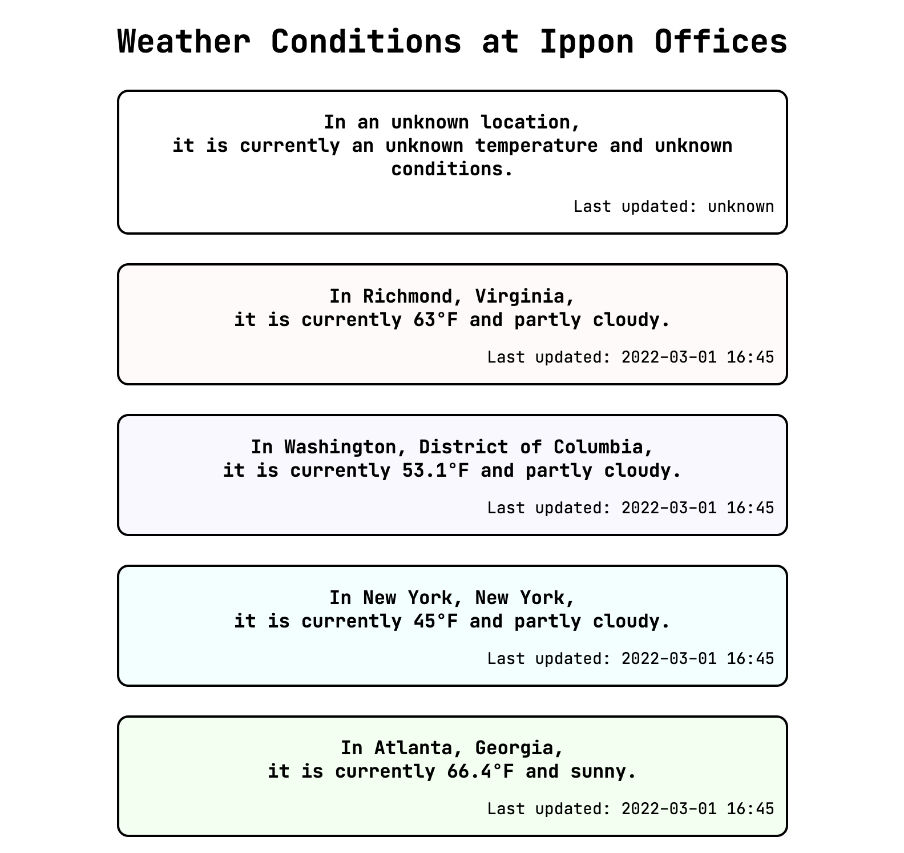
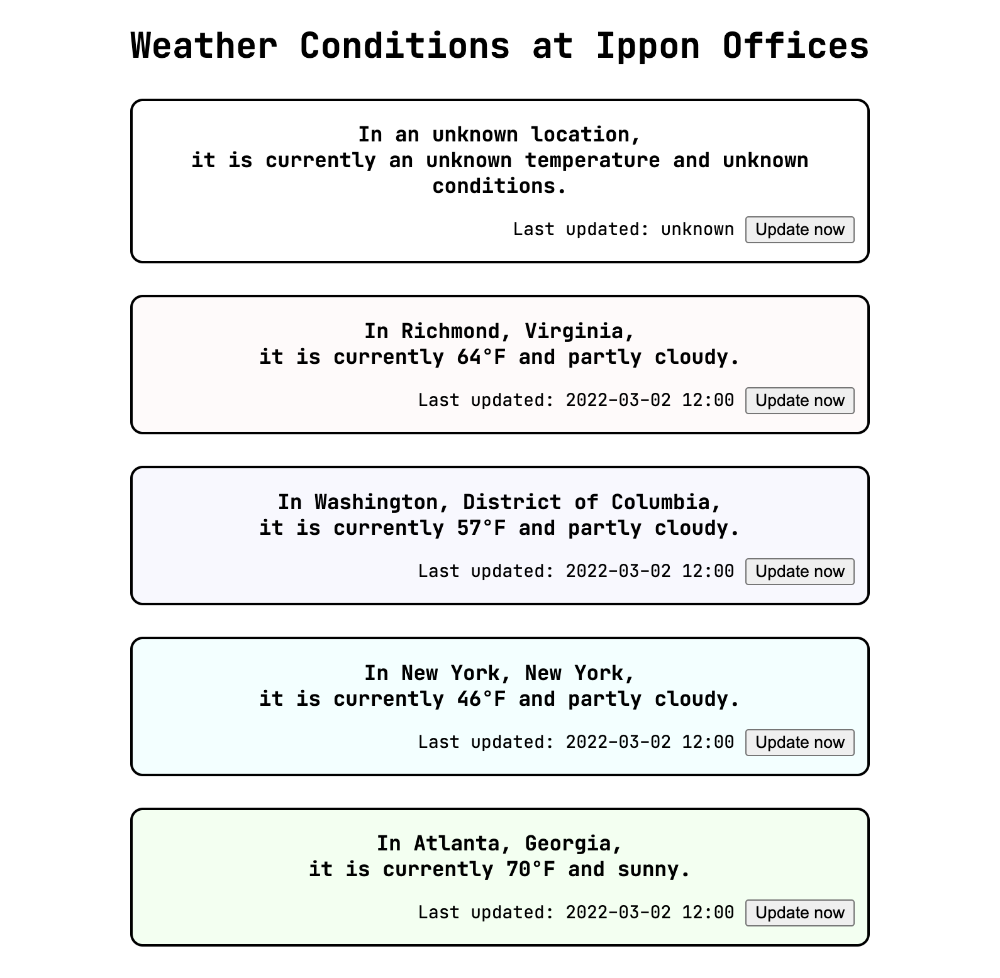
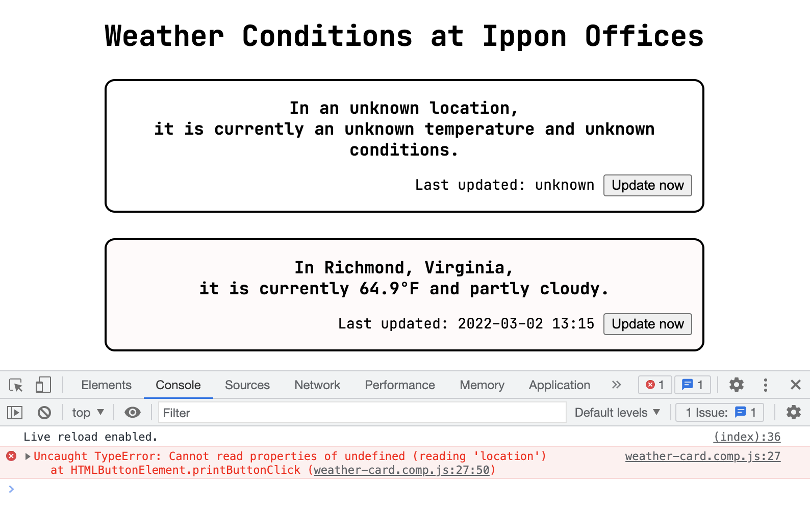
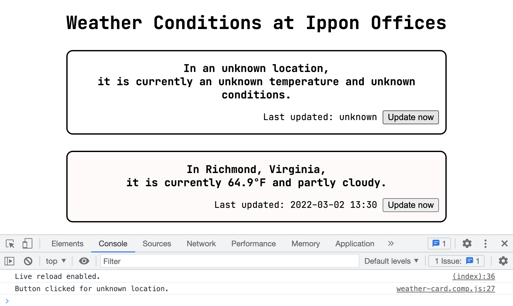
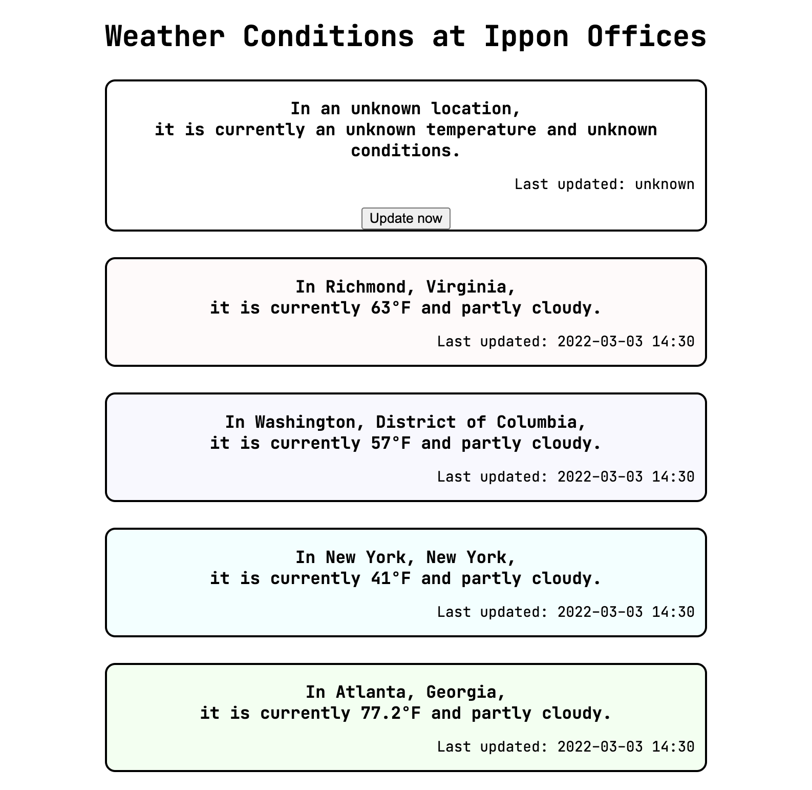
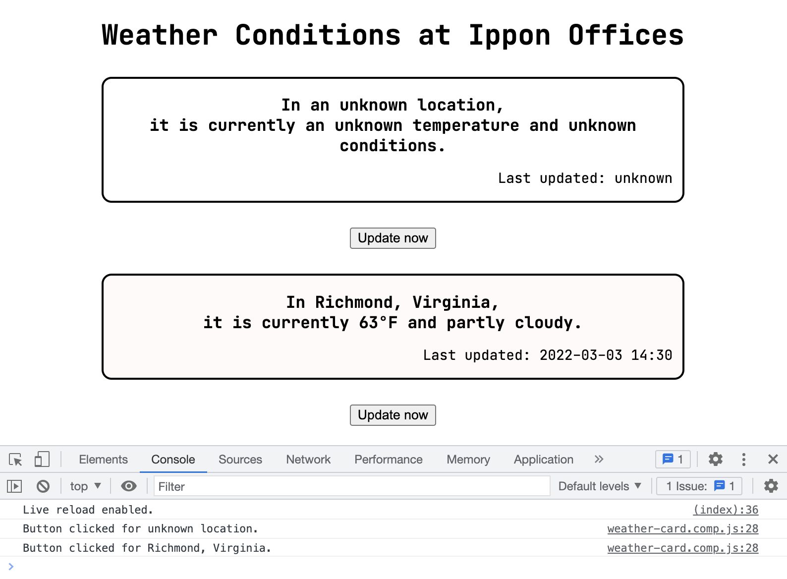
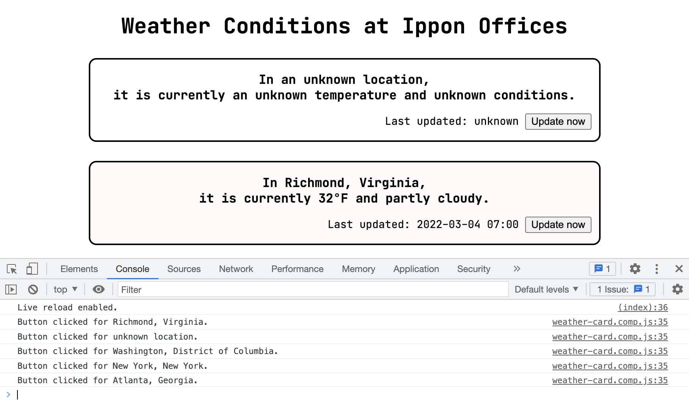
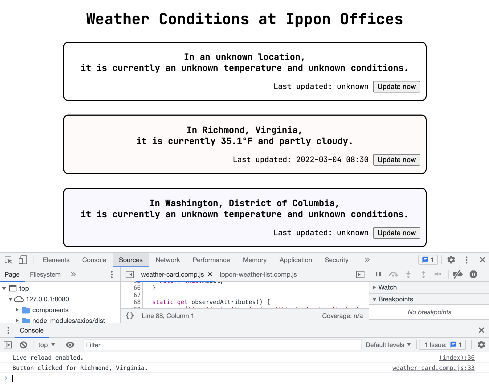

---
authors:
- Christina Annas
tags:
-back-end
-career-development
-front-end
-javascript
date: 2022-02-28T22:00:00.000Z
title: "Schrödinger's Pineapple Upside Down Cake: Front-End Development for Back-End Engineers"
---

Hey, good to see you again! Let's start by reviewing where we left off. We have a webpage that displays weather information for each of the Ippon offices in the US. However, although our page is created in a much more dynamic way than how it started out, we are still displaying out-of-date information. 

```
todo: add in from-last-time screenshot here.
```

It's the moment we've all been waiting for -- let's use current data! If you're coming to front-end development from a back-end perspective, like I did, you may already know that we'll be fetching the current weather data by making an HTTP request to an API endpoint. As a reminder, there is an accompanying [GitHub repository](https://github.com/christinaannas/weather-at-the-office) to follow along with this series. 

## Our API

We'll be getting our data from a API at `http://api.weatherapi.com`, which requires an free API key. Instructions for getting your own API key are in the README in the GitHub repo we've been using. However, so that you don't have to request one in order to follow along, we'll use a straightforward little Node.js server as a bit of middleware between our front end and that API. Our server looks for a `WEATHER_API_KEY` environment variable and will use it to call the API if present, but otherwise will pull data from some cached responses for each of our four cities. It also tries the cached data in case the API call fails. I've copied a few details in the listing below, but left some bits out so we can focus on a couple of aspects at play.

``` js weather-server.js
const requestListener = async function(req, res) {
  const apiKey = process.env.WEATHER_API_KEY;
  const queryString = url.parse(req.url, true).query.q;
  var body;
  if (apiKey) {
    body = await useApi(queryString, apiKey);
  } 
  if (!body) {
    body = useCache(queryString);
  }
  // build the response with body and headers
}

async function useApi(queryString, apiKey) {
  const baseUrl = 'http://api.weatherapi.com/v1/';
  const endpoint = `${baseUrl}current.json?key=${apiKey}&q=${queryString}`;
  var weatherApiResponse;
  try {
    weatherApiResponse = await axios.get(endpoint);
  } catch (error) {
    console.log(`Error hitting ${endpoint} -- ${error}`);
    return;
  }
  const data = await weatherApiResponse.data;
  return data;
}

function useCache(queryString) {
  // details on GitHub
}

const server = http.createServer(requestListener);
server.listen(5000);
```

The most interesting bit of this is within our `useApi` function. Notice that it is marked with the `async` keyword, which means that it implicitly returns a Promise. Promises are another front-end concept that perplexed me at first. Let's take a look at Promises now, and we'll return to that "implicit" bit in a moment.

### Promises

Promises are a bit like Schrödinger's cat. I'm hungry, though, so let's call it Schrödinger's pineapple-upside-down-cake. Suppose I have plans to see my friend Sarah tomorrow, I ask her to bring some dessert for us to share, and she agrees. At this point I've already gotten _something_ from my friend, but it certainly isn't dessert. It's more like a "promise" of dessert, right? The social contract between us allows me to expect that either I'll see my ~~cake~~ friend tomorrow _or_ I'll at least get a text from her saying she can't make it (or the grocery store was out of pineapple chunks, or whatever). 

So right now, I have a "promise" that may or may not turn into cake, but I know that at some point in the near future I'll hear back about the result, favorably or not. In Promise language, we call the favorable outcome "resolved," while the unfavorable outcome is called "rejected". While my Schrödinger's box is still closed, I have to prepare as if the cake is both there and not there. Naturally, I'll want to do different things based on the result -- eat cake, or not. With Promises, we can specify the behavior we want in either case.

We can explicitly pass that behavior to a Promise object using callbacks and the `then` function. This can be an elegant solution for simple cases, but it can get complicated when multiple Promises are used which depend on one another. We'll return to callbacks, but let's take a baby step first and use an abstraction JavaScript provides.

For those of us who don't necessarily want to have to think about quantum superposition in order to make an API call, the `async/await` construct allows us to write our code as if it were synchronous, throwing exceptions. So while our call to `axios.get` returns a Promise, we decide to just wait until the Promise is resolved or rejected. We handle the rejection the same way we would handle an exception being thrown in Java, with a `catch` block. Even though we've ended up with syntax that looks very familiar, it's good to know that Promises are behind it and that they can be used other ways. 

## HTTP Requests

We've gotten a sneak peak of how to make an HTTP request, so let's incorporate this into our webpage. 

First, let's set up the HTTP call to our server in a utility/service file, so that we can abstract out those details from our component code. We'll create a file `util/weather-info.service.mjs` with a function `getWeatherData` that, given a location, makes a request to our web server (running locally on port 5000) and transforms the output into an object like the ones we've been using to describe the `props` on our `WeatherCardComponent`. 

Recall from our web server that `async` functions "implicitly" return a Promise -- that is, even if the `async` function returns the string `"pineapple upside down cake"`, any user of that function actually receives a Promise (or Schrödinger's box) wrapped around that value, rather than the value itself. Here we see that we can create Promise objects explicitly if we wish to, specifying whether the Promise is `resolve`d or `reject`ed. However, we continue to use `async` and `await` to handle the Promise that comes back from our `axios` call.

``` js
export async function getWeatherData(location) {
  if (! location) {
    return Promise.reject("No location specified.");
  }
  try {
    const response = await axios.get('http://localhost:5000/weather-api?q=' + location);
    const data = await response.data;
    return Promise.resolve({
      location: `${data.location.name}, ${data.location.region}`,
      temp: data.current.temp_f,
      condition: data.current.condition.text.toLowerCase(),
      updated: data.current.last_updated
    });
  } catch (error) {
    Promise.reject(`Invalid location queried: ${location}. ${error.message}`);
  }
}
```

We'll want to use this function from within our `IpponWeatherListComponent` to set the `props` on each of its child card components. In order for this function to be available, we'll import it in our list component file.

``` js
import { getWeatherData } from "../util/weather-info.service.mjs";
```

And we'll also add the `axios` module to our `index.html` file so the browser knows what we're talking about. (We didn't need to do this for our web server, because it runs in a Node runtime rather than the browser. We only needed to add `axios` as a dependency in our `package.json` file and use `npm` to install it, then Node knew where to find it.)

``` html
<script src="./node_modules/axios/dist/axios.min.js"></script>
```

Now we're ready to use the `getData` function within our `IpponWeatherListComponent`! For now, we'll continue using the `async`/`await` construct that feels familiar, so we'll put our changes into an `async connectedCallback` function. 

``` js
async connectedCallback() {
  for (const weatherCard of this.shadowRoot.querySelectorAll('weather-card-component')) {
    const weatherData = await getWeatherData(weatherCard.props.location)
    weatherCard.props = weatherData;
  }
}
```

And this _mostly_ works. We end up with the page looking how we expect, but if we look closely, it's obvious that the cards are being updated one at a time, and the small delays to get responses back for each request add up, since we are waiting for the first one to finish before even sending the next one. I was able to grab a screenshot of an intermediate state of the page, when one card had up-to-date weather data, but the others have the default text. 



Because we examined Promises closely earlier, we know that in this case it is perhaps preferable to use a callback construct rather than `await`-ing in the loop. We explicitly provide a callback for the `rejected` case here, although it does nothing; we could also have simply left it out. And, because we won't be using the `await` keyboard anymore, we can move this back into a non-async function -- namely, our constructor. 

``` js
for (const officeObject of that.offices) {
  const componentElement = document.createElement('weather-card-component');
  containerElement.appendChild(componentElement);
  componentElement.props = officeObject;

  getWeatherData(componentElement.props.location).then(
    (resolved) => {
      componentElement.props = resolved;
    }, 
    (rejected) => {}
  );
}
```

We've opted to do nothing in the case of a rejected promise. That might be fine, but let's bring back one of our "default" test cases to check it out. 

``` js
that.offices = [
  {},
  // ...
]
```

Since we're not passing a `location` property to the first card, we might expect that our `getWeatherData` service function would return a rejected Promise saying that there is no location specified.

``` js
if (! location) {
  return Promise.reject("No location specified.");
}
```



Oh, drat. One glance at our `WeatherCardComponent` shows us what we forgot: the default location is the string `"an unknown location"`, so even though we aren't passing a value from the `IpponWeatherListComponent`, there is a value in `weatherCard.props.location` that evaluates to `true` when coerced to a boolean. This can easily be fixed by setting the value to null in the constructor and adding a ternary operator in `getInnerHTML`, and in fact it might be best to follow suit with the other properties as well. 

``` js
constructor() {
  var that = super();
  that.model = {
    location: null,
    temp: null,
    condition: null,
    updated: null,
    color_class: "transparent"
  };
  // ...
}

getInnerHTML() {
    return `
<h3>In ${this.model.location ? this.model.location: "an unknown location"},<br/>it is currently ${getTemperatureString(this.model.temp)} and ${this.model.condition ? this.model.condition : "unknown conditions"}.</h3>
<p>Last updated: ${this.model.updated ? this.model.updated : "unknown"}</p>
    `;
}
```



It might be even better for the `IpponWeatherListComponent` to delegate getting the location and updating the properties to the `WeatherCardComponent` itself, to avoid one from relying too much on implementation details of the other. In fact, adding some functionality to our weather card component so that it can update its own data would be a good next step. I'm sure you're also itching to make our webpage respond to some kind of user interaction. Let's feed both those birds with our next scone.

## DOM Events
One feature of the DOM that we haven't spoken about yet is events. One type of event is those fired due to user interaction, perhaps by mouse or keyboard. A simple and familiar example is a button being clicked. Let's create a simple button as part of our weather card component.

Ideally, the button to update the weather data would be nicely located right next to the information about when the last update happened. So we'll just add a button tag within the same paragraph.

``` js
return `
<h3>In ${this.model.location ? this.model.location : "an unknown location"},<br/>it is currently ${getTemperatureString(this.model.temp)} and ${this.model.condition ? this.model.condition : "unknown conditions"}.</h3>
<p>Last updated: ${this.model.updated ? this.model.updated : "unknown"} <button>Update now</button></p>
`;
```

For now, let's simply log a statement to the console when the button is clicked, since we want to iterate quickly rather than waiting around for the API-returned data to be updated. 

``` js
printButtonClick() {
  console.log(`Button clicked for ${this.model.location ? this.model.location : "unknown location"}.`);
}
```

So that's the function that we'll want to call when we click the button on a card; we need to tell the button to listen for the `click` event and use this function as the callback. We can do that in our constructor. 

``` js
that.divElement = document.createElement('div');
that.updateInnerHTML();
that.updateClass();
shadowRoot.appendChild(that.divElement);

const buttonElement = that.shadowRoot.querySelector('button');
buttonElement.addEventListener('click', that.printButtonClick);
```

The button is created in `updateInnerHTML`, so we after that's done, we can grab the `button` element and add an event listener -- namely, our simple `printButtonClick` function. Looking at the page, our buttons are present; I think they look rather nice placed where they are in the cards! Let's try them out. 



If we open the console and press a few buttons, we see... nothing good. Pressing the button in the no-information card logs an `Uncaught TypeError` to the console, and pressing the button in the Richmond card does absolutely nothing. 



It seems that although what we're trying to do is simple, it isn't as straightforward as we might have thought. We'll have to do some debugging. (Fun!) We have a couple of problems here, since our no-information and Richmond cards are both acting unexpectedly, but in different ways. We'll see that one problem has a quick fix but couldn't have been anticipated based on what we've covered so far, while the other is understandable but a smidge more involved to fix. Let's start with the quick fix. 

### Execution Contexts and Function Binding

We can fix the error caused by clicking on the no-information card's button by updating our event listener ever so slightly, from `buttonElement.addEventListener('click', that.printButtonClick);` to `buttonElement.addEventListener('click', that.printButtonClick.bind(that));`. 



Okay, fine. But _why_? 

We'll start by demonstrating what's going on. We can update the `printButtonClick` to first log `this` to the console, and add both versions of the function (the regular one and the one bound to `that`) as event listeners. 


We see that within the unbound function, `this` refers to the `button` element itself, whereas within the bound function, `this` refers to the `weather-card-component` element, which was what we wanted. Indeed, it's more than what we wanted; that's what we expected based on experience with Java. In Java, a method within a class is an instance method (unless it's static), and calling the method on an instance means that `this` always refers to that instance. Instance methods couple together two slightly different concerns: where to find the method and what object to operate them on. 

Analogy time! From just the perspective of syntax and scope, let's imagine a class as a building, and a method or function defined within the class as a room in the building ("the room where it happens," as they say). There's a frame on a wall of the room that will show you what `this` is. An instance of a Java class is like a suburban home with a family living in it. For the concern of finding the method, a neighbor can point you to the Smith house and likely can tell you where the living room is one you get inside. For the concern of knowing what object to operate on, we look at the frame on the wall and find a somewhat impressionist pastel rendering of the front of the Smiths' house. It was a gift from the builder, so each house in the neighborhood has a similar frame in the living room, depicting the house it's in. So calling an instance method in Java is like finding a map of the neighborhood, navigating to the right house, stepping into the correct room, looking at the frame on the wall to determine `this`, and then... doing something. What folks do in the privacy of their own homes is none of our business!

If we step into a JavaScript class, it's a little bit different. We see modern architecture, made with modular building techniques and lots of glass. The rooms encircle a central atrium (the execution context) with a large sculpture in the middle. And each room has a frame around a window that looks out into the atrium, with a perfect view of the sculpture. The sculpture we see from the window is how we know what `this` is. Let's walk the path of calling a class function from within another function in the same class (or otherwise in the same lexical scope). For the concern of finding the function, we leap through the open window onto the `this` sculpture in the atrium -- the floor is lava -- then we leap again into the other room. Once we're there, we look back through the window for the concern of knowing what object to operate on, and we find the same `this` sculpture. That's why directly calling functions has not messed with `this` so far. 

But wait -- we're not directly calling the function. We're grabbing the function and then passing it to the button as a callback. Now we come to the point where the distinction between finding the function and knowing what object to act upon comes into play. Within the scope of our constructor, we go find the `printButtonClick` function we want (this is the leaping-and-staying-out-of-the-lava bit). But instead of invoking the function then, we say to the JavaScript engine, "Hey, please make a copy of this room and give it to this button element object." We also ask the engine to watch out for `click` events and go into the new copied room to handle that type of event. When we look out the window in our copied, unbound callback function's room, we see the sculpture in the button element object's atrium. 

Let's look at our `bind`, then. Before we talk to the JavaScript engine and hand over our room, it's like we print out a big picture of what the atrium looks like at that moment and paste it up over the window, so that no matter where the room goes, we'll see the same sculpture. Or maybe it's like instead of handing over a room for the engine to make a copy, instead we give the engine a secret passageway that drops right into the original room. Either way, the result is that once we have bound the function to our original object, that function will always see the original object's atrium with the original object's `this` sculpture, no matter which execution-context atrium we're adjacent to when we invoke the function. 

For an exceptional explanation of lexical environments, execution contexts, scope chains, and everything else that is "weird" about JavaScript, I _highly_ recommend the work of Tony Alicea. He has full courses available, but the beginning of his JavaScript course is also available [on YouTube](https://www.youtube.com/watch?v=Bv_5Zv5c-Ts) for free. 

Phew, that was a lot of explaining for less than a dozen additional characters. Worth it, though, I think. We've fixed our problem with the no-information card, but for our Richmond card and the rest, it's still the case that nothing happens when we press their buttons.

### Disappearing Buttons

My section heading asserts that the problem is buttons disappearing, but surely not, right? I mean, we can _see_ them. Well. What's really happening is that the buttons are being replaced. In the constructor, we create a button in our initial call to `updateInnerHTML` by giving a snippet of HTML to the little monster who builds the DOM. We equip this button with an event listener. Then, in subsequent calls to `updateInnerHTML` (like the one triggered by the `IpponWeatherListComponent` calling the `props` setter), we give a new snippet to the little monster. The monster clears everything out of our `divElement`, throws it away like _trash_ (rude, but also exactly what we asked for), and creates a new segment of DOM based on the new HTML. Our old button with the event listener is gone, and an imposter has taken its place! We can convince ourselves of this by adding a button element to our `divElement` via DOM interaction in the constructor -- rather than including it in the `innerHTML` -- and observing that it is gone by the time the list component is done setting up. 

```js
that.divElement = document.createElement('div');
that.updateInnerHTML();
that.updateClass();
const buttonElement = document.createElement('button');
buttonElement.innerHTML = "Update now";
buttonElement.addEventListener('click', that.printButtonClick.bind(that));
that.divElement.appendChild(buttonElement);
shadowRoot.appendChild(that.divElement);
```



Let's try instead adding the button to the `shadowRoot` directly.

``` js
const buttonElement = document.createElement('button');
buttonElement.innerHTML = "Update now";
buttonElement.addEventListener('click', that.printButtonClick.bind(that));
shadowRoot.appendChild(buttonElement);
```



With this change, the button is not wiped out. It functions for each card! But... it's ugly. We really want the button to be within the card, on the same line as the "Last updated" text.

While this change will take more than a dozen characters, it's still fairly straightforward. We'll set the `innerHTML` on the `divElement` only once, and use class selectors to modify elements within the card on update rather than the whole card itself. That way, we can avoid replacing our button with an imposter. 

``` js
constructor() {
  // ...
  that.divElement = document.createElement('div');
  that.divElement.innerHTML = `
<h3 class="conditions">${that.getConditionsString()}</h3>
<p><span class="updatedText">${that.getUpdatedString()}</span> <button class="updateButton">Update now</button></p>
  `;
  const buttonElement = that.divElement.querySelector('.updateButton');
  buttonElement.innerHTML = "Update now";
  buttonElement.addEventListener('click', that.printButtonClick.bind(that));
  that.updateContents();
  that.updateClass();
  shadowRoot.appendChild(that.divElement);
  // ...
}

updateContents() {
  this.divElement.querySelector('.conditions').innerHTML = this.getConditionsString();
  this.divElement.querySelector('.updatedText').innerHTML = this.getUpdatedString();
}

updateClass() {
  this.divElement.setAttribute('class', `${this.model.color_class}`);
}

getConditionsString() {
  return `In ${this.model.location ? this.model.location : "an unknown location"},<br/>it is currently ${this.getTemperatureString(this.model.temp)} and ${this.model.condition ? this.model.condition : "unknown conditions"}.`;
}

getTemperatureString(temperatureValue) {
  // same contents, now arbitrarily not nested in another method
}

getUpdatedString() {
  return `Last updated: ${this.model.updated ? this.model.updated : "unknown"} `;
}
```



Oh, I almost forgot! Our buttons are working in that they're logging statements to the console, but we intended for them to refresh the data on the card. Let's make that quick change, then call it a day!

We'll change the name of our button click callback method to be a bit more generic and update the method to also set the props to the result of our `getWeatherData` function. Recall that the result of that function is a Promise, so we either `await` the result and make our method `async` or provide a callback arrow function for when the Promise resolves. 

``` js
handleButtonClick() {
  console.log(`Button clicked for ${this.model.location ? this.model.location : "unknown location"}.`);
  if (this.model.location) {
    getWeatherData(this.model.location).then((resolved) => {
      this.props = resolved;
    });
  }
}
```

In order to see this in action, we'll also comment out the logic in the `ippon-weather-list` component's constructor where it calls `getWeatherData` for each card. 



Hooray!

## Exercises Left to the Reader

I hope that you've enjoyed our journey together as much as I have. We've learned a lot, and you're ready to flap your wings and fly on your own! There are a few more things along the line of this project that I'd recommend tinkering with, but solving them will be "an exercise left to the reader," as math textbooks always say.

### Inputs

The next level to add complexity to our page would be to allow the user to specify any location and fetch current weather data for that location. This would involve a type of HTML element we haven't talked about yet -- `input`. You'd probably also want another `button` to submit the request, so you're not making an HTTP call every time the user enters an additional character or presses backspace. 

### Build-A-List

Even better would be a new list component that contains the searching functionality (in a child component) and manages a list of cards for locations the user has submitted. We've covered several ways to pass information into a child component, but what about passing information from a child to the parent component? Your child component could emit a custom event that the parent component listens for and handles. 

### Why Not Both? 

Once you have the Ippon list and the new custom list, consider making a homepage that can navigate back and forth between the two lists. Watch out for considerations you'll need to take when connecting and disconnecting components from the DOM! This will introduce the concept of a "single-page" application. React, Angular, and Vue all provide for this -- changing the contents of the page without refreshing the page. 

### Do It All Again

Speaking of [React](reactjs.org), [Angular](angular.io), and [Vue](vuejs.org), we've learned a lot about what happens behind the scenes of these frameworks. With all of this context, you could test your understanding of the concepts by trying to replicate what we've built using a framework. They are widely-used for a reason! Pick a framework -- perhaps consult [this blog post](https://blog.ippon.tech/how-to-choose-between-react-angular-and-vue/) to decide which one -- and try your hand at rebuilding what we've done!
