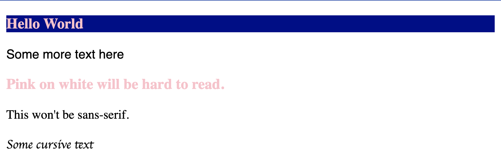
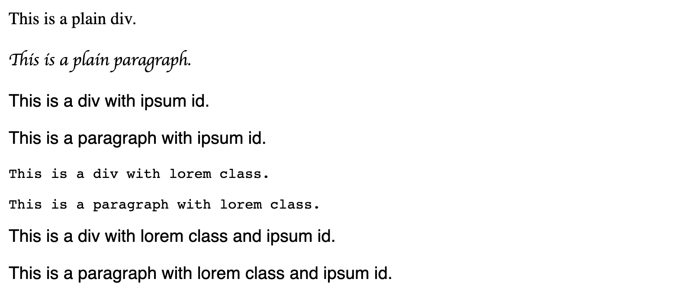
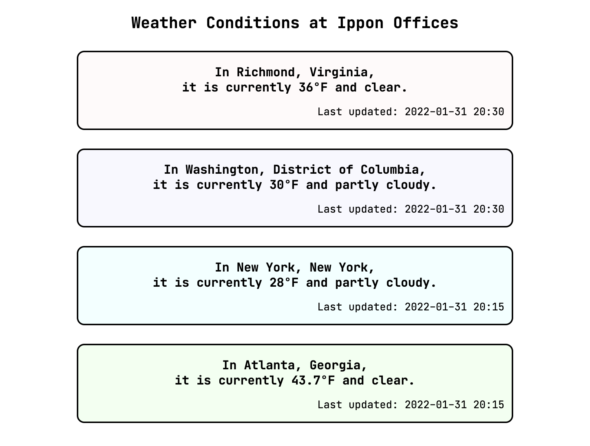
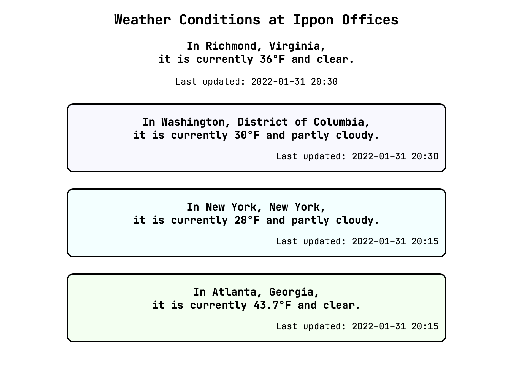

---
authors:
- Christina Annas
tags:
- back-end
- career-development
- front-end
- javascript
date: 2022-02-23T12:21:50.000Z
title: "The Documents Are In The Computer: Front-End Development for Back-End Engineers"
image: 
---

I'm a back-end Java engineer, mostly, but I've been breaking out of that. Historically, whenever I've tried to sift through front-end code, I felt like there was something I was missing. Several somethings. About as many somethings as Owen Wilson and Ben Stiller were missing when they tried to break open a Mac with some animal's thigh bone to get to the documents "in the computer." But I digress.

I think part of my struggle is that the way that I learn is concept-oriented -- before I get into syntax, I like to understand what I'm trying to do. Because of this, I've never really been someone who can hear a problem and immediately start typing in their IDE. I generally need to spend some time at the whiteboard first, identifying the core pieces about the problem and reasoning about them. 

I also came to programming from a different direction compared to many of my peers. While many of my classmates were creating themes for their Xanga sites with HTML and CSS, I remember being _super_ intimidated. I was a kid and I really didn't need a website, anyway, so I gave up and chalked up programming as something that wasn't for me. In college, though, I encountered opportunities to use a computer in the context of domains I was already interested in -- agent-based modeling of population growth, and "Why bother to do the integral when Mathematica can do it for me?", and so on. The problems I was trying to solve normally didn't include a graphical user interface, and never required me to create a web-based front-end. 

All of that to say: I'm writing this blog post as a way of summing up what I've learned about the "somethings" of front-end development, including naming and defining some of the concepts I had no idea existed. I'll also give some examples of what the concepts look like applied in a simple application we'll build along the way. 

# Setting the Stage

Let's start by briefly getting a feel for the environment we're entering. For more in-depth descriptions of all things web development, I highly recommend [MDN Web Docs](https://developer.mozilla.org/en-US/docs/Web). 

## Content: HTML

The main structure of a web page is written in HTML (HyperText Markup Language). The HTML holds the page content. If you've ever visited a website that had a bunch of black Times New Roman text on a white background, with maybe some bigger text or bolded text or links, that's basically what HTML is bringing to the table. Let's look at a quick sample.

``` html
<!DOCTYPE html>
<html>
  <h3 class="lorem">Hello World</h3>
  <p id="ipsum">Some more text here</p>
</html>
```

In this example, we have a heading element, opened and closed with `h3` tags, with some text enclosed in it and a `class` attribute with value `"lorem"` applied to the opening tag, as well as a paragraph `p` element. Notice that in the rendered output below, there's nothing about the attributes -- no `class` or `id` or `lorem` or `ipsum` -- we see only the text enclosed in each element, with the heading element having a big, bold style that HTML gives us for free.


Although they don't show up directly in the output, attributes are useful ways of providing extra information to or about an element. Elements' tags, classes, and ids may be used in CSS selectors, which we'll talk about in the next section. 

## Style: CSS

CSS (Cascading Style Sheets) is used to define "style" or presentational differences for selected elements. Our definition is pretty nonspecific because there is a huge variety of things we can do with CSS. To barely scratch the surface, let's revisit our HTML and make use of the attributes we added to the elements.

``` html
<!DOCTYPE html>
<html>
  <h3 class="lorem">Hello World</h3>
  <p id="ipsum">Some more text here</p>
</html>
<style>
  h3 {
    color: pink;
  }
  .lorem {
    background-color: darkblue;
  }
  #ipsum {
    font-family: sans-serif;
  }
</style>
```

We've added a `style` section to our HTML document, but we could alternatively place our styles in an external `.css` document and import them. Let's talk about the CSS selectors we've used in this sample. To apply a style to every element with a certain tag type, we simply put the tag name before the style definition, as shown here with `h3`. To select by class, we put a `.` in front of the class name as shown with `.lorem`; similarly, to select by id, we put a `#` in front of the id as shown with `#ipsum`. 


The rendered output shows the color changes applied to the heading element and the font change applied to the paragraph element. The styles defined here will only be applied to elements that match the selectors, and we can also add styling directly to an element via its `style` attribute, although this approach is likely to get unmaintainable quickly. Let's add a few elements to our HTML to demonstrate: 

``` html
  <h3>Pink on white will be hard to read.</h3>
  <p>This won't be sans-serif.</p>
  <p style="font-family: cursive">Some cursive text</p>
```



Because the new heading does not have a class, it doesn't have the benefit of the darker background color, but still has the pink text color because it is a `h3` tag. The plain paragraph has no styling applied, and the paragraph with the in-line styling appears as cursive. One question we might have is: what happens when two conflicting styles are applied to the same element? 

Let's demonstrate what happens in this case by setting up different `font-family` styling based on tag, class, and id selectors. We'll add different combinations of these to different elements. 

``` html
<!DOCTYPE html>
<html>
  <div>This is a plain div.</div>
  <p>This is a plain paragraph.<p>
  <div id="ipsum">This is a div with ipsum id.</div>
  <p id="ipsum">This is a paragraph with ipsum id.</p>
  <div class="lorem">This is a div with lorem class.</div>
  <p class="lorem">This is a paragraph with lorem class.</p>
  <div class="lorem" id="ipsum">This is a div with lorem class and ipsum id.</div>
  <p class="lorem" id="ipsum">This is a paragraph with lorem class and ipsum id.</p>
</html>
<style>
  #ipsum {
    font-family: sans-serif;
  }
  .lorem {
    font-family: monospace;
  }
  p {
    font-family: cursive;
  }
</style>
```

So, how has this turned out? We see our first element, to which none of the selectors apply, has our default serif font. The second element, which has the `p` tag, has the cursive font. These first two make sense -- there is no conflict of what style might apply. For the next four, we see either the class or id style in the output. It might have seemed obvious that this would be the case, because the class and id are, intuitively, more _specific_ selectors than the tag. Extending this intuition, we can understand that id is "more" specific than class, since the final two lines have the sans-serif styling specified for the `#ipsum` selector rather than the monospace styling specified for the `.lorem` selector. 



CSS makes it easy to apply styling rules based on different types of selectors, so it also makes it easy to apply conflicting styling. What we've just seen is an application of CSS specificity, or how the browser decides which of the potentially conflicting rules applied to an element. In some cases, one type of selector is more specific than another (like an id is more specific than a class); in other cases, two types of selector are equally specific, and the last one applied wins. If you ever find yourself wondering why your styling isn't showing up, specificity might be a good first thing to check. 

To summarize, we've learned about CSS selectors and specificity, as well as different ways to include styling in HTML. While internal style sheets (as we used) and external style sheets (reusable, and imported into the HTML file) are fairly similar, inline styling is not ideal because it can be hard to maintain. However, CSS enables a much wider variety of presentational differences than we've looked at. For those who want to know more, I encourage you to check out [cssbattle.dev](http://www.cssbattle.dev) for examples of what can be done with CSS and to try your hand at a variety of puzzles.

## Logic: JavaScript

JavaScript is a programming language that can run in the browser. It's very easy to get started in, but on the other hand it's more complicated than it may appear. Especially for someone coming to JavaScript from a background in Java, there are several JavaScript features that invite misconceptions. Some key things to look out for to avoid these misconceptions are: hoisting; execution contexts, scope, and what `this` means; and type coercion. We'll revisit a couple of these potential gotchas later on, as most of what we'll write together will be JavaScript, but for now it's just good to know where some of the traps are!

## Secret Sauce: The DOM

The DOM (Document Object Model) felt like a secret someone was keeping from me for a long time -- on this topic, I felt _very much_ like the Zoolander scene I alluded to at the opening of this post. "The documents are _in_ the computer!!" 

I think I was making it more complicated than it needed to be. It boils down to a representation (or _model_) of some HTML (the _document_) as a JavaScript _object_ that can be manipulated. That explains the words that are used to name the DOM, but doesn't do much to tell us how to interact with it. 

 Without knowing the details of how a browser works, we can simply imagine a little monster inside the computer who reads the HTML document and creates a DOM. The little monster's DOM might be objects nested inside objects, or the little monster might build a tree structure. It doesn't really matter exactly what the data structure looks from the perspective of the monster. All that matters to us is the language that we use when we talk to the monster and ask it to make changes. That language -- the API -- uses terms we're familiar with from talking about tree structures. We can ask the little monster to add a child node to an existing one, or remove a child. We can also ask the little monster to make changes to an existing node representing an HTML element, like adding or removing attributes or changing internal HTML. 

 So, while I can't tell you exactly what the DOM looks like within the browser, we know that there is somehow an API that exposes the document we've provided as objects that we can interact with as if they were nodes of a tree to add, remove, and change elements. 

 # On to the Show

Now that the stage has been set, we're ready to look at the main concepts that show up in component-based front end development, along with examples. 

I've chosen to present this evolving example without the use of a front-end framework or library like React, Angular, or Vue. I'll admit that I initially scoffed at another blog post that recommended new-to-front-end learners begin with vanilla JavaScript. Ignoring that advice, I began by following tutorials for React, Angular, _and_ Vue in parallel, to get a sense of what functionality each one provided and the ergonomics of the syntax used in each. My approach worked well for the goal of exploring the syntax. However, I found that I ended up with no idea what functionality each tool provided, as what I was able to do with each one seemed to be largely the same. Because I didn't know what could be done without those tools, I didn't know what benefit there was to using any of them, let alone one over the others. 

Without using React, Angular, or Vue, we have access to the Web Components API. There are several technologies that make this possible, but the big idea is that we can make small pieces of a front-end, called "components." We'll talk more about components a little bit later, but first let's decide what we're going to build as we learn.

## What We're Building

Okay, you're right, I've already made the decision for us. We're going to build a page that shows weather conditions at each of the Ippon offices in the US. Our example is a little boring and contrived, I admit, but that's to be expected. We'll start with one file, called `index.html`, that contains some HTML and some CSS in a `style` block. 

``` html
<!DOCTYPE html>
<html>
  <head>
    <title>Weather Conditions at Ippon Offices</title>
  </head>
  <body>
    <h2>Weather Conditions at Ippon Offices</h2>
    <div class="weather-card pink">
      <h3>In Richmond, Virginia,<br/>it is currently 36&deg;F and clear.</h3>
      <p>Last updated: 2022-01-31 20:30</p>
    </div>
    <div class="weather-card purple">
      <h3>In Washington, District of Columbia,<br/>it is currently 30&deg;F and partly cloudy.</h3>
      <p>Last updated: 2022-01-31 20:30</p>
    </div>
    <div class="weather-card blue">
      <h3>In New York, New York,<br/>it is currently 28&deg;F and partly cloudy.</h3>
      <p>Last updated: 2022-01-31 20:15</p>
    </div>
    <div class="weather-card green">
      <h3>In Atlanta, Georgia,<br/>it is currently 43.7&deg;F and clear.</h3>
      <p>Last updated: 2022-01-31 20:15</p>
    </div>
  </body>

  <style>
    body {
      text-align: center;
      font: 14px "JetBrains Mono", "Trebuchet MS", monospace;
    }
    .weather-card {
      width: 75%;
      border: solid;
      border-color: black;
      border-radius: 10px;
      border-width: 2px;
      margin: 25px auto;
    }
    .weather-card h3 {
      text-align: center;
      margin-bottom: 0px;
    }
    .weather-card p {
      text-align: right;
      padding-right: 10px;
    }
    .pink {
      background-color: snow;
    }
    .purple {
      background-color: ghostwhite;
    }
    .blue {
      background-color: azure;
    }
    .green {
      background-color: honeydew;
    }
  </style>
</html>
```

We have an overall heading and a card-like `div` element for each office, showing the weather conditions at the time I was putting this example together. We use the class selector `.weather-card` to apply styling to every weather card element, and combine the class name with tag names to make more specific selectors which apply only to parts of the cards. This allows us to change the alignment of the smaller text with time the information was last updated separately from the alignment of the main text in the card. We also use a set of classes to add some off-white colors to the cards, to keep me from getting too bored of a blank page. Note that your browser may use Trebuchet MS or its default sans-serif font instead of JetBrains Mono, so your output may look a bit different than the images I'll include here.



From this starting point, we'll incrementally refactor, introducing new concepts as we go. Our aim is to get to a point where we can call an external API to get up-to-date weather conditions for each office. I'll include relevant code snippets within this text, but each step is available in its entirety as a commit in [this GitHub repository](https://github.com/christinaannas/weather-at-the-office). Instructions for local setup are available in the README of that repository so that you can follow along and play around. 

Now, let's get into the concepts and start building!

## Components

Jumping back to the concept of a component seems like a good place to start. A component is a piece of a front-end that we can write once and reuse multiple times on the same page or on different pages. Components add value even if they aren't used more than once, as a way to encapsulate content, logic and style for one piece of a page into a structure such that it's easy to keep that piece separate from the rest of the page.

By comparing this definition with our current example page, it becomes obvious that our card-like `div` elements are good candidates for replacing with a component. Let's start by replacing the Richmond office's card with a custom element.

First, we create a JavaScript file named `weather-card.comp.js` to hold our component, placed in a folder called `components`. 

``` js
export class WeatherCardComponent extends HTMLElement {
  constructor() {
    var that = super();
    const shadowRoot = that.attachShadow({mode: 'open'});

    const divElement = document.createElement('div');
    divElement.setAttribute('class', 'weather-card pink');
    divElement.innerHTML = that.getInnerHTML();
    shadowRoot.appendChild(divElement);
  }

  getInnerHTML() {
    return `
<h3>In Richmond, Virginia,<br/>it is currently 36&deg;F and clear.</h3>
<p>Last updated: 2022-01-31 20:30</p>
    `;
  }
}
```

Let's pause first at that first line of the constructor: `var that = super();`. This is equivalent to `super(); var that = this;`. The keyword `var` is one of a few keywords (`const`, `let` are others) in JavaScript for declaring variables. Introducing a variable named `that` to alias `this` is sometimes done in JavaScript to hold on to `this` where it might otherwise refer to something unexpected. Precisely when that phenomenon would happen and why is beyond the scope of this post, so I encourage the reader to research `this` more. I use `that` in this case simply to remind us that `this` is not exactly what we might be used to from Java, and we should handle it with care. 

If we take a moment to compare our component file against the HTML snippet that we're interested in replacing (reproduced below), we see that we recognize almost everything. We're programatically creating a `div` element, and giving it a `class` and some internal HTML, just as we did before. It seems logical that our class would extend `HTMLElement`, since we're trying to create a new type of HTML element. Constructors are familiar from Java, and the `getInnerHTML()` method simply prevents our constructor from getting too cluttered with a long static string. The only truly unknown thing here is the `shadowRoot`; we'll come back to that in just a moment.

``` html
<div class="weather-card pink">
  <h3>In Richmond, Virginia,<br/>it is currently 36&deg;F and clear.</h3>
  <p>Last updated: 2022-01-31 20:30</p>
</div>
```

In order to use this component, we create another JavaScript file to import in our HTML, called `app.js`. In it, we tell the `window` (a global variable) to recognize `weather-card-component` as a tag that represents the custom element we've built. 

``` javascript app.js
import { WeatherCardComponent } from "./components/weather-card.comp.js";

window.customElements.define('weather-card-component', WeatherCardComponent);
```

Now that our custom element's tag is available to the window, the last step is to update our `index.html` to reference `app.js` and replace our Richmond office card HTML with our new custom element. 

``` html index.html
<html>
  <head>
    <title>Weather Conditions at Ippon Offices</title>
    <script type="module" src="app.js" defer></script>
  </head>
  <body>
    <h2>Weather Conditions at Ippon Offices</h2>
    <weather-card-component></weather-card-component>
    ...
</html>
```

We did it!! Let's take a look at the rendered output.



Well. That took the wind out of our sails a bit. Our custom element seems not to be styled as expected. But if we can understand it, then we can fix it. Let's get started.

### The Shadow DOM

It turns out that the styling we see is due to style encapsulation provided by the shadow DOM. (Remember that `attachShadow` we said we'd get back to?) Let's look at the shadow DOM and style encapsulation with the help of our little monster from earlier. 

Basically, a shadow DOM is a piece of the document that our little monster treats as a black box. The piece of the document that is in the shadow may be only one element, or several nested together under a common root element. The little monster generally acts like it can't see what's inside the shadow DOM. 

Now, let's look at what happened to our example app to understand the style encapsulation of the shadow DOM. The styling for the class `weather-card` was not applied to any elements which were contained within the `weather-card-component` element, even though our `div` element has the `weather-card` class. This is the meat of style encapsulation -- any styling for elements selected based on the class that we defined doesn't leak into the custom element's shadow DOM.

However, the styling for elements selected by `body` -- that is, the font and text alignment -- _was_ applied within the `weather-card-component` element. So, styling applied to parent elements "above" our custom element in the DOM "tree" _do_ permeate into the shadow DOM. And because styling _cascades_ down the document, the class styling we define within our custom element does not leak "up" to the enclosing element. 

Taking all of these effects together, style encapsulation provides for avoiding naming collisions on selectors between custom elements and the context where they are used. I could have different styling specified for the same class selector `.weather-card` in the custom element and in my general `index.html` file, and they would not conflict. This is especially useful for using custom elements written by others -- we wouldn't need to know the internal details of class selectors used by the custom element to avoid collisions between our styling and that of the custom element. 

I've put several permutations of classes and styling in different commits in [the GitHub repository for this post](https://github.com/christinaannas/weather-at-the-office). The different permutations demonstrate the effects we've discussed here. This may be a good time, if you haven't already, to check out this code and experiment.

### Components vs. Class Selectors

Just a little aside here. Recall that we used the class selector `.weather-card` to apply styling to our initial cards, and copied that approach when we recreated our card in our custom element. Given that our custom element benefits from style encapsulation, we can remove the class references from within our component, instead adding a style "element" within our shadow DOM using tag-only selectors on `div`, `h3`, and `p`. 

### Lifecycle of an Element
When we discussed the DOM, we mentioned that elements can be added and removed from the DOM programmatically. Therefore, the _construction_ of the object that represents our element is conceptually separate from the _attachment_ of that object to the DOM. In fact, we've already seen this to be true. 

``` js snippet from weather-card.comp.js
const divElement = document.createElement('div');
// manipulating divElement
shadowRoot.appendChild(divElement);
```

In the constructor of our weather card component, we create elements, manipulate them, and append them to our shadow root. Construction, connection, and disconnection are examples of events in an element's _lifecycle_. In much the same way as our constructor provides the code to be run when the object is created, we can implement additional callback functions that provide the code to be run when the object is added or removed for the DOM. Our custom element inherits these functions because it is an `HTMLElement`. As their names make obvious, the `connectedCallback` is invoked when the object is attached to the DOM and the `disconnectedCallback` is invoked when the object is removed. Another notable example is `attributeChangedCallback`, which we will cover in more depth later. 

At this point, our component is in great shape. Of course, we can only use it to show outdated information about weather in Richmond. The more impressive outcome we've achieved, though, is an excellent foundation of understanding on which to build. 
