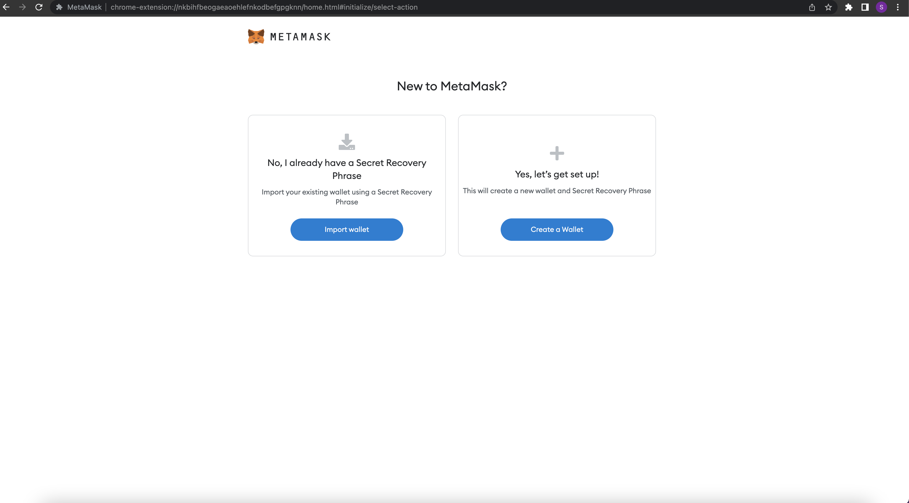
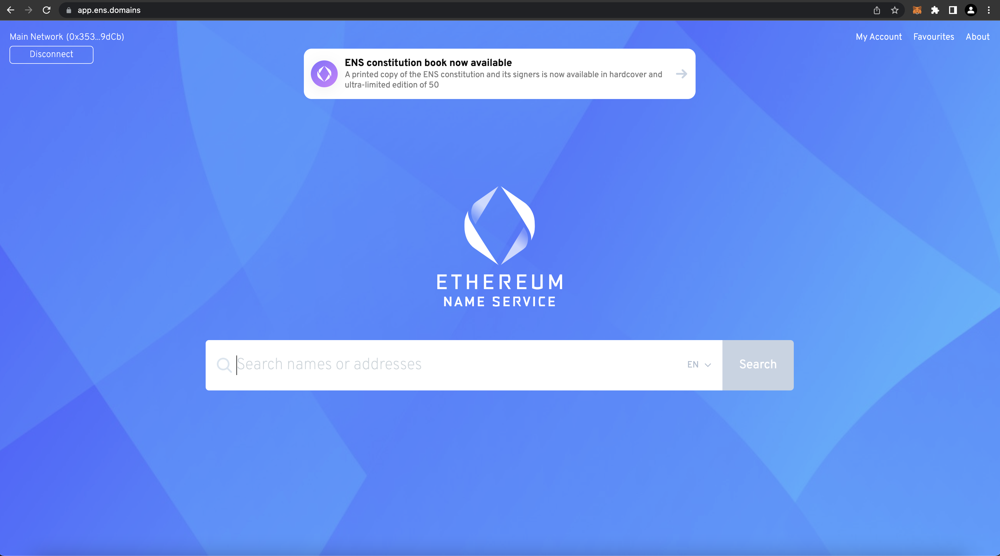
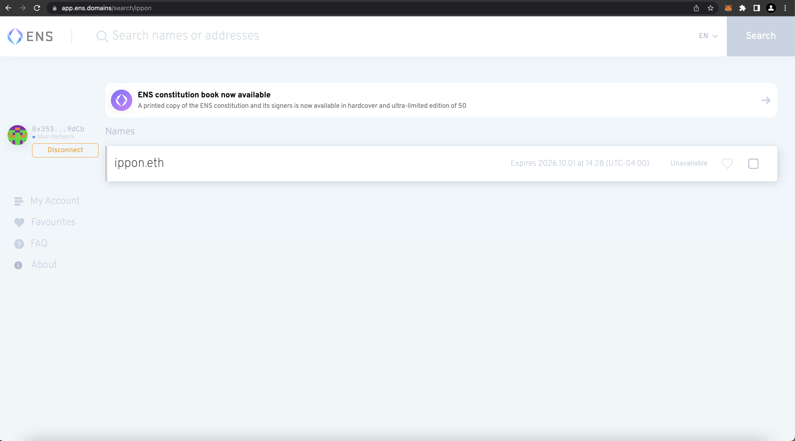
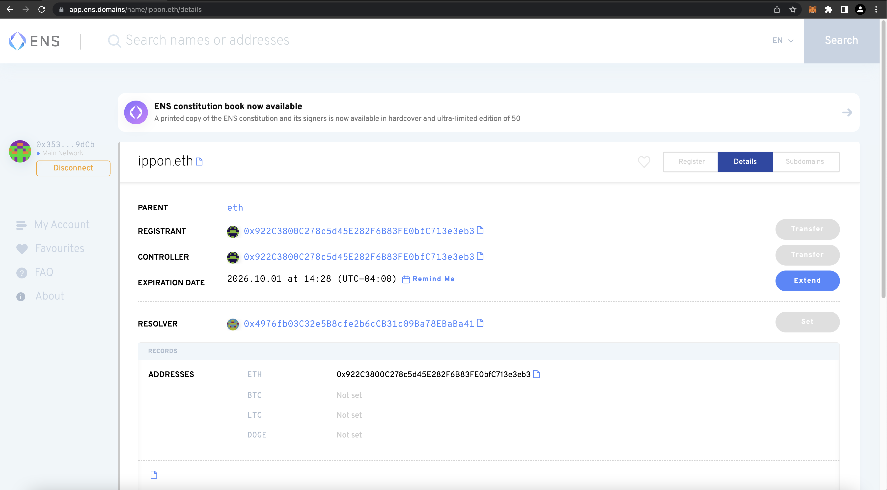
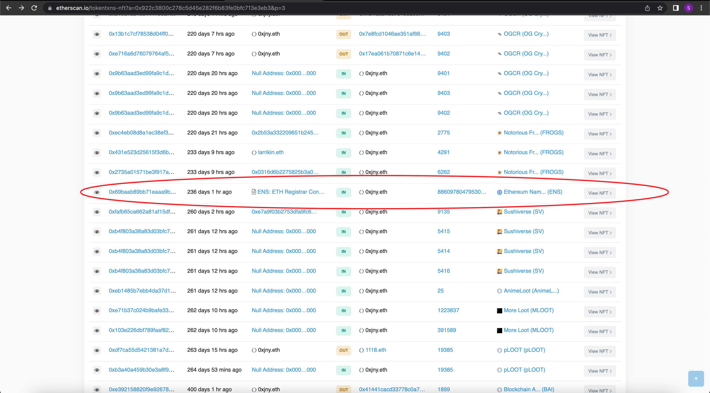

---
authors:
- Samir Pradhan

tags:
- Web3
- Ethereum
- Blockchain
- ENS/DNS

date: 2022-05-25T00:00:00.000Z

title: "Guide to Web3 domains with ENS"

---

#Guide to Web3 domains with ENS

---
## Ethereum

Ethereum is a decentralized, open-source blockchain with smart contract functionality. Ether (ETH or Ξ) is the native cryptocurrency of the platform. This platform allows you to deploy distributed unstoppable applications that run on top of the blockchain network.

## Ethereum Name Service (ENS)

The [Ethereum Name Service](https://ens.domains/) is an open source decentralized internet naming protocol that runs as a set of smart contracts on the Ethereum blockchain. Similar to the Domain Name System (DNS), ENS translates computer identifiers into human-readable names with a dot-separated right-to-left hierarchical naming structure.

The native suffix of ENS is .eth but does support other Top Level Domains (TLDs) like .luxe, .abc, and .xyz with DNSSEC integration implementation.

## Creating an Ethereum Wallet

Ethereum wallets are applications that let you interact with your Ethereum account. Think of it like an internet banking app – without the bank. Your wallet lets you read your balance, send transactions and connect to applications. You will need a wallet and some ethereum to register an ENS domain. You can create a metamask or coinbase wallet for free. In this guide we will mostly focus on using the metamask wallet, but setting up another wallet should be very similar.

- [Coinbase](https://www.coinbase.com/wallet)

- [MetaMask](https://metamask.io/)

Install the MetaMask browser extension from their website -> [MetaMask (https://metamask.io/)](https://metamask.io/)

Follow the instructions and make sure to save your secret seed phrase somewhere that you will be able to retrieve it later on. If you lose this you might not be able to access your wallet and lose your crypto holdings.

You should be able to see the ETH address in your wallet after the setup is completed.
Ethereum addresses are unique, 42 hex string characters, not case-sensitive and are generated from the private key. They represent an account on the Ethereum blockchain. They are generated using the public key and private key of an account and through cryptographic hashes.

## Linking and funding a Wallet to ENS

You can now attach the wallet to the ENS app using the browser extension.

You can fund the wallet by buying ETH on MetaMask itself OR you can use an exchange like Coinbase, Kraken, Gemini or Binance (US) to buy the ETH there and then send it to your wallet's address.

## Using ENS App

Link to --> [Ethereum Name Service App](https://app.ens.domains/)

In this example we search for **"ippon.eth"** 

As you see, this ENS domain is already registered to an address

- **REGISTRANT** : The owner of a registration. The registrant may transfer the registration, set the Controller, and reclaim ownership of the name in the registry if required.
- **CONTROLLER** : The account that may edit the records of a name. The Controller may be changed by the Registrant or Controller.
- **RESOLVER** : A resolver is a contract that maps from name to the resource (e.g., cryptocurrency addresses, content hash, etc). Resolvers are pointed to by the resolver field of the registry. 

If you want to learn more about the terminology in Ethereum Name Service, please refer to this link --> [ENS Terminology](https://docs.ens.domains/terminology)

## Using Etherscan
Etherscan is a block explorer and analytics platform that allows you to access details on any Ethereum blockchain transactions that are pending or confirmed.

Link to --> [Etherscan](https://etherscan.io/)

Using Etherscan we can search the blockchain for the transactions belonging to the address that has **ippon.eth** registered to...

